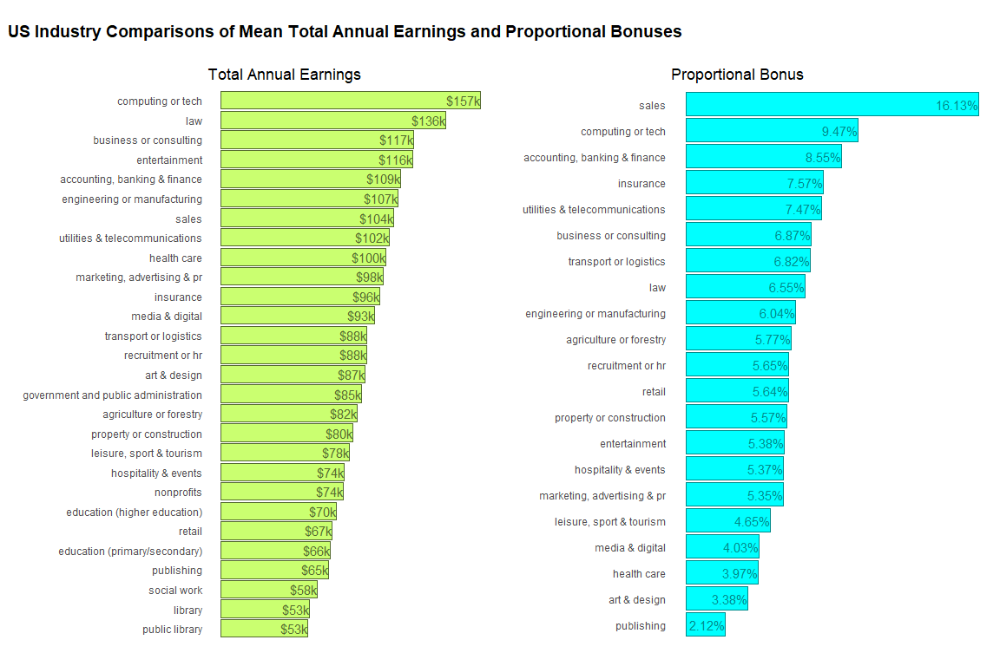
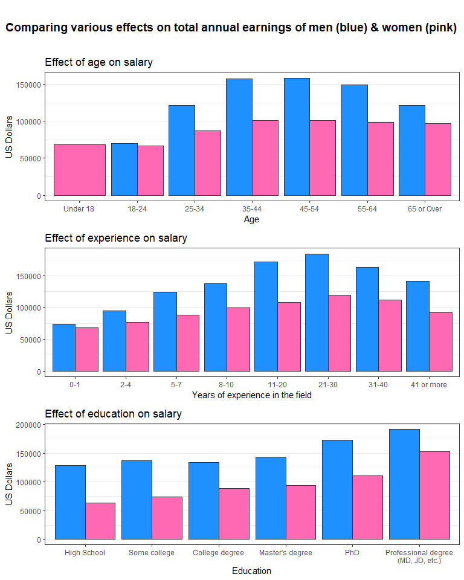
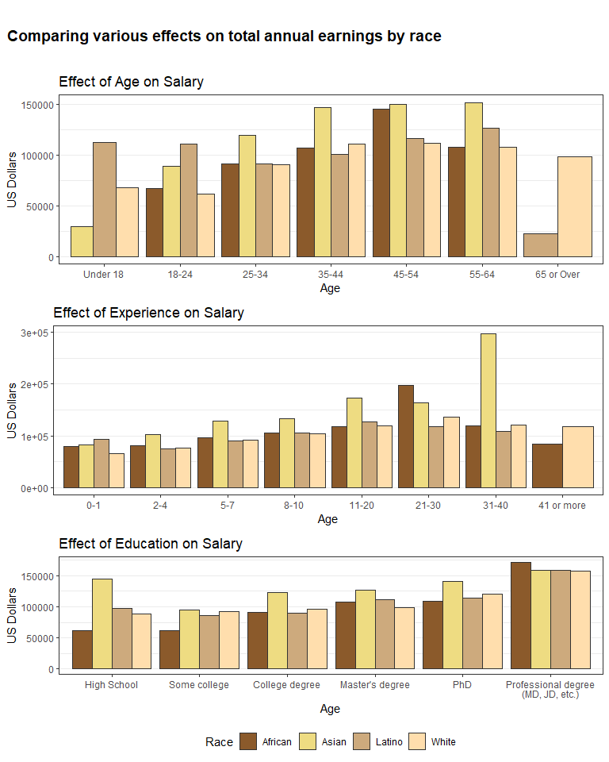
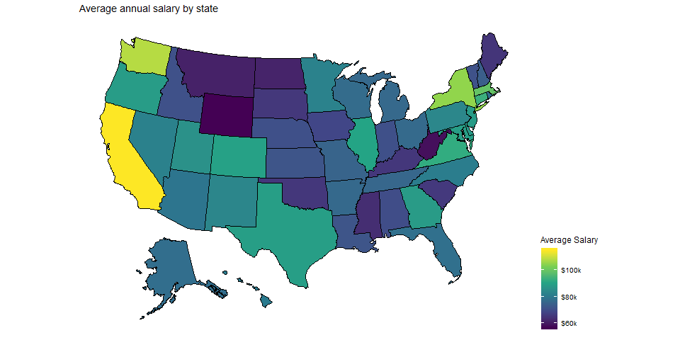

20210518 - Ask a Manager Survey
================
Nick Cruickshank
5/18/2021

``` r
# Load Libraries
library(cowplot)
library(forcats)
library(usmap)
library(tidytuesdayR)
library(tidyverse)
```

``` r
# Get the Data
survey <- readr::read_csv('https://raw.githubusercontent.com/rfordatascience/tidytuesday/master/data/2021/2021-05-18/survey.csv')
```

The salary survey a few weeks ago got a huge response — 24,000+ people
shared their salaries and other info, which is a lot of raw data to sift
through. Reader Elisabeth Engl kindly took the raw data and analyzed
some of the trends in it and here’s what she found. (She asked me to
note that she did this as a fun project to share some insights from the
survey, rather than as a paid engagement.)

This data does not reflect the general population; it reflects Ask a
Manager readers who self-selected to respond, which is a very different
group (as you can see just from the demographic breakdown below, which
is very white and very female).

# Tidy Data Set

``` r
# filter for just America
survey$other_monetary_comp[is.na(survey$other_monetary_comp)] <- 0
sv <- survey %>%
  filter(currency == "USD") %>%
  mutate(
    # add additional salary columns
    other_monetary_comp = as.numeric(other_monetary_comp),
    total_annual_earnings = annual_salary + other_monetary_comp,
    bonus_proportion = other_monetary_comp / total_annual_earnings,
    # tidy industries
    industry = str_to_lower(industry)
    )
```

# Exploratory Analysis

Looks like the survey must have allowed for open response in the
industry field. I could manually group tidy the industries into to cut
out all the noise through use of a `case_when()` statement within a
`mutate()` clause (i.e. when `str_detect(industry, "academ(ia|ic|y)") ==
TRUE ~ "academia"`). However, that would require a lot of time to
carefully parse through the 800+ unique `industry` entries, and would
still likely be subject to my own biases. It’s likely easier (and more
meaningful) simply find a reasonable cutoff point to `filter()` the data
set by.

The following graph plots the top 50 industries by number of survey
responses. The number 50 is chosen somewhat arbitrarily, but serves to
show where a plausible cutoff point would be for trimming
difficult-to-use entries. From this graph, it looks like `filtering` for
industries with \> 50 responses should be appropriate.

``` r
sv %>%
  filter(!(is.na(industry))) %>%
  group_by(industry) %>%
  dplyr::summarise(responses = n()) %>%
  arrange(desc(responses)) %>%
  head(30) %>%
  ggplot(aes(fct_reorder(industry, responses), responses)) + 
  geom_bar(stat = "identity") + 
  geom_text(aes(label = responses), vjust = -1) +
  labs(
    title = "Survey responses by industry",
    subtitle = "Filtering the survey responses for industries with > 50 responses should suffice for trimming",
    x = "industry"
  ) + 
  theme_bw() +
  theme(
    axis.text.x = element_blank(),
    axis.ticks.x = element_blank(),
    panel.grid.major = element_blank(),
    panel.grid.minor = element_blank()
  )
```

<!-- -->

``` r
# create industries rollup df for plotting
industries <- sv %>%
  filter(
    total_annual_earnings < 100000000 # boxplot revealed a clear outlier here
  ) %>%
  group_by(industry) %>%
  dplyr::summarise(
    responses = n(),
    mean_salary = mean(total_annual_earnings),
    sd_salary = sd(total_annual_earnings),
    min_salary = min(total_annual_earnings),
    max_salary = max(total_annual_earnings),
    mean_proportional_bonus = mean(bonus_proportion, na.rm = TRUE)
  ) %>%
  filter(
    responses > 50 # to cut out the noisy free response entries
  )

industries_list <- unique(industries$industry)

industries %>%
  arrange(desc(mean_salary)) %>%
  mutate(
    mean_salary = paste0("$", round(mean_salary / 1000, 2), "k"),
    sd_salary = paste0("$", round(sd_salary / 1000, 2), "k"),
    max_salary = paste0("$", round(max_salary / 1000, 2), "k"),
    mean_proportional_bonus = paste0(round(100 * mean_proportional_bonus, 2), "%")
  ) %>%
  select(-min_salary) %>%
  head(10) %>%
  knitr::kable(align = 'c',
               caption = "Summary statistics for the Top 10 Industries")
```

|            industry            | responses | mean\_salary | sd\_salary | max\_salary | mean\_proportional\_bonus |
| :----------------------------: | :-------: | :----------: | :--------: | :---------: | :-----------------------: |
|       computing or tech        |   3509    |   $157.16k   |  $122.73k  |  $2196.15k  |           9.47%           |
|              law               |    924    |   $136.13k   |  $107.45k  |   $1200k    |           6.55%           |
|     business or consulting     |    650    |   $116.79k   |  $80.03k   |   $1270k    |           6.87%           |
|         entertainment          |    190    |   $115.85k   |  $103.46k  |    $860k    |           5.38%           |
| accounting, banking & finance  |   1389    |   $108.57k   |  $99.17k   |   $1615k    |           8.55%           |
|  engineering or manufacturing  |   1293    |   $107.23k   |  $61.17k   |   $1100k    |           6.04%           |
|             sales              |    222    |   $104.43k   |  $79.82k   |    $560k    |          16.13%           |
| utilities & telecommunications |    243    |   $101.94k   |   $50.4k   |    $360k    |           7.47%           |
|          health care           |   1498    |   $99.84k    |  $91.92k   |   $1900k    |           3.97%           |
|  marketing, advertising & pr   |    877    |    $98.4k    |  $61.32k   |    $835k    |           5.35%           |

Summary statistics for the Top 10 Industries

``` r
income_plot <- industries %>%
  ggplot(aes(fct_reorder(industry, mean_salary), mean_salary)) + 
  geom_bar(stat = "identity", color = "darkolivegreen", fill = "darkolivegreen1") + 
  geom_text(aes(label = paste0("$", round(mean_salary/1000), "k")), hjust = 1, color = "darkolivegreen") +
  coord_flip() + 
  labs(
    title = "Total Annual Earnings",
    x = "",
    y = ""
  ) +
  theme_minimal() +
  theme(
    axis.text.x = element_blank(),
    axis.ticks.x = element_blank(),
    panel.grid = element_blank()
  )

bonus_plot <- industries %>%
  filter(
    mean_proportional_bonus > 0.02
  ) %>%
  ggplot(aes(fct_reorder(industry, mean_proportional_bonus), mean_proportional_bonus)) + 
  geom_bar(stat = "identity", color = "darkcyan", fill = "cyan") + 
  geom_text(aes(label = paste0(round(100*mean_proportional_bonus, 2), "%")), hjust = 1, color = "darkcyan") +
  coord_flip() + 
  labs(
    title = "Proportional Bonus",
    x = "",
    y = ""
  ) + 
  theme_minimal() +
  theme(
    axis.text.x = element_blank(),
    axis.ticks.x = element_blank(),
    panel.grid = element_blank()
  )

plot_row <- plot_grid(income_plot, bonus_plot)

title <- ggdraw() + 
  draw_label(
    "US Industry Comparisons of Mean Total Annual Earnings and Proportional Bonuses",
    fontface = 'bold',
    x = 0,
    hjust = 0
  ) +
  theme(
    # add margin on the left of the drawing canvas,
    # so title is aligned with left edge of first plot
    plot.margin = margin(0, 0, 0, 7)
  )

plot_grid(
  title, plot_row,
  ncol = 1,
  # rel_heights values control vertical title margins
  rel_heights = c(0.1, 1)
)
```

<!-- -->

The phrase “bonus” is used here as a shorthand for “other monetary
compensation”, as there is little difference for most industries.
However, there are some clear interesting trends here. “Sales” making
the top of the list is no surprise as commission is built into their
employment contracts. A similar principle stands for “retail” and
“property or construction” (i.e. real estate).

## Gender vs Total Annual Earnings

``` r
salaries <- sv %>%
  mutate(
    how_old_are_you = str_replace(how_old_are_you, "under 18", "18-18"),
    how_old_are_you = str_replace(how_old_are_you, "65 or over", "65-65")
  ) %>%
  separate(how_old_are_you, into = c("min_age", "max_age"), sep = "-", remove = FALSE) %>%
  mutate(
    mean_age = (as.numeric(min_age) + as.numeric(max_age))/2,
    years_of_experience_in_field = str_replace(years_of_experience_in_field, "\\s-\\s", "-"),
    years_of_experience_in_field = str_remove(years_of_experience_in_field, "\\syears"),
    years_of_experience_in_field = str_replace(years_of_experience_in_field, "1 year or less", "0-1")
  ) %>%
  separate(years_of_experience_in_field, into = c("min_years", "max_years"), sep = "-", remove = FALSE) %>%
  mutate(
    mean_years_of_experience = (as.numeric(min_years) + as.numeric(max_years))/2,
    how_old_are_you = str_replace(how_old_are_you, "18-18", "Under 18"),
    how_old_are_you = str_replace(how_old_are_you, "65-65", "65 or Over")
  )
```

``` r
gen_age_p <- salaries %>%
  filter(
    total_annual_earnings < 100000000,
    gender %in% c("Man", "Woman")
  ) %>%
  group_by(gender, how_old_are_you, mean_age) %>%
  dplyr::summarise(
    responses = n(),
    mean_annual_earnings = mean(total_annual_earnings)
  ) %>%
  ggplot(aes(fct_reorder(how_old_are_you, mean_age), mean_annual_earnings)) + 
  geom_bar(aes(fill = gender), stat = "identity", position = "dodge", color = "gray20") + 
  scale_fill_manual(values = c(
    "Man" = "dodgerblue",
    "Woman" = "hotpink"
  )) + 
  labs(
    title = "Effect of age on salary",
    x = "Age",
    y = "US Dollars",
    fill = "Gender"
  ) + 
  theme_bw() + 
  theme(
    legend.position = "none",
    panel.grid.major.x = element_blank()
  )

gen_exp_p <- salaries %>%
  filter(
    total_annual_earnings < 100000000,
    gender %in% c("Man", "Woman")
  ) %>%
  group_by(gender, years_of_experience_in_field, mean_years_of_experience) %>%
  dplyr::summarise(
    responses = n(),
    mean_annual_earnings = mean(total_annual_earnings)
  ) %>%
  ggplot(aes(fct_reorder(years_of_experience_in_field, mean_years_of_experience), mean_annual_earnings)) + 
  geom_bar(aes(fill = gender), stat = "identity", position = "dodge", color = "gray20") + 
  scale_fill_manual(values = c(
    "Man" = "dodgerblue",
    "Woman" = "hotpink"
  )) + 
  labs(
    title = "Effect of experience on salary",
    x = "Years of experience in the field",
    y = "US Dollars",
    fill = "Gender"
  ) + 
  theme_bw() + 
  theme(
    legend.position = "none",
    panel.grid.major.x = element_blank()
  )

gen_edu_p <- salaries %>%
  filter(
    total_annual_earnings < 100000000,
    gender %in% c("Man", "Woman"),
    !(is.na(highest_level_of_education_completed))
  ) %>%
  mutate(
    education_tier = case_when(
      highest_level_of_education_completed == "High School" ~ 1,
      highest_level_of_education_completed == "Some college" ~ 2,
      highest_level_of_education_completed == "College degree" ~ 3,
      highest_level_of_education_completed == "Master's degree" ~ 4,
      highest_level_of_education_completed == "PhD" ~ 5,
      highest_level_of_education_completed == "Professional degree (MD, JD, etc.)" ~ 6
    ),
    highest_level_of_education_completed = str_replace(highest_level_of_education_completed, 
                                                       "Professional degree \\(MD, JD, etc.\\)",
                                                       "Professional degree\n(MD, JD, etc.)") # so it fits better 
  ) %>%
  group_by(gender, highest_level_of_education_completed, education_tier) %>%
  dplyr::summarise(
    responses = n(),
    mean_annual_earnings = mean(total_annual_earnings)
  ) %>%
  ggplot(aes(fct_reorder(highest_level_of_education_completed, education_tier), mean_annual_earnings)) + 
  geom_bar(aes(fill = gender), stat = "identity", position = "dodge", color = "gray20") + 
  scale_fill_manual(values = c(
    "Man" = "dodgerblue",
    "Woman" = "hotpink"
  )) + 
  labs(
    title = "Effect of education on salary",
    x = "Education",
    y = "US Dollars",
    fill = "Gender"
  ) + 
  theme_bw() + 
  theme(
    legend.position = "none",
    panel.grid.major.x = element_blank()
  )

gen_plot_row <- plot_grid(gen_age_p, gen_exp_p, gen_edu_p, ncol = 1)

gen_title <- title <- ggdraw() + 
  draw_label(
    "Comparing various effects on total annual earnings of men (blue) & women (pink)",
    fontface = 'bold',
    x = 0,
    hjust = 0
  ) +
  theme(
    # add margin on the left of the drawing canvas,
    # so title is aligned with left edge of first plot
    plot.margin = margin(0, 0, 0, 7)
  )

plot_grid(gen_title, gen_plot_row, ncol = 1, rel_heights = c(0.1, 1))
```

<!-- -->

## Race vs Total Annual Earnings

``` r
race_list <- sv %>% 
  filter(race != "Another option not listed here or prefer not to answer") %>%
  group_by(race) %>%
  dplyr::summarise(count = n()) %>%
  arrange(desc(count)) %>%
  head(4)

sv_races <- sv %>%
  filter(
    race %in% unique(race_list$race),
    total_annual_earnings < 100000000,
    gender %in% c("Man", "Woman")
  ) %>%
  mutate(
    how_old_are_you = str_replace(how_old_are_you, "under 18", "18-18"),
    how_old_are_you = str_replace(how_old_are_you, "65 or over", "65-65")
  ) %>%
  separate(how_old_are_you, into = c("min_age", "max_age"), sep = "-", remove = FALSE) %>%
  mutate(
    mean_age = (as.numeric(min_age) + as.numeric(max_age))/2,
    years_of_experience_in_field = str_replace(years_of_experience_in_field, "\\s-\\s", "-"),
    years_of_experience_in_field = str_remove(years_of_experience_in_field, "\\syears"),
    years_of_experience_in_field = str_replace(years_of_experience_in_field, "1 year or less", "0-1")
  ) %>%
  separate(years_of_experience_in_field, into = c("min_years", "max_years"), sep = "-", remove = FALSE) %>%
  mutate(
    mean_years_of_experience = (as.numeric(min_years) + as.numeric(max_years))/2,
    how_old_are_you = str_replace(how_old_are_you, "18-18", "Under 18"),
    how_old_are_you = str_replace(how_old_are_you, "65-65", "65 or Over"),
    education_tier = case_when(
      highest_level_of_education_completed == "High School" ~ 1,
      highest_level_of_education_completed == "Some college" ~ 2,
      highest_level_of_education_completed == "College degree" ~ 3,
      highest_level_of_education_completed == "Master's degree" ~ 4,
      highest_level_of_education_completed == "PhD" ~ 5,
      highest_level_of_education_completed == "Professional degree (MD, JD, etc.)" ~ 6
    ),
    highest_level_of_education_completed = str_replace(highest_level_of_education_completed, 
                                                       "Professional degree \\(MD, JD, etc.\\)",
                                                       "Professional degree\n(MD, JD, etc.)"),
    race = case_when(
      str_detect(race, "Asian") == TRUE ~ "Asian",
      str_detect(race, "Black") == TRUE ~ "African",
      str_detect(race, "Latino") ~ "Latino",
      str_detect(race, "White") ~ "White"
    )
  )
```

``` r
races_age_p <- sv_races %>%
  group_by(race, how_old_are_you, mean_age) %>%
  dplyr::summarise(
    earnings = mean(total_annual_earnings)
  ) %>%
  ggplot(aes(fct_reorder(how_old_are_you, mean_age), earnings)) + 
  geom_bar(aes(fill = race), stat = "identity", position = "dodge", color = "gray20") + 
  scale_fill_manual(values = c(
    "African" = "tan4",
    "Asian" = "lightgoldenrod2",
    "Latino" = "burlywood3",
    "White" = "navajowhite"
  )) +
  labs(
    title = "Effect of Age on Salary",
    x = "Age",
    y = "US Dollars"
  ) +
  theme_bw() + 
  theme(
    legend.position = "none",
    panel.grid.major.x = element_blank()
  )

races_exp_p <- sv_races %>%
  group_by(race, years_of_experience_in_field, mean_years_of_experience) %>%
  dplyr::summarise(
    earnings = mean(total_annual_earnings)
  ) %>%
  ggplot(aes(fct_reorder(years_of_experience_in_field, mean_years_of_experience), earnings)) + 
  geom_bar(aes(fill = race), stat = "identity", position = "dodge", color = "gray20") + 
  scale_fill_manual(values = c(
    "African" = "tan4",
    "Asian" = "lightgoldenrod2",
    "Latino" = "burlywood3",
    "White" = "navajowhite"
  )) +
  labs(
    title = "Effect of Experience on Salary",
    x = "Age",
    y = "US Dollars"
  ) +
  theme_bw() + 
  theme(
    legend.position = "none",
    panel.grid.major.x = element_blank()
  )

races_edu_p <- sv_races %>%
  filter(
    !(is.na(highest_level_of_education_completed))
  ) %>%
  group_by(race, highest_level_of_education_completed, education_tier) %>%
  dplyr::summarise(
    earnings = mean(total_annual_earnings)
  ) %>%
  ggplot(aes(fct_reorder(highest_level_of_education_completed, education_tier), earnings)) + 
  geom_bar(aes(fill = race), stat = "identity", position = "dodge", color = "gray20") + 
  scale_fill_manual(values = c(
    "African" = "tan4",
    "Asian" = "lightgoldenrod2",
    "Latino" = "burlywood3",
    "White" = "navajowhite"
  )) +
  labs(
    title = "Effect of Education on Salary",
    x = "Age",
    y = "US Dollars",
    fill = "Race"
  ) +
  theme_bw() + 
  theme(
    legend.position = "bottom",
    panel.grid.major.x = element_blank()
  )

race_plot_row <- plot_grid(races_age_p, races_exp_p, races_edu_p, ncol = 1)

race_title <- title <- ggdraw() + 
  draw_label(
    "Comparing various effects on total annual earnings by race",
    fontface = 'bold',
    x = 0,
    hjust = 0
  ) +
  theme(
    # add margin on the left of the drawing canvas,
    # so title is aligned with left edge of first plot
    plot.margin = margin(0, 0, 0, 7)
  )

plot_grid(race_title, race_plot_row, ncol = 1, rel_heights = c(0.1, 1))
```

<!-- -->

## State of Employment vs Salary

``` r
states <- tibble(state = state.name) %>%
   bind_cols(tibble(abb = state.abb)) %>% 
   bind_rows(tibble(state = "District of Columbia", abb = "DC"))

sv_states <- sv %>%
  filter(!(is.na(state))) %>%
  group_by(state) %>%
  dplyr::summarise(
    responses = n(),
    state_avg = round(mean(annual_salary) / 1000, 2)
  ) %>%
  filter(responses > 5) %>%
  ungroup() %>%
  left_join(states)

plot_usmap(data = sv_states, values = "state_avg", color = "black") +
  scale_fill_viridis_c(name = "Average Salary", label = scales::dollar_format(suffix = "k"), option = "viridis") +
  labs(title = "Average annual salary by state") +
  theme(legend.position = "right")
```

<!-- -->
