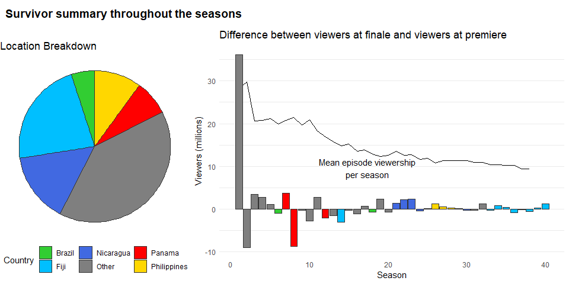
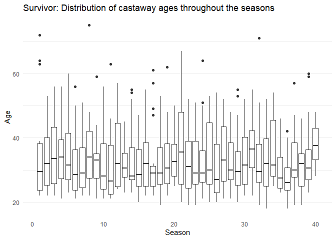
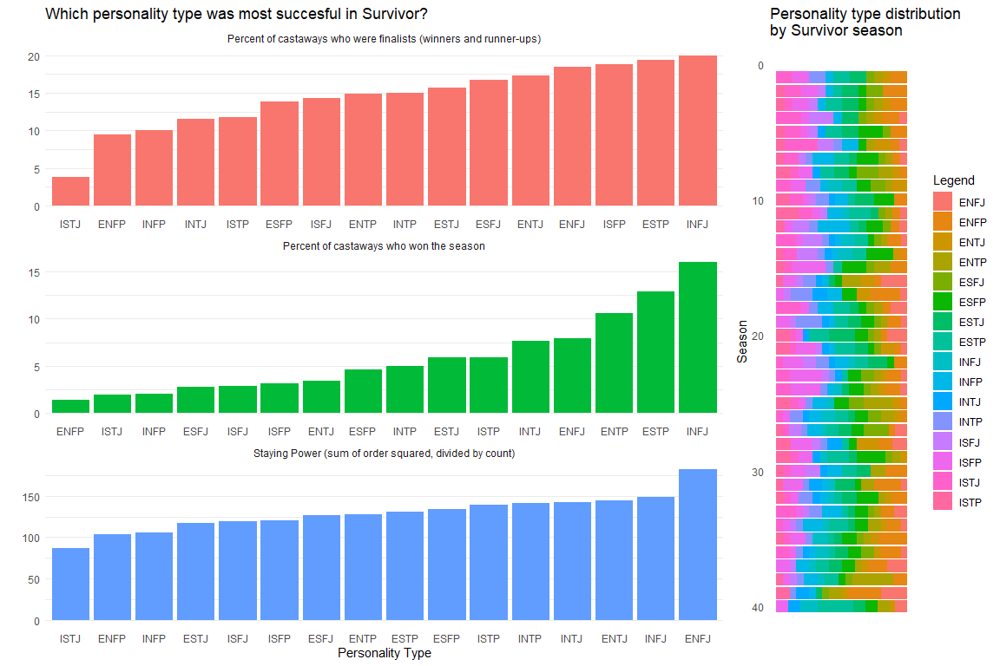
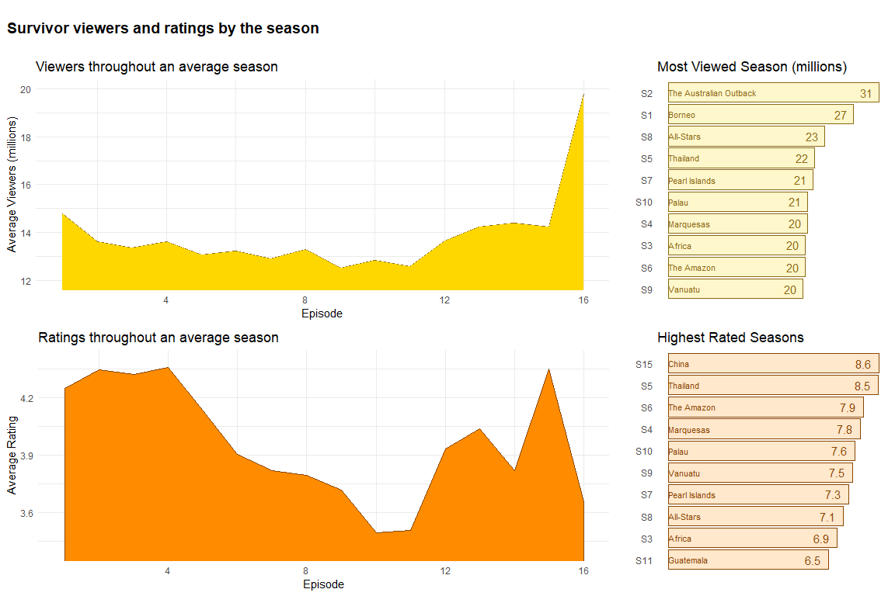

Tidy Tuesday 20210601 - SURVIVOR
================
Nick Cruickshank
6/1/2021

``` r
# libraries
library(cowplot)
library(forcats)
library(ggrepel)
library(readr)
library(tidytext)
library(tidyverse)
```

``` r
# data
summary <- readr::read_csv('https://raw.githubusercontent.com/rfordatascience/tidytuesday/master/data/2021/2021-06-01/summary.csv')
castaways <- readr::read_csv('https://raw.githubusercontent.com/rfordatascience/tidytuesday/master/data/2021/2021-06-01/castaways.csv')
jury_votes <- readr::read_csv('https://raw.githubusercontent.com/rfordatascience/tidytuesday/master/data/2021/2021-06-01/jury_votes.csv')
challenges <- readr::read_csv('https://raw.githubusercontent.com/rfordatascience/tidytuesday/master/data/2021/2021-06-01/challenges.csv')
viewers <- readr::read_csv('https://raw.githubusercontent.com/rfordatascience/tidytuesday/master/data/2021/2021-06-01/viewers.csv')
```

``` r
# functions
Mode <- function(x) {
  ux <- unique(x)
  ux[which.max(tabulate(match(x, ux)))]
}
```

# Exploratory Analysis

## Summary

``` r
knitr::kable(head(summary),
             align = 'c',
             caption = "Head of summary table")
```

|           season\_name           | season |                        location                        |  country  |                           tribe\_setup                            |   full\_name   | winner  |     runner\_ups      | final\_vote |     timeslot      | premiered  |   ended    | filming\_started | filming\_ended | viewers\_premier | viewers\_finale | viewers\_reunion | viewers\_mean | rank |
| :------------------------------: | :----: | :----------------------------------------------------: | :-------: | :---------------------------------------------------------------: | :------------: | :-----: | :------------------: | :---------: | :---------------: | :--------: | :--------: | :--------------: | :------------: | :--------------: | :-------------: | :--------------: | :-----------: | :--: |
|         Survivor: Borneo         |   1    |              Pulau Tiga, Sabah, Malaysia               | Malaysia  |                  Two tribes of eight new players                  | Richard Hatch  | Richard |  Kelly Wiglesworth   |     4-3     | Wednesday 8:00 pm | 2000-05-31 | 2000-08-23 |    2000-03-13    |   2000-04-20   |      15.51       |      51.69      |      36.70       |     28.30     |  2   |
| Survivor: The Australian Outback |   2    | Herbert River at Goshen Station, Queensland, Australia | Australia |                  Two tribes of eight new players                  |  Tina Wesson   |  Tina   |   Colby Donaldson    |     4-3     | Thursday 8:00 pm  | 2001-01-28 | 2001-05-03 |    2000-10-23    |   2000-12-03   |      45.37       |      36.35      |      28.01       |     29.80     |  1   |
|         Survivor: Africa         |   3    |             Shaba National Reserve, Kenya              |   Kenya   |                  Two tribes of eight new players                  |   Ethan Zohn   |  Ethan  |     Kim Johnson      |     5-2     | Thursday 8:00 pm  | 2001-10-11 | 2002-01-10 |    2001-07-11    |   2001-08-18   |      23.84       |      27.26      |      19.05       |     20.69     |  8   |
|       Survivor: Marquesas        |   4    |     Nuku Hiva, Marquesas Islands, French Polynesia     | Polynesia |                  Two tribes of eight new players                  | Vecepia Towery | Vecepia |     Neleh Dennis     |     4-3     | Thursday 8:00 pm  | 2002-02-28 | 2002-05-19 |    2001-11-12    |   2001-12-20   |      23.19       |      25.87      |      19.05       |     20.77     |  6   |
|        Survivor: Thailand        |   5    |          Ko Tarutao, Satun Province, Thailand          | Thailand  | Two tribes of eight new players; picked by the two oldest players |  Brian Heidik  |  Brian  |     Clay Jordan      |     4-3     | Thursday 8:00 pm  | 2002-09-19 | 2002-12-19 |    2002-06-10    |   2002-07-18   |      23.05       |      24.08      |      20.43       |     21.21     |  4   |
|       Survivor: The Amazon       |   6    |              Rio Negro, Amazonas, Brazil               |  Brazil   |         Two tribes of eight new players divided by gender         | Jenna Morasca  |  Jenna  | Matthew Von Ertfelda |     6-1     | Thursday 8:00 pm  | 2003-02-13 | 2003-05-11 |    2002-11-07    |   2002-12-15   |      23.26       |      22.29      |      20.43       |     19.97     |  9   |

Head of summary table

Which season had the greatest disparity between viewers at premier vs at
finale?

``` r
# identify what the top five countries are for filling the graph
list_top5_countries <- head(arrange(count(summary, vars = country), desc(n)), 5)$vars

# reshape summary by country with "Other" category
sum_pie_df <- summary %>%
  mutate(
    country_category = ifelse(country %in% list_top5_countries, country, "Other")
  ) %>%
  group_by(country_category) %>%
  dplyr::summarise(value = n())

# colors to use by country
countries_colors <- c(
  "Brazil" = "limegreen",
  "Fiji" = "deepskyblue",
  "Nicaragua" = "royalblue",
  "Other" = "gray50",
  "Panama" = "red",
  "Philippines" = "gold"
)

# create plots
## pie chart and legen
sum_pie <- ggplot(sum_pie_df, aes(x = "", y = value, fill = country_category)) + 
  geom_bar(stat = "identity", color = "gray20") + 
  coord_polar("y", start = 0) + 
  scale_fill_manual(values = countries_colors) + 
  labs(title = "Location Breakdown", fill = "Country") +
  theme_void() + 
  theme(legend.position = "bottom")

## viewership delta
sum_delta_plot <- summary %>%
  mutate(
    viewer_delta = viewers_finale - viewers_premier,
    country_category = ifelse(country %in% list_top5_countries, country, "Other")
  ) %>%
  ggplot(aes(season, viewer_delta)) + 
  geom_line(aes(season, viewers_mean)) +
  ggrepel::geom_text_repel(
    data = filter(summary, season == 20),
    aes(season, viewers_mean), label = "Mean episode viewership\nper season"
    ) +
  geom_bar(aes(fill = country_category), stat = "identity", color = "gray20") +
  scale_fill_manual(values = countries_colors) +
  labs(
    title = "Difference between viewers at finale and viewers at premiere",
    x = "Season",
    y = "Viewers (millions)"
  ) + 
  theme_minimal() +
  theme(
    legend.position = "none",
    panel.grid.major.x = element_blank(),
    panel.grid.minor.x = element_blank()
  )

# put the two plots together
plots_row <- plot_grid(sum_pie, sum_delta_plot, rel_widths = c(1,2))

title <- ggdraw() + 
  draw_label(
    "Survivor summary throughout the seasons",
    fontface = 'bold',
    x = 0,
    hjust = 0
  ) +
  theme(
    plot.margin = margin(0, 0, 0, 7)
  )

summary_plot <- plot_grid(
  title, plots_row,
  ncol = 1,
  rel_heights = c(0.1, 1)
)

summary_plot
```

<!-- -->

Looks like overall mean viewership declined throughout the seasons (no
surprise). Also, the variance in the delta between viewers at finale and
viewers at premiere dropped off over time. I interpret this as
demonstrating that the people who watched the later seasons of the show
were already enfranchised, and were thus more likely to commit to
finishing the season once started.

``` r
repeat_winners <- filter(count(summary, vars = full_name), n > 1)$vars
seasons_with_returns <- nrow(filter(summary, str_detect(tribe_setup, "(returning|past)")))
```

Looking at the winners from each season, it is clear that there were
only two repeat winners: Sandra Diaz-Twine, Tony Vlachos.

Of the 40 seasons of Survivor, there were 12 seasons where returning
players were allowed. From those 12 emerged 2 repeat winners: Sandra
Diaz-Twine, Tony Vlachos.

## Challenges

``` r
knitr::kable(head(challenges),
             align = 'c',
             caption = "Head of challenges table")
```

|       season\_name       | season | episode |         title          | day | challenge\_type | winners | winning\_tribe |
| :----------------------: | :----: | :-----: | :--------------------: | :-: | :-------------: | :-----: | :------------: |
| Survivor: Winners at War |   40   |    1    | Greatest of the Greats |  2  |     reward      |  Amber  |     Dakal      |
| Survivor: Winners at War |   40   |    1    | Greatest of the Greats |  2  |     reward      |  Tyson  |     Dakal      |
| Survivor: Winners at War |   40   |    1    | Greatest of the Greats |  2  |     reward      | Sandra  |     Dakal      |
| Survivor: Winners at War |   40   |    1    | Greatest of the Greats |  2  |     reward      |   Yul   |     Dakal      |
| Survivor: Winners at War |   40   |    1    | Greatest of the Greats |  2  |     reward      | Wendell |     Dakal      |
| Survivor: Winners at War |   40   |    1    | Greatest of the Greats |  2  |     reward      | Sophie  |     Dakal      |

Head of challenges table

Nothing here really interests me. Maybe could join this table with
another to see relationships between `challenge type` and some other
metrics (e.g. viewers, ratings, castaway personality type, etc).
However, there are only two challenge types, both of which seem
relatively evenly distributed. Specifically, there are 2535 reward
challenges and 2488 immnity challenges.

## Castaways

``` r
knitr::kable(head(castaways),
             align = 'c',
             caption = "Head of castaways table")
```

|       season\_name       | season |    full\_name    | castaway | age |     city     |     state     | personality\_type | day | order |    result     |  jury\_status   | original\_tribe | swapped\_tribe | swapped\_tribe2 | merged\_tribe | total\_votes\_received | immunity\_idols\_won |
| :----------------------: | :----: | :--------------: | :------: | :-: | :----------: | :-----------: | :---------------: | :-: | :---: | :-----------: | :-------------: | :-------------: | :------------: | :-------------: | :-----------: | :--------------------: | :------------------: |
| Survivor: Winners at War |   40   | Natalie Anderson | Natalie  | 33  |  Edgewater   |  New Jersey   |       ESTP        |  2  |   1   | 1st voted out |       NA        |      Sele       |       NA       |       NA        |      NA       |           11           |          1           |
| Survivor: Winners at War |   40   |  Amber Mariano   |  Amber   | 40  |  Pensacola   |    Florida    |       ISFP        |  3  |   2   | 2nd voted out | 1st jury member |      Dakal      |       NA       |       NA        |      NA       |           6            |          0           |
| Survivor: Winners at War |   40   | Danni Boatwright |  Danni   | 43  |   Shawnee    |    Kansas     |       ENFJ        |  6  |   3   | 3rd voted out | 2nd jury member |      Sele       |       NA       |       NA        |      NA       |           8            |          0           |
| Survivor: Winners at War |   40   |    Ethan Zohn    |  Ethan   | 45  | Hillsborough | New Hampshire |       ISFP        |  9  |   4   | 4th voted out | 3rd jury member |      Sele       |       NA       |       NA        |      NA       |           4            |          0           |
| Survivor: Winners at War |   40   |  Tyson Apostol   |  Tyson   | 39  |     Mesa     |    Arizona    |       ESTP        | 11  |   5   | 5th voted out |       NA        |      Dakal      |       NA       |       NA        |      NA       |           12           |          0           |
| Survivor: Winners at War |   40   |   Rob Mariano    |   Rob    | 43  |  Pensacola   |    Florida    |       ESTJ        | 14  |   6   | 6th voted out | 4th jury member |      Sele       |      Yara      |       NA        |      NA       |           4            |          0           |

Head of castaways table

### Age by Season

``` r
castaways_sum <- castaways %>%
  group_by(season) %>%
  dplyr::summarise(
    players = n_distinct(full_name),
    mode_personality = Mode(personality_type),
    min_age = min(age),
    mean_age = mean(age),
    max_age = max(age)
  )
```

``` r
castaways %>%
  ggplot(aes(season, age)) + 
  geom_boxplot(aes(group = season)) +
  labs(
    title = "Survivor: Distribution of castaway ages throughout the seasons",
    x = "Season",
    y = "Age"
  ) + 
  theme_minimal() + 
  theme(
    panel.grid.major.x = element_blank(),
    panel.grid.minor.x = element_blank()
  )
```

<!-- -->

For the above boxplot, it is possible to assign color of the graph to
season rating or viewers. However, this would be substantially
confounded by the fact that both factors went down over time. At that
point, it would be plotting two different mesaures (season by age, and
season by viewers), and potentially suggesting a false causality.
Therefore, this was not done.

### Result by Personality Type

``` r
personality_type_distr <- castaways %>%
  filter(!(is.na(personality_type))) %>%
  count(season, personality_type) %>%
  ggplot(aes(season, n, fill = personality_type)) + 
  geom_bar(stat = "identity", position = "fill") + 
  labs(
    title = "Personality type distribution\nby Survivor season",
    fill = "Legend",
    y = "",
    x = "Season"
  ) + 
  coord_flip() +
  scale_x_reverse() + 
  theme_minimal() + 
  theme(
    panel.grid = element_blank(),
    axis.text.x = element_blank()
  )

castaway_result_noise <- filter(count(castaways, result), n < 10)$result

castaway_personality <- castaways %>%
  filter(
    !(result %in% castaway_result_noise),
    !(is.na(personality_type))
    ) %>%
  group_by(personality_type) %>%
  dplyr::summarise(
    `Percent of castaways who won the season` = 100*(sum(result == "Sole Survivor") / n()),
    `Percent of castaways who were finalists (winners and runner-ups)` = 100*(sum(str_detect(str_to_lower(result), "(runner-up|sole survivor)")) / n()),
    `Staying Power (sum of order squared, divided by count)` = sum(order^2) / n(),
  )

personality_success_plot <- castaway_personality %>%
  pivot_longer(cols = -personality_type, names_to = "success_metric", values_to = "rate") %>%
  ggplot(aes(reorder_within(personality_type, rate, success_metric), rate)) + 
  geom_bar(aes(fill = success_metric), stat = "identity") + 
  scale_x_reordered() + 
  facet_wrap(~ success_metric, ncol = 1, scales = "free") + 
  labs(
    title = "Which personality type was most succesful in Survivor?",
    x = "Personality Type",
    y = ""
  ) +
  theme_minimal() + 
  theme(
    legend.position = "none",
    panel.grid.major.x = element_blank(),
    panel.grid.minor.x = element_blank()
  )

plot_grid(personality_success_plot, personality_type_distr, 
          rel_widths = c(2.7,1))
```

<!-- -->

## Viewers

``` r
knitr::kable(head(viewers),
             align = 'c',
             caption = "Viewers table head")
```

|       season\_name       | season | episode\_number\_overall | episode |            title             | episode\_date | viewers | rating\_18\_49 | share\_18\_49 |
| :----------------------: | :----: | :----------------------: | :-----: | :--------------------------: | :-----------: | :-----: | :------------: | :-----------: |
| Survivor: Winners at War |   40   |           583            |    1    |    Greatest of the Greats    |  2020-02-12   |  6.68   |      1.3       |       7       |
| Survivor: Winners at War |   40   |           584            |    2    | It’s Like a Survivor Economy |  2020-02-19   |  7.16   |      1.4       |       7       |
| Survivor: Winners at War |   40   |           585            |    3    |        Out for Blood         |  2020-02-26   |  7.14   |      1.4       |       7       |
| Survivor: Winners at War |   40   |           586            |    4    |        I Like Revenge        |  2020-03-04   |  7.08   |      1.4       |       7       |
| Survivor: Winners at War |   40   |           587            |    5    | The Buddy System on Steroids |  2020-03-11   |  6.91   |      1.4       |       6       |
| Survivor: Winners at War |   40   |           588            |    6    |      Quick on the Draw       |  2020-03-18   |  7.83   |      1.6       |       7       |

Viewers table head

### Viewership and ratings over the course of a season

``` r
# viewers plot
viewers_season_plot <- viewers %>%
  filter(
    episode < 17,
    !(is.na(viewers))
  ) %>%
  group_by(episode) %>%
  dplyr::summarise(
    mean_viewers = mean(viewers),
    sd_viewers = sd(viewers)
  ) %>%
  ggplot(aes(episode, mean_viewers)) + 
  geom_line(color = "goldenrod4") + 
  geom_area(fill = "gold") + 
  coord_cartesian(ylim = c(12, 20)) + 
  labs(
    title = "Viewers throughout an average season",
    x = "Episode",
    y = "Average Viewers (millions)"
  ) + 
  theme_minimal()

# top viewed seasons
top_viewed_plots <- viewers %>%
  group_by(season_name, season) %>%
  dplyr::summarise(mean_viewers = mean(viewers, na.rm = TRUE)) %>%
  arrange(desc(mean_viewers)) %>%
  head(10) %>%
  mutate(
    season_tidy = paste0("S", season),
    season_name_tidy = str_remove(season_name, "Survivor: ")
  ) %>%
  ggplot(aes(fct_reorder(season_tidy, mean_viewers), mean_viewers)) + 
  geom_bar(stat = "identity", fill = "gold", color = "goldenrod4", alpha = 0.2) + 
  geom_text(aes(label = season_name_tidy, y = 0), size = 3, hjust = "left", color = "goldenrod4") + 
  geom_text(aes(label = round(mean_viewers)), hjust = 1.5, color = "goldenrod4") + 
  coord_flip() + 
  labs(
    title = "Most Viewed Season (millions)",
    x = "",
    y = ""
  ) + 
  theme_minimal() + 
  theme(
    panel.grid = element_blank(),
    axis.text.x = element_blank()
  )

# rating plot
ratings_season_plot <- viewers %>%
  filter(
    episode < 17, 
    !(is.na(rating_18_49))
  ) %>%
  group_by(episode) %>%
  dplyr::summarise(mean_rating = mean(rating_18_49)) %>%
  ggplot(aes(episode, mean_rating)) + 
  geom_line() + 
  geom_area(fill = "darkorange", color = "darkorange4") + 
  coord_cartesian(ylim = c(3.4, 4.4)) + 
  labs(
    title = "Ratings throughout an average season",
    x = "Episode",
    y = "Average Rating"
  ) + 
  theme_minimal()

# top rated seasons
top_rated_seasons_plot <- viewers %>%
  group_by(season_name, season) %>%
  dplyr::summarise(mean_rating = mean(rating_18_49, na.rm = TRUE)) %>%
  arrange(desc(mean_rating)) %>%
  head(10) %>%
  mutate(
    season_tidy = paste0("S", season),
    season_name_tidy = str_remove(season_name, "Survivor: "),
    ) %>%
  ggplot(aes(fct_reorder(season_tidy, mean_rating), mean_rating)) + 
  geom_bar(stat = "identity", fill = "darkorange", color = "darkorange4", alpha = 0.2) + 
  geom_text(aes(label = season_name_tidy, y = 0), size = 3, hjust = "left", color = "darkorange4") +
  geom_text(aes(label = round(mean_rating, 1)), hjust = 1.5, color = "darkorange4") +
  coord_flip() + 
  labs(
    title = "Highest Rated Seasons",
    x = "",
    y = ""
  ) + 
  theme_minimal() + 
  theme(
    panel.grid = element_blank(),
    axis.text.x = element_blank()
  )

# merge all four plots together
plots_row <- plot_grid(viewers_season_plot, top_viewed_plots, ratings_season_plot, top_rated_seasons_plot,
          ncol = 2, rel_widths = c(2.2,1))

title <- ggdraw() + 
  draw_label(
    "Survivor viewers and ratings by the season",
    fontface = "bold", x = 0, hjust = 0
  ) + 
  theme(
    plot.margin = margin(0,0,0,7)
  )

viewers_plot <- plot_grid(title, plots_row, ncol = 1, rel_heights = c(0.1,1))
viewers_plot
```

<!-- -->
