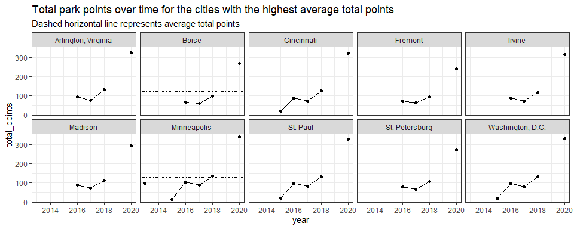
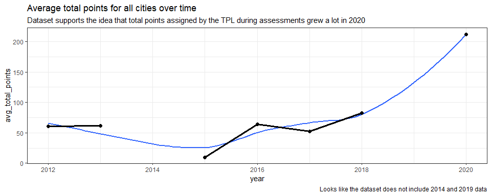
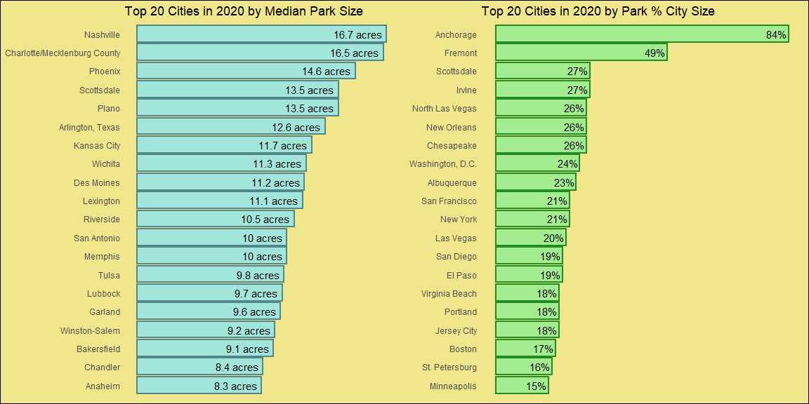
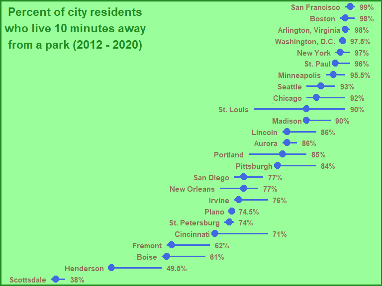
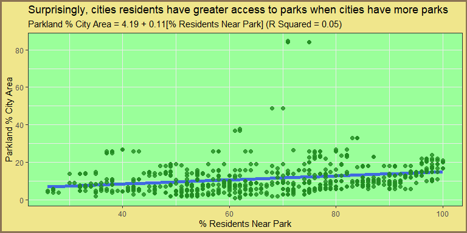
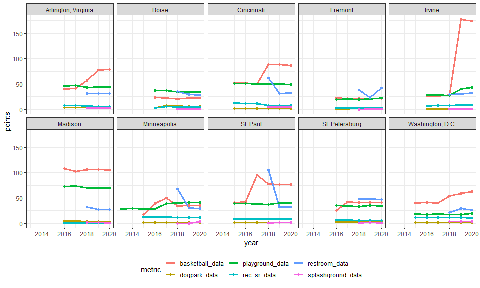
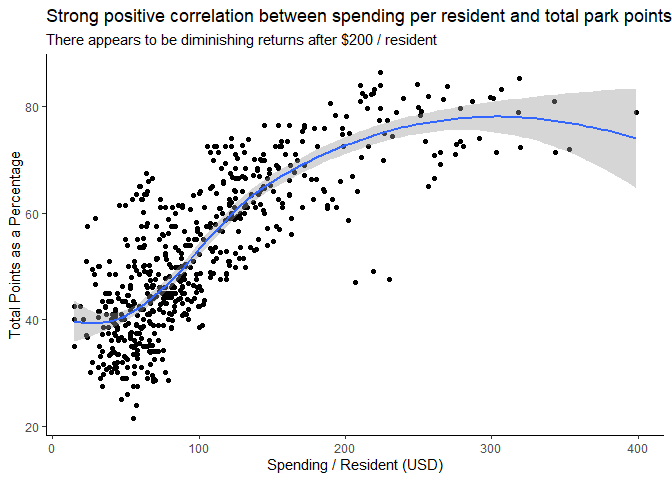

20210622 - Parks Access
================
Nick Cruickshank
6/23/2021

  - [Introduction](#introduction)
      - [Noteworthy Excerpts](#noteworthy-excerpts)
      - [Tidy Data Set](#tidy-data-set)
      - [Yearly rank of cities over
        time](#yearly-rank-of-cities-over-time)
      - [Which cities have the largest
        parks?](#which-cities-have-the-largest-parks)
      - [Which cities have the highest percent of residents within a
        10min
        walk?](#which-cities-have-the-highest-percent-of-residents-within-a-10min-walk)
          - [Distribution](#distribution)
          - [10min Walk by Percent City
            Size](#min-walk-by-percent-city-size)
      - [Distribution of auxillary park types by
        city](#distribution-of-auxillary-park-types-by-city)
      - [Relationship between spending per resident and total
        rank](#relationship-between-spending-per-resident-and-total-rank)

``` r
# library
library(cowplot)
library(forcats)
library(glue)
library(readr)
library(tidyverse)
```

``` r
# data
parks <- readr::read_csv('https://raw.githubusercontent.com/rfordatascience/tidytuesday/master/data/2021/2021-06-22/parks.csv')
```

# Introduction


This weeks project uses data sourced from [The Trust for Public
Land](https://www.tpl.org/parks-and-an-equitable-recovery-parkscore-report).
The article written by
[Citylab](https://www.bloomberg.com/news/articles/2021-05-27/the-cities-where-people-of-color-can-walk-to-a-park)
provides a good starting narrative for park access and this dataset.

## Noteworthy Excerpts

> When the pandemic forced millions of Americans to shelter indoors,
> parks saw a surge in popularity. Parks in North Carolina received an
> all-time high of 20 million visitors in 2020, an uptick of one million
> from the year before. In New York, the number of park-goers topped 78
> million.

> But even as green spaces proved to be a crucial element to people’s
> physical and mental well-being — especially for urban dwellers — the
> pandemic further exposed the disparity in who has access to parks. …
> Low-income communities have access to 42% less than high-income
> neighborhoods.

> The Trust for Public Land (TPL) has kept track of green space
> availability across U.S. metros, using the ParkScore index, which
> measures how well cities are meeting their residents’ need for parks
> based on \[five\] metrics: park access, acreage, investment,
> amenities, … \[and\] equity.

> Its assessment is grounded in the idea that Americans should have park
> access within a 10-minute walk from their home.

This data set explores an 8 timeframe from  to -.

## Tidy Data Set

``` r
# Tidy
tidy_parks <- parks %>%
  mutate(
    park_pct_city_data = as.double(str_remove(park_pct_city_data, "\\%")),
    pct_near_park_data = as.double(str_remove(pct_near_park_data, "\\%")),
    spend_per_resident_data = as.double(str_remove(spend_per_resident_data, "\\$")),
    basketball_data = 10 * basketball_data, # per 100,000 residents
    playground_data = 10 * playground_data, # per 100,000 residents
    rec_sr_data = 5 * rec_sr_data, # per 100,000 residents
    restroom_data = 10 * restroom_data, # per 100,000 residents
    )

city_avg_points <- parks %>%
  group_by(city) %>%
  dplyr::summarise(
    years = n(),
    avg_total_points = mean(total_points, na.rm = TRUE)
    ) %>%
  filter(years > 2) %>%
  arrange(desc(avg_total_points))

top_25_cities <- head(city_avg_points, 25)
top_10_cities <- head(city_avg_points, 10)
```

## Yearly rank of cities over time

Plot year by total points, facet by city. Which cities have gone up or
down

``` r
parks %>%
  filter(
    city %in% top_10_cities$city
  )  %>%
  left_join(city_avg_points) %>%
  ggplot(aes(year, total_points)) + 
  geom_line() + 
  geom_point() + 
  geom_hline(aes(yintercept = avg_total_points), linetype = "dotdash") +
  labs(
    title = "Total park points over time for the cities with the highest average total points",
    subtitle = "Dashed horizontal line represents average total points"
  ) +
  facet_wrap(~ city, ncol = 5) + 
  theme_bw()
```

<!-- -->

Data points don’t look particularly well distributed. Each of these
cities seems to have surged in 2020. I wonder if that is an anomally of
these cities, or a trend seen throughout the dataset.

``` r
parks %>%
  group_by(year) %>%
  dplyr::summarise(avg_total_points = mean(total_points, na.rm = TRUE)) %>%
  ggplot(aes(year, avg_total_points)) + 
  geom_smooth(se = FALSE) + 
  geom_line(size = 1.2) + 
  geom_point(size = 2) + 
  labs(
    title = "Average total points for all cities over time",
    subtitle = "Dataset supports the idea that total points assigned by the TPL during assessments grew a lot in 2020",
    caption = "Looks like the dataset does not include 2014 and 2019 data"
  ) + 
  theme_bw()
```

<!-- -->

## Which cities have the largest parks?

``` r
top_20_parks_med_size <- parks %>%
  filter(year == 2020) %>%
  arrange(desc(med_park_size_data)) %>%
  head(20) %>%
  ggplot(aes(fct_reorder(city, med_park_size_data), med_park_size_data)) + 
  geom_bar(stat = "identity", fill = "cadetblue2", alpha = 0.8, color = "cadetblue4", size = 1.05) + 
  geom_text(aes(label = paste0(med_park_size_data, " acres")), hjust = 1.1) +
  coord_flip() + 
  labs(
    title = "Top 20 Cities in 2020 by Median Park Size"
  ) + 
  theme_minimal() +
  theme(
    axis.title = element_blank(),
    panel.grid = element_blank(),
    axis.text.x = element_blank()
  )

top_20_parks_perc_size <- parks %>%
  filter(year == 2020) %>%
  mutate(park_pct_city_data = as.double(str_remove(park_pct_city_data, "\\%"))) %>%
  arrange(desc(park_pct_city_data)) %>%
  head(20) %>%
  ggplot(aes(fct_reorder(city, park_pct_city_data), park_pct_city_data)) + 
  geom_bar(stat = "identity", fill = "palegreen2", alpha = 0.8, color = "forestgreen", size = 1.05) + 
  geom_text(aes(label = paste0(park_pct_city_data, "%")), hjust = 1.1) +
  coord_flip() + 
  labs(
    title = "Top 20 Cities in 2020 by Park % City Size"
  ) + 
  theme_minimal() +
  theme(
    axis.title = element_blank(),
    panel.grid = element_blank(),
    axis.text.x = element_blank()
  )

park_size_plot <- plot_grid(top_20_parks_med_size, top_20_parks_perc_size) + 
  theme(
    plot.background = element_rect(fill = "khaki")
  )

park_size_plot
```

<!-- -->

## Which cities have the highest percent of residents within a 10min walk?

### Distribution

``` r
access_label <- data.frame(city = "San Francisco", median = 42,
                           label = "Percent of city residents\nwho live 10 minutes away\nfrom a park (2012 - 2020)")

parks %>%
  filter(
    city %in% top_25_cities$city
  ) %>%
  mutate(pct_near_park_data = as.double(str_remove(pct_near_park_data, "\\%"))) %>%
  group_by(city) %>%
  dplyr::summarise(
    min = min(pct_near_park_data),
    median = median(pct_near_park_data),
    max = max(pct_near_park_data)
  ) %>%
  ggplot(aes(fct_reorder(city, median), median)) + 
  geom_pointrange(aes(ymin = min, ymax = max), color = "royalblue", size = 1.1) + 
  geom_text(aes(y = min - 1, label = city), hjust = "right", color = "burlywood4", fontface = "bold") + 
  geom_text(aes(y = max + 1, label = paste0(median, "%")), hjust = "left", color = "burlywood4", fontface = "bold") + 
  geom_text(data = access_label, aes(label = label), vjust = "top",
            size = 6, fontface = "bold", color = "forestgreen") +
  coord_flip(ylim = c(30, 102)) +
  theme_void() + 
  theme(
    plot.background = element_rect(fill = "palegreen1", color = "forestgreen", size = 2)
  )
```

<!-- -->

### 10min Walk by Percent City Size

``` r
# make linear model
park_access_model1 <- lm(formula = park_pct_city_data ~ pct_near_park_data, data = tidy_parks)

# get formula
park_access_model1_intercept <- park_access_model1$coefficients["(Intercept)"]
park_access_model1_weight <- park_access_model1$coefficients["pct_near_park_data"]
park_access_model1_rsq <- summary(park_access_model1)$r.squared

tidy_parks %>%
  ggplot(aes(pct_near_park_data, park_pct_city_data)) + 
  geom_smooth(method = "lm", se = FALSE, color = "royalblue", size = 2) + 
  geom_point(color = "forestgreen", size = 2, alpha = 0.8) + 
  labs(
    title = "Surprisingly, cities residents have greater access to parks when cities have more parks",
    subtitle = glue("Parkland % City Area = {round(park_access_model1_intercept, 2)} + {round(park_access_model1_weight, 2)}[% Residents Near Park] (R Squared = {round(park_access_model1_rsq, 2)})"),
    x = "% Residents Near Park",
    y = "Parkland % City Area"
  ) + 
  theme_bw() + 
  theme(
    panel.background = element_rect(fill = "palegreen1"),
    plot.background = element_rect(fill = "khaki", color = "burlywood4", size = 2)
  )
```

<!-- -->

## Distribution of auxillary park types by city

Pivot `basketball_data`, `dogpark_data`, `playground_data`,
`rec_sr_data`, and `splashground_data`. First you’ll need to standardize
the per capita metrics.

``` r
tidy_parks %>%
  pivot_longer(cols = c(basketball_data, dogpark_data, playground_data, rec_sr_data, restroom_data, splashground_data), values_to = "points", names_to = "metric") %>%
  filter(city %in% top_10_cities$city) %>%
  ggplot(aes(year, points)) + 
  geom_line(aes(color = metric), size = 1.2) +
  geom_point(aes(color = metric), size = 1.5) +
  facet_wrap(~ city, ncol = 5) +
  theme_bw() + 
  theme(
    legend.position = "bottom"
  )
```

<!-- -->

This is all well and good, but what cities have seen the greatest surge
in `total_points` from 2012 to 2020?

## Relationship between spending per resident and total rank

``` r
tidy_parks %>%
  ggplot(aes(spend_per_resident_data, total_pct)) + 
  geom_point() + 
  geom_smooth() + 
  labs(
    title = "Strong positive correlation between spending per resident and total park points",
    subtitle = "There appears to be diminishing returns after $200 / resident",
    x = "Spending / Resident (USD)",
    y = "Total Points as a Percentage"
  ) + 
  theme_classic()
```

<!-- -->
