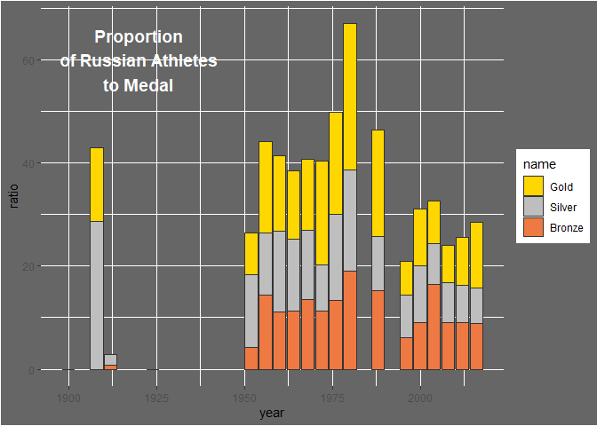

20210727 - Olympics
================
Nick Cruickshank
7/31/2021

  - [Ideas for Visualization](#ideas-for-visualization)
  - [Gold Medal Proportions](#gold-medal-proportions)
  - [Russian Blood Doping](#russian-blood-doping)

``` r
# libraries
library(ggtext)
library(ggstream)
library(readr)
library(tidyverse)
```

``` r
# data
olympics <- readr::read_csv('https://raw.githubusercontent.com/rfordatascience/tidytuesday/master/data/2021/2021-07-27/olympics.csv')
```

# Ideas for Visualization

  - Proportion of Gold Medals Over Time
      - For each year of the olympics, find the proportion of medals for
        each of the Top X nations  
      - Include an other stream for not Top X nations  
  - Russian Blood Doping
      - Do some kind of timeline analysis for Russian athletes  
      - Be sure to replace ‘Soviet Union’ with ‘Russia’
  - Distributions of Weights and/or Heights by Sport

# Gold Medal Proportions

# Russian Blood Doping

[Wikipedia Page for Blood Doping
Scandal](https://en.wikipedia.org/wiki/Doping_in_Russia)

``` r
rus <- olympics %>%
  mutate(team = ifelse(team == "Soviet Union", "Russia", team)) %>%
  filter(
    season == "Summer",
    team == "Russia"
  ) %>%
  group_by(year, city) %>% #and by sport?
  dplyr::summarise(
    athletes = n(),
    gold = sum(medal == "Gold", na.rm = TRUE),
    silver = sum(medal == "Silver", na.rm = TRUE),
    bronze = sum(medal == "Bronze", na.rm = TRUE)
  )
```

``` r
rus %>%
  pivot_longer(cols = c("gold", "silver", "bronze")) %>%
  mutate(
    ratio = 100 * (value / athletes),
    name = factor(str_to_title(name), levels = c("Gold", "Silver", "Bronze"))
  ) %>%
  ggplot() + 
  geom_col(aes(year, ratio, fill = name), color = "grey20") + 
  scale_fill_manual(values = c(
    "Gold" = "gold",
    "Silver" = "gray",
    "Bronze" = "sienna2"
  )) + 
  annotate("text", x = 1920, y = 60, label = "Proportion\nof Russian Athletes\nto Medal", size = 5, fontface = "bold", color = "white") + 
  theme(
    plot.background = element_rect(fill = "gray40"),
    panel.background = element_rect(fill = "gray40")
  )
```

<!-- -->

  - Embellish this plot with historical info at relevant bars
      - 1980 (big spike) was held in Moscow, and tons of (Russian)
        athletes were doping
  - Replace x axis with “City”
  - Highlight years where the most russian athletes won, label with the
    sport  
  - Replace x grid with dashed grid for olympic games
