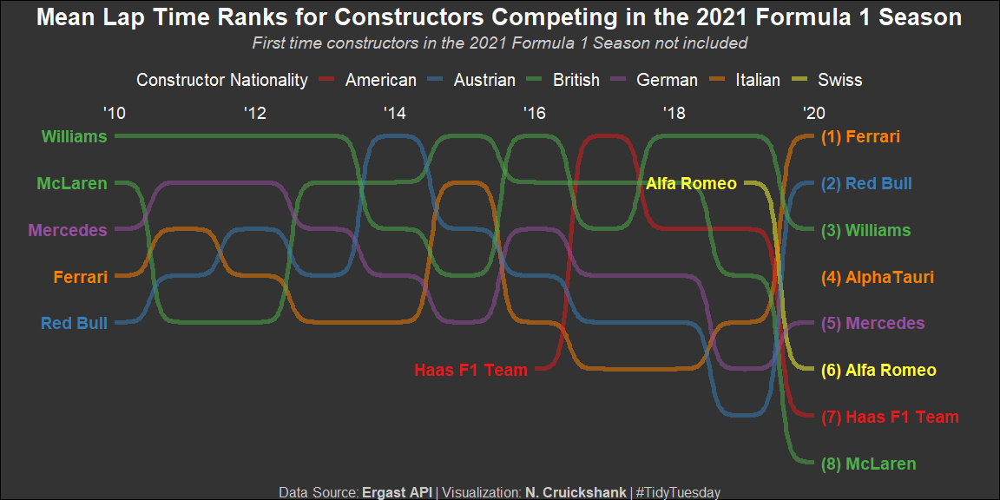

Formula 1 Racing
================
Nick Cruickshank
9/12/2021

-   [Introduction](#introduction)
-   [Prepare for Analysis](#prepare-for-analysis)
    -   [Libraries](#libraries)
    -   [Data](#data)
-   [Analysis](#analysis)
    -   [Data Preparation](#data-preparation)
        -   [Join Tables](#join-tables)
        -   [Tidy f1 for plotting](#tidy-f1-for-plotting)


# Introduction

This week’s [Tidy Tuesday
Project](https://github.com/rfordatascience/tidytuesday/tree/master/data/2021/2021-09-07)
features [Formula 1 Racing](https://en.wikipedia.org/wiki/Formula_One)!
The data is made available through the [Ergast
API](https://ergast.com/mrd/db/#csv). The [data
dictionary](http://ergast.com/docs/f1db_user_guide.txt) can be found at
that same website.

Image from [CHUTTERSNAP](https://unsplash.com/@chuttersnap).

# Prepare for Analysis

## Libraries

``` r
# libraries
library(ggbump)
library(ggtext)
library(readr)
library(tidyverse)
```

## Data

``` r
# data
circuits <- readr::read_csv('https://raw.githubusercontent.com/rfordatascience/tidytuesday/master/data/2021/2021-09-07/circuits.csv')
constructors <- readr::read_csv('https://raw.githubusercontent.com/rfordatascience/tidytuesday/master/data/2021/2021-09-07/constructors.csv')
drivers <- readr::read_csv('https://raw.githubusercontent.com/rfordatascience/tidytuesday/master/data/2021/2021-09-07/drivers.csv')
lap_times <- readr::read_csv('https://raw.githubusercontent.com/rfordatascience/tidytuesday/master/data/2021/2021-09-07/lap_times.csv')
races <- readr::read_csv('https://raw.githubusercontent.com/rfordatascience/tidytuesday/master/data/2021/2021-09-07/races.csv')
results <- readr::read_csv('https://raw.githubusercontent.com/rfordatascience/tidytuesday/master/data/2021/2021-09-07/results.csv')
```

``` r
# circuits head
head(circuits)
```

<div data-pagedtable="false">

<script data-pagedtable-source type="application/json">
{"columns":[{"label":["circuitId"],"name":[1],"type":["dbl"],"align":["right"]},{"label":["circuitRef"],"name":[2],"type":["chr"],"align":["left"]},{"label":["name"],"name":[3],"type":["chr"],"align":["left"]},{"label":["location"],"name":[4],"type":["chr"],"align":["left"]},{"label":["country"],"name":[5],"type":["chr"],"align":["left"]},{"label":["lat"],"name":[6],"type":["dbl"],"align":["right"]},{"label":["lng"],"name":[7],"type":["dbl"],"align":["right"]},{"label":["alt"],"name":[8],"type":["dbl"],"align":["right"]},{"label":["url"],"name":[9],"type":["chr"],"align":["left"]}],"data":[{"1":"1","2":"albert_park","3":"Albert Park Grand Prix Circuit","4":"Melbourne","5":"Australia","6":"-37.84970","7":"144.96800","8":"10","9":"http://en.wikipedia.org/wiki/Melbourne_Grand_Prix_Circuit"},{"1":"2","2":"sepang","3":"Sepang International Circuit","4":"Kuala Lumpur","5":"Malaysia","6":"2.76083","7":"101.73800","8":"18","9":"http://en.wikipedia.org/wiki/Sepang_International_Circuit"},{"1":"3","2":"bahrain","3":"Bahrain International Circuit","4":"Sakhir","5":"Bahrain","6":"26.03250","7":"50.51060","8":"7","9":"http://en.wikipedia.org/wiki/Bahrain_International_Circuit"},{"1":"4","2":"catalunya","3":"Circuit de Barcelona-Catalunya","4":"Montmeló","5":"Spain","6":"41.57000","7":"2.26111","8":"109","9":"http://en.wikipedia.org/wiki/Circuit_de_Barcelona-Catalunya"},{"1":"5","2":"istanbul","3":"Istanbul Park","4":"Istanbul","5":"Turkey","6":"40.95170","7":"29.40500","8":"130","9":"http://en.wikipedia.org/wiki/Istanbul_Park"},{"1":"6","2":"monaco","3":"Circuit de Monaco","4":"Monte-Carlo","5":"Monaco","6":"43.73470","7":"7.42056","8":"7","9":"http://en.wikipedia.org/wiki/Circuit_de_Monaco"}],"options":{"columns":{"min":{},"max":[10]},"rows":{"min":[10],"max":[10]},"pages":{}}}
  </script>

</div>

``` r
# constructors head
head(constructors)
```

<div data-pagedtable="false">

<script data-pagedtable-source type="application/json">
{"columns":[{"label":["constructorId"],"name":[1],"type":["dbl"],"align":["right"]},{"label":["constructorRef"],"name":[2],"type":["chr"],"align":["left"]},{"label":["name"],"name":[3],"type":["chr"],"align":["left"]},{"label":["nationality"],"name":[4],"type":["chr"],"align":["left"]},{"label":["url"],"name":[5],"type":["chr"],"align":["left"]}],"data":[{"1":"1","2":"mclaren","3":"McLaren","4":"British","5":"http://en.wikipedia.org/wiki/McLaren"},{"1":"2","2":"bmw_sauber","3":"BMW Sauber","4":"German","5":"http://en.wikipedia.org/wiki/BMW_Sauber"},{"1":"3","2":"williams","3":"Williams","4":"British","5":"http://en.wikipedia.org/wiki/Williams_Grand_Prix_Engineering"},{"1":"4","2":"renault","3":"Renault","4":"French","5":"http://en.wikipedia.org/wiki/Renault_in_Formula_One"},{"1":"5","2":"toro_rosso","3":"Toro Rosso","4":"Italian","5":"http://en.wikipedia.org/wiki/Scuderia_Toro_Rosso"},{"1":"6","2":"ferrari","3":"Ferrari","4":"Italian","5":"http://en.wikipedia.org/wiki/Scuderia_Ferrari"}],"options":{"columns":{"min":{},"max":[10]},"rows":{"min":[10],"max":[10]},"pages":{}}}
  </script>

</div>

``` r
# drivers head 
head(drivers)
```

<div data-pagedtable="false">

<script data-pagedtable-source type="application/json">
{"columns":[{"label":["driverId"],"name":[1],"type":["dbl"],"align":["right"]},{"label":["driverRef"],"name":[2],"type":["chr"],"align":["left"]},{"label":["number"],"name":[3],"type":["chr"],"align":["left"]},{"label":["code"],"name":[4],"type":["chr"],"align":["left"]},{"label":["forename"],"name":[5],"type":["chr"],"align":["left"]},{"label":["surname"],"name":[6],"type":["chr"],"align":["left"]},{"label":["dob"],"name":[7],"type":["date"],"align":["right"]},{"label":["nationality"],"name":[8],"type":["chr"],"align":["left"]},{"label":["url"],"name":[9],"type":["chr"],"align":["left"]}],"data":[{"1":"1","2":"hamilton","3":"44","4":"HAM","5":"Lewis","6":"Hamilton","7":"1985-01-07","8":"British","9":"http://en.wikipedia.org/wiki/Lewis_Hamilton"},{"1":"2","2":"heidfeld","3":"\\\\N","4":"HEI","5":"Nick","6":"Heidfeld","7":"1977-05-10","8":"German","9":"http://en.wikipedia.org/wiki/Nick_Heidfeld"},{"1":"3","2":"rosberg","3":"6","4":"ROS","5":"Nico","6":"Rosberg","7":"1985-06-27","8":"German","9":"http://en.wikipedia.org/wiki/Nico_Rosberg"},{"1":"4","2":"alonso","3":"14","4":"ALO","5":"Fernando","6":"Alonso","7":"1981-07-29","8":"Spanish","9":"http://en.wikipedia.org/wiki/Fernando_Alonso"},{"1":"5","2":"kovalainen","3":"\\\\N","4":"KOV","5":"Heikki","6":"Kovalainen","7":"1981-10-19","8":"Finnish","9":"http://en.wikipedia.org/wiki/Heikki_Kovalainen"},{"1":"6","2":"nakajima","3":"\\\\N","4":"NAK","5":"Kazuki","6":"Nakajima","7":"1985-01-11","8":"Japanese","9":"http://en.wikipedia.org/wiki/Kazuki_Nakajima"}],"options":{"columns":{"min":{},"max":[10]},"rows":{"min":[10],"max":[10]},"pages":{}}}
  </script>

</div>

``` r
# lap_times head 
head(lap_times)
```

<div data-pagedtable="false">

<script data-pagedtable-source type="application/json">
{"columns":[{"label":["raceId"],"name":[1],"type":["dbl"],"align":["right"]},{"label":["driverId"],"name":[2],"type":["dbl"],"align":["right"]},{"label":["lap"],"name":[3],"type":["dbl"],"align":["right"]},{"label":["position"],"name":[4],"type":["dbl"],"align":["right"]},{"label":["time"],"name":[5],"type":["chr"],"align":["left"]},{"label":["milliseconds"],"name":[6],"type":["dbl"],"align":["right"]}],"data":[{"1":"841","2":"20","3":"1","4":"1","5":"1:38.109","6":"98109"},{"1":"841","2":"20","3":"2","4":"1","5":"1:33.006","6":"93006"},{"1":"841","2":"20","3":"3","4":"1","5":"1:32.713","6":"92713"},{"1":"841","2":"20","3":"4","4":"1","5":"1:32.803","6":"92803"},{"1":"841","2":"20","3":"5","4":"1","5":"1:32.342","6":"92342"},{"1":"841","2":"20","3":"6","4":"1","5":"1:32.605","6":"92605"}],"options":{"columns":{"min":{},"max":[10]},"rows":{"min":[10],"max":[10]},"pages":{}}}
  </script>

</div>

``` r
# races head 
head(races)
```

<div data-pagedtable="false">

<script data-pagedtable-source type="application/json">
{"columns":[{"label":["raceId"],"name":[1],"type":["dbl"],"align":["right"]},{"label":["year"],"name":[2],"type":["dbl"],"align":["right"]},{"label":["round"],"name":[3],"type":["dbl"],"align":["right"]},{"label":["circuitId"],"name":[4],"type":["dbl"],"align":["right"]},{"label":["name"],"name":[5],"type":["chr"],"align":["left"]},{"label":["date"],"name":[6],"type":["date"],"align":["right"]},{"label":["time"],"name":[7],"type":["chr"],"align":["left"]},{"label":["url"],"name":[8],"type":["chr"],"align":["left"]}],"data":[{"1":"1","2":"2009","3":"1","4":"1","5":"Australian Grand Prix","6":"2009-03-29","7":"06:00:00","8":"http://en.wikipedia.org/wiki/2009_Australian_Grand_Prix"},{"1":"2","2":"2009","3":"2","4":"2","5":"Malaysian Grand Prix","6":"2009-04-05","7":"09:00:00","8":"http://en.wikipedia.org/wiki/2009_Malaysian_Grand_Prix"},{"1":"3","2":"2009","3":"3","4":"17","5":"Chinese Grand Prix","6":"2009-04-19","7":"07:00:00","8":"http://en.wikipedia.org/wiki/2009_Chinese_Grand_Prix"},{"1":"4","2":"2009","3":"4","4":"3","5":"Bahrain Grand Prix","6":"2009-04-26","7":"12:00:00","8":"http://en.wikipedia.org/wiki/2009_Bahrain_Grand_Prix"},{"1":"5","2":"2009","3":"5","4":"4","5":"Spanish Grand Prix","6":"2009-05-10","7":"12:00:00","8":"http://en.wikipedia.org/wiki/2009_Spanish_Grand_Prix"},{"1":"6","2":"2009","3":"6","4":"6","5":"Monaco Grand Prix","6":"2009-05-24","7":"12:00:00","8":"http://en.wikipedia.org/wiki/2009_Monaco_Grand_Prix"}],"options":{"columns":{"min":{},"max":[10]},"rows":{"min":[10],"max":[10]},"pages":{}}}
  </script>

</div>

``` r
# results head
head(results)
```

<div data-pagedtable="false">

<script data-pagedtable-source type="application/json">
{"columns":[{"label":["resultId"],"name":[1],"type":["dbl"],"align":["right"]},{"label":["raceId"],"name":[2],"type":["dbl"],"align":["right"]},{"label":["driverId"],"name":[3],"type":["dbl"],"align":["right"]},{"label":["constructorId"],"name":[4],"type":["dbl"],"align":["right"]},{"label":["number"],"name":[5],"type":["dbl"],"align":["right"]},{"label":["grid"],"name":[6],"type":["dbl"],"align":["right"]},{"label":["position"],"name":[7],"type":["chr"],"align":["left"]},{"label":["positionText"],"name":[8],"type":["chr"],"align":["left"]},{"label":["positionOrder"],"name":[9],"type":["dbl"],"align":["right"]},{"label":["points"],"name":[10],"type":["dbl"],"align":["right"]},{"label":["laps"],"name":[11],"type":["dbl"],"align":["right"]},{"label":["time"],"name":[12],"type":["chr"],"align":["left"]},{"label":["milliseconds"],"name":[13],"type":["chr"],"align":["left"]},{"label":["fastestLap"],"name":[14],"type":["chr"],"align":["left"]},{"label":["rank"],"name":[15],"type":["chr"],"align":["left"]},{"label":["fastestLapTime"],"name":[16],"type":["chr"],"align":["left"]},{"label":["fastestLapSpeed"],"name":[17],"type":["chr"],"align":["left"]},{"label":["statusId"],"name":[18],"type":["dbl"],"align":["right"]}],"data":[{"1":"1","2":"18","3":"1","4":"1","5":"22","6":"1","7":"1","8":"1","9":"1","10":"10","11":"58","12":"1:34:50.616","13":"5690616","14":"39","15":"2","16":"1:27.452","17":"218.300","18":"1"},{"1":"2","2":"18","3":"2","4":"2","5":"3","6":"5","7":"2","8":"2","9":"2","10":"8","11":"58","12":"+5.478","13":"5696094","14":"41","15":"3","16":"1:27.739","17":"217.586","18":"1"},{"1":"3","2":"18","3":"3","4":"3","5":"7","6":"7","7":"3","8":"3","9":"3","10":"6","11":"58","12":"+8.163","13":"5698779","14":"41","15":"5","16":"1:28.090","17":"216.719","18":"1"},{"1":"4","2":"18","3":"4","4":"4","5":"5","6":"11","7":"4","8":"4","9":"4","10":"5","11":"58","12":"+17.181","13":"5707797","14":"58","15":"7","16":"1:28.603","17":"215.464","18":"1"},{"1":"5","2":"18","3":"5","4":"1","5":"23","6":"3","7":"5","8":"5","9":"5","10":"4","11":"58","12":"+18.014","13":"5708630","14":"43","15":"1","16":"1:27.418","17":"218.385","18":"1"},{"1":"6","2":"18","3":"6","4":"3","5":"8","6":"13","7":"6","8":"6","9":"6","10":"3","11":"57","12":"\\\\N","13":"\\\\N","14":"50","15":"14","16":"1:29.639","17":"212.974","18":"11"}],"options":{"columns":{"min":{},"max":[10]},"rows":{"min":[10],"max":[10]},"pages":{}}}
  </script>

</div>

# Analysis

Average lap time by constructor and constructor nationality for each of
the most recent F1 seasons for constructors participating in the 2021
Season. I figured that Fastest Lap Time was too easy, and also not quite
as meaningful for consistent performance.

## Data Preparation

### Join Tables

``` r
# join relevant datasets
## prepare race df for joining
race_tidy <- races %>%
  left_join(circuits, by = "circuitId", suffix = c("_race", "_circuit")) %>%
  select(raceId, year, name_race, name_circuit, location, country)

## prepare drivers df for joining
driver_tidy <- drivers %>%
  mutate(name_driver = paste(forename, surname), nationality_driver = nationality) %>%
  select(driverId, code, name_driver, nationality_driver)

## prepare results df for joining
### it provides a bridge between racers and constructors
results_tidy <- results %>%
  select(resultId, raceId, driverId, constructorId, fastestLapTime)

## join all tables together and remove irrelevant columns
f1 <- lap_times %>%
  left_join(results_tidy, by = c("raceId", "driverId")) %>%
  left_join(race_tidy, by = "raceId") %>%
  left_join(constructors, by = "constructorId") %>%
  left_join(driver_tidy, by = "driverId") %>%
  select(-ends_with("Id"), -url)
```

The following dataframe most likely has more information than is
strictly needed for the rank charts provided. But it could also likely
be used for extracting more insights regarding lap times.

``` r
## f1 head
head(f1)
```

<div data-pagedtable="false">

<script data-pagedtable-source type="application/json">
{"columns":[{"label":["lap"],"name":[1],"type":["dbl"],"align":["right"]},{"label":["position"],"name":[2],"type":["dbl"],"align":["right"]},{"label":["time"],"name":[3],"type":["chr"],"align":["left"]},{"label":["milliseconds"],"name":[4],"type":["dbl"],"align":["right"]},{"label":["fastestLapTime"],"name":[5],"type":["chr"],"align":["left"]},{"label":["year"],"name":[6],"type":["dbl"],"align":["right"]},{"label":["name_race"],"name":[7],"type":["chr"],"align":["left"]},{"label":["name_circuit"],"name":[8],"type":["chr"],"align":["left"]},{"label":["location"],"name":[9],"type":["chr"],"align":["left"]},{"label":["country"],"name":[10],"type":["chr"],"align":["left"]},{"label":["constructorRef"],"name":[11],"type":["chr"],"align":["left"]},{"label":["name"],"name":[12],"type":["chr"],"align":["left"]},{"label":["nationality"],"name":[13],"type":["chr"],"align":["left"]},{"label":["code"],"name":[14],"type":["chr"],"align":["left"]},{"label":["name_driver"],"name":[15],"type":["chr"],"align":["left"]},{"label":["nationality_driver"],"name":[16],"type":["chr"],"align":["left"]}],"data":[{"1":"1","2":"1","3":"1:38.109","4":"98109","5":"1:29.844","6":"2011","7":"Australian Grand Prix","8":"Albert Park Grand Prix Circuit","9":"Melbourne","10":"Australia","11":"red_bull","12":"Red Bull","13":"Austrian","14":"VET","15":"Sebastian Vettel","16":"German"},{"1":"2","2":"1","3":"1:33.006","4":"93006","5":"1:29.844","6":"2011","7":"Australian Grand Prix","8":"Albert Park Grand Prix Circuit","9":"Melbourne","10":"Australia","11":"red_bull","12":"Red Bull","13":"Austrian","14":"VET","15":"Sebastian Vettel","16":"German"},{"1":"3","2":"1","3":"1:32.713","4":"92713","5":"1:29.844","6":"2011","7":"Australian Grand Prix","8":"Albert Park Grand Prix Circuit","9":"Melbourne","10":"Australia","11":"red_bull","12":"Red Bull","13":"Austrian","14":"VET","15":"Sebastian Vettel","16":"German"},{"1":"4","2":"1","3":"1:32.803","4":"92803","5":"1:29.844","6":"2011","7":"Australian Grand Prix","8":"Albert Park Grand Prix Circuit","9":"Melbourne","10":"Australia","11":"red_bull","12":"Red Bull","13":"Austrian","14":"VET","15":"Sebastian Vettel","16":"German"},{"1":"5","2":"1","3":"1:32.342","4":"92342","5":"1:29.844","6":"2011","7":"Australian Grand Prix","8":"Albert Park Grand Prix Circuit","9":"Melbourne","10":"Australia","11":"red_bull","12":"Red Bull","13":"Austrian","14":"VET","15":"Sebastian Vettel","16":"German"},{"1":"6","2":"1","3":"1:32.605","4":"92605","5":"1:29.844","6":"2011","7":"Australian Grand Prix","8":"Albert Park Grand Prix Circuit","9":"Melbourne","10":"Australia","11":"red_bull","12":"Red Bull","13":"Austrian","14":"VET","15":"Sebastian Vettel","16":"German"}],"options":{"columns":{"min":{},"max":[10]},"rows":{"min":[10],"max":[10]},"pages":{}}}
  </script>

</div>

### Tidy f1 for plotting

``` r
# find out which constructors had the fastest average lap time in the most recent year of the race
f1_2021_constructors <- f1 %>%
  filter(year == 2021) %>%
  group_by(name) %>%
  dplyr::summarise(mean_lap_time = mean(milliseconds)) %>%
  ungroup() %>%
  pull(name)

# reshape for rank plotting
f1_ranks <- f1 %>%
  filter(
    name %in% f1_2021_constructors,
    (year >= 2010 & year != 2021)
  ) %>%
  group_by(year, name, nationality) %>%
  dplyr::summarise(
    total_laps = n(),
    distinct_drivers = n_distinct(name_driver),
    mean_lap_time_ms = mean(milliseconds),
    mean_lap_time_min = mean(milliseconds) / 60000
  ) %>%
  ungroup() %>%
  group_by(year) %>%
  mutate(rank = rank(-mean_lap_time_min, ties = "random")) %>%
  ungroup() %>%
  group_by(name) %>%
  mutate(
    start_year = ifelse((year == first(year) & (first(year) != last(year))), year, NA),
    start_label = ifelse((year == first(year) & (first(year) != last(year))), name, NA),
    end_year = ifelse(year == last(year), year, NA),
    end_label = ifelse(year == last(year), paste0("(", rank, ") ",name), NA)
  )
```

Rank plot, where x axis is year of performance and y axis is constructor
who participated in 2021 F1 Season.

Formula 1 2021 is still ongoing.

``` r
f1_ranks %>%
  ggplot(aes(year, rank, color = nationality, group = name)) + 
  geom_bump(lwd = 2, alpha = 0.5) + 
  annotate("text", x = seq(2010, 2020, 2), y = 0.5, label = paste0("'", seq(10, 20, 2)), color = "grey98", size = 5) + 
  geom_text(
    aes(x = start_year, label = start_label, color = nationality),
    hjust = 1, nudge_x = -0.1, show.legend = FALSE, fontface = "bold", size  = 5
  ) +
  geom_text(
    aes(x = end_year, label = end_label, color = nationality),
    hjust = 0, nudge_x = 0.1, show.legend = FALSE, fontface = "bold", size  = 5
  ) + 
  expand_limits(x = c(2009, 2022)) + 
  scale_y_reverse(breaks = c(1:10)) +
  scale_color_brewer(palette = "Set1") +
  guides(color = guide_legend(nrow = 1, title = "Constructor Nationality")) +
  labs(
    title = "Mean Lap Time Ranks for Constructors Competing in the 2021 Formula 1 Season",
    subtitle = "First time constructors in the 2021 Formula 1 Season not included<br>",
    x = "Year",
    y = "Rank",
    color = "",
    caption = "Data Source: <b>Ergast API</b> |  Visualization: <b>N. Cruickshank</b> | #TidyTuesday",
  ) +
  theme_void() + 
  theme(
    legend.position = "top",
    plot.title = element_textbox(hjust = 0.5, size = 20, face = "bold", color = "grey98"),
    plot.subtitle = element_textbox(hjust = 0.5, size = 14, face = "italic", color = "grey80"),
    plot.caption = element_textbox(hjust = 0.5, size = 12, color = "grey80"),
    plot.background = element_rect(fill = "grey20"),
    legend.text = element_text(size = 15, color = "grey98"),
    legend.title = element_text(size = 15, color = "grey98")
  )
```

<!-- -->
