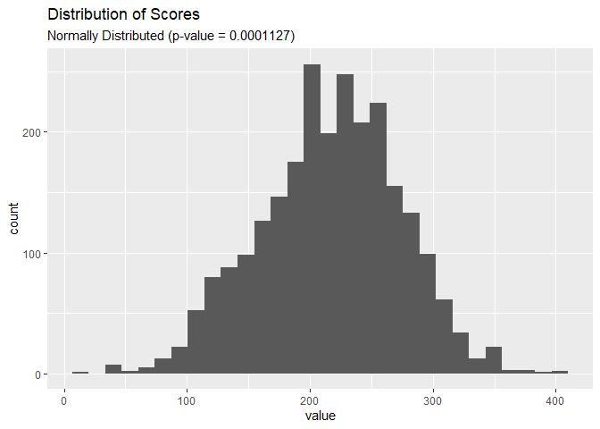

Cricket
================
Nick Cruickshank
12/4/2021

-   [Introduction](#introduction)
-   [Analysis](#analysis)
    -   [EDA](#eda)
        -   [Most Represented Teams](#most-represented-teams)
        -   [Distribution of Scores](#distribution-of-scores)
        -   [Which teams have the highest win
            rate?](#which-teams-have-the-highest-win-rate)
        -   [Is the player of the match more often on the winnning team,
            or the losing
            team?](#is-the-player-of-the-match-more-often-on-the-winnning-team-or-the-losing-team)
        -   [When and where do most games
            happen?](#when-and-where-do-most-games-happen)
    -   [Tidy](#tidy)
    -   [Visualization](#visualization)

# Introduction

This week’s [Tidy Tuesday
Project](https://github.com/rfordatascience/tidytuesday/tree/master/data/2021/2021-11-30)
features data about [Cricket](https://en.wikipedia.org/wiki/Cricket)
from [ESPN Cricket](https://www.espncricinfo.com/).

> Cricket is a bat-and-ball game played between two teams of eleven
> players on a field at the centre of which is a 22-yard (20-metre)
> pitch with a wicket at each end, each comprising two bails balanced on
> three stumps. The game proceeds when a player on the fielding team,
> called the bowler, “bowls” (propels) the ball from one end of the
> pitch towards the wicket at the other end. The batting side’s players
> score runs by striking the bowled ball with a bat and running between
> the wickets, while the bowling side tries to prevent this by keeping
> the ball within the field and getting it to either wicket, and dismiss
> each batter (so they are “out”). Means of dismissal include being
> bowled, when the ball hits the stumps and dislodges the bails, and by
> the fielding side either catching a hit ball before it touches the
> ground, or hitting a wicket with the ball before a batter can cross
> the crease line in front of the wicket to complete a run. When ten
> batters have been dismissed, the innings ends and the teams swap
> roles. The game is adjudicated by two umpires, aided by a third umpire
> and match referee in international matches.

> A One Day International (ODI) is a form of limited overs cricket,
> played between two teams with international status, in which each team
> faces a fixed number of overs, currently 50, with the game lasting up
> to 9 hours.\[1\]\[2\] The Cricket World Cup, generally held every four
> years, is played in this format. One Day International matches are
> also called Limited Overs Internationals (LOI), although this generic
> term may also refer to Twenty20 International matches. They are major
> matches and considered the highest standard of List A, limited-overs
> competition.

> The Cricket World Cup (officially known as ICC Men’s Cricket World
> Cup)\[2\] is the international championship of One Day International
> (ODI) cricket. The event is organised by the sport’s governing body,
> the International Cricket Council (ICC), every four years, with
> preliminary qualification rounds leading up to a finals tournament.
> The tournament is one of the world’s most viewed sporting events and
> is considered the “flagship event of the international cricket
> calendar” by the ICC

# Analysis

``` r
# libraries
library(forcats)
library(ggnetwork)
library(ggtext)
library(glue)
library(readr)
library(tidyverse)
```

``` r
# data
matches <- readr::read_csv('https://raw.githubusercontent.com/rfordatascience/tidytuesday/master/data/2021/2021-11-30/matches.csv')
```

``` r
# head
head(matches)
```

    ## # A tibble: 6 x 24
    ##   match_id   team1        team2 score_team1 score_team2 wickets_team2 wickets_team
    ##   <chr>      <chr>        <chr>       <dbl>       <dbl>         <dbl>        <dbl>
    ## 1 ODI # 1028 West Indies  Aust~         172         173             9            9
    ## 2 ODI # 1029 West Indies  Sri ~         194         124            10           10
    ## 3 ODI # 1030 Sri Lanka    West~         102         104            10            3
    ## 4 ODI # 1031 West Indies  Aust~         231         217            10           10
    ## 5 ODI # 1032 Australia    Sri ~         213         214             5            7
    ## 6 ODI # 1033 South Africa Engl~         211         205             8           10
    ## # ... with 17 more variables: team1_away_or_home <chr>, team2_home_away <chr>,
    ## #   winner <chr>, margin <dbl>, margin_type <chr>, time_of_day <chr>,
    ## #   series <chr>, player_of_match <chr>, player_of_match_team <chr>,
    ## #   venue <chr>, toss <chr>, toss_decision <chr>, ball_remaining <chr>,
    ## #   ground <chr>, ground_city <chr>, ground_country <chr>, match_date <chr>

## EDA

### Most Represented Teams

Pretty big cut off after the top 9 teams.

``` r
team_counts <- matches %>%
  select(team1, team2) %>%
  pivot_longer(cols = c("team1", "team2")) %>%
  count(value, sort = TRUE)

relevant_teams <- team_counts %>%
  head(10) %>%
  pull(value)

team_counts %>%
  ggplot(aes(n, fct_reorder(value, n))) + 
  geom_bar(stat = "identity") + 
  labs(title = "Very big cutoff after top 11 teams")
```

<!-- -->

### Distribution of Scores

``` r
score_dist <- matches %>%
  select(score_team1, score_team2) %>%
  pivot_longer(cols = c("score_team1", "score_team2")) 

shapiro.test(score_dist$value)
```

    ## 
    ##  Shapiro-Wilk normality test
    ## 
    ## data:  score_dist$value
    ## W = 0.99707, p-value = 0.0001127

``` r
score_dist %>%
  ggplot() + 
  geom_histogram(aes(value)) + 
  labs(
    title = "Distribution of Scores",
    subtitle = "Normally Distributed (p-value = 0.0001127)"
  )
```

<!-- -->

### Which teams have the highest win rate?

``` r
matches %>%
  select(team1, team2, winner) %>%
  pivot_longer(cols = c("team1", "team2")) %>%
  mutate(win = ifelse(winner == value, 1, 0)) %>%
  group_by(value) %>%
  dplyr::summarise(
    games = n(),
    wins = sum(win, na.rm = TRUE)
  ) %>%
  ungroup() %>%
  mutate(
    win_rate = wins / games,
    disp = ifelse(win_rate > 0.5, "Positive", "Negative")
  ) %>%
  filter(win_rate > 0) %>%
  arrange(desc(win_rate)) %>%
  ggplot(aes(win_rate, fct_reorder(value, win_rate))) + 
  geom_vline(xintercept = 0.5, linetype = "dashed") +
  geom_bar(aes(color = disp), fill = "white", stat = "identity", size = 2) + 
  geom_text(aes(label = paste(round(100 * win_rate, 2), "% (", wins, " out of ", games, " games)")), 
            hjust = -0.1, color = "grey30") + 
  scale_color_manual(values = c(
    "Negative" = "red",
    "Positive" = "green3"
  )) + 
  scale_y_discrete(name = NULL) + 
  scale_x_continuous(limits = c(0, 1.25), expand = c(0,0), name = NULL) + 
  labs(
    title = "Only 5 of the 21 represented teams have a positive win rate"
  ) +
  theme_minimal() + 
  theme(
    legend.position = "none",
    panel.grid = element_blank(),
    axis.ticks.x = element_blank(),
    axis.text.x = element_blank()
  )
```

<!-- -->

### Is the player of the match more often on the winnning team, or the losing team?

Perhaps not surprisingly, the Player of the Match is most often on the
winning team.

``` r
matches %>%
  select(winner, player_of_match_team) %>%
  mutate(disp = ifelse(winner == player_of_match_team, "Winner", "Loser")) %>%
  count(disp, sort = TRUE)
```

    ## # A tibble: 2 x 2
    ##   disp       n
    ##   <chr>  <int>
    ## 1 Winner  1150
    ## 2 Loser     87

### When and where do most games happen?

``` r
matches %>%
  count(time_of_day, sort = TRUE)
```

    ## # A tibble: 2 x 2
    ##   time_of_day       n
    ##   <chr>         <int>
    ## 1 Day             721
    ## 2 Day and night   516

``` r
matches %>%
  count(venue, sort = TRUE) %>%
  head(10)
```

    ## # A tibble: 10 x 2
    ##    venue                                     n
    ##    <chr>                                 <int>
    ##  1 Sharjah Cricket Association Stadium     101
    ##  2 R Premadasa Stadium, Colombo             55
    ##  3 Harare Sports Club                       49
    ##  4 Bangabandhu National Stadium, Dhaka      46
    ##  5 Gymkhana Club Ground, Nairobi            36
    ##  6 Sinhalese Sports Club Ground, Colombo    36
    ##  7 Sydney Cricket Ground                    33
    ##  8 Melbourne Cricket Ground                 31
    ##  9 Queens Sports Club, Bulawayo             31
    ## 10 Gaddafi Stadium, Lahore                  28

## Tidy

``` r
# tidy


## alphabetically sort pairings and ensure no duplicates
match_pairs <- matches %>%
  select(match_id, team1, team2) %>%
  pivot_longer(cols = c("team1", "team2"), names_to = "team_number", values_to = "team") %>%
  filter(team %in% relevant_teams) %>%
  group_by(match_id) %>%
  summarize(pair = as.character(glue_collapse(sort(team), sep = "-"))) %>%
  ungroup() %>%
  mutate(dash = str_count(pair, "-")) %>%
  filter(dash > 0) %>%
  select(-dash)

# plot coordinates by team
team_coords <- tibble(
  team1 = sort(relevant_teams),
  team2 = sort(relevant_teams),
  coord = c("2,1", "4,1", "5,3", "5,5", "5,7", "4,9", "2,9", "1,7", "1,5", "1,3")
) 

team_coords2 <- team_coords %>%
  select(team1, coord) %>%
  separate(coord, into = c("x", "y"), sep = ",") %>%
  mutate(x = as.double(x), y = as.double(y))

# create plottable df
network <- matches %>%
  inner_join(match_pairs, by = "match_id") %>%
  select(pair, margin, winner) %>%
  separate(col = "pair", into = c("team1", "team2"), sep = "-", remove = FALSE) %>%
  mutate(side = ifelse(winner == team1, "left", "right")) %>%
  pivot_longer(cols = c("team1", "team2")) %>%
  group_by(pair, side) %>%
  dplyr::summarise(
    margin_adj = mean(margin, na.rm = TRUE)
  ) %>% 
  ungroup() %>%
  pivot_wider(id_cols = "pair", values_from = margin_adj, names_from = "side") %>%
  separate(pair, into = c("team1", "team2"), sep = "-", remove = FALSE) %>%
  mutate(
    left = replace_na(left, 0),
    right = replace_na(right, 0),
    margin_delta = abs(left - right),
    in_favor_of = ifelse(left - right > 0, team1, team2)
  ) %>%
  select(-left, -right) %>%
  left_join(select(team_coords, team1, coord), by = "team1") %>%
  rename(c("team1_coord" = "coord")) %>%
  left_join(select(team_coords, team2, coord), by = "team2") %>%
  rename(c("team2_coord" = "coord")) %>%
  separate(team1_coord, into = c("x", "y"), sep = ",") %>%
  separate(team2_coord, into = c("xend", "yend"), sep = ",") %>%
  mutate(
    x = as.double(x),
    y = as.double(y),
    xend = as.double(xend),
    yend = as.double(yend),
    margin_bin = case_when(
      margin_delta < 20 ~ "0 - 20",
      margin_delta < 40 ~ "20 - 40",
      margin_delta >= 40 ~ "40+"
    )
  )
```

Delta = the difference in the average margin when the left team wins as
opposed to the average margin when the right team wins. - High Positive
Value = Left wins by a wider margin when they win - High Negative Value
= Right wins by a wider margin when they win

## Visualization

Create a network plot where each node is a team and the edges are the
average margin between those teams

``` r
# network plot of teams
network %>%
  ggplot() +
  geom_edges(aes(x = x, y = y, xend = xend, yend = yend, color = in_favor_of, size = margin_bin, linetype = margin_bin), curvature = 0.2) +
  #geom_nodes(aes(x, y, color = team1), size = 10) + 
  geom_point(data = team_coords2, aes(x, y, color =  team1), size = 10) +
  # ggrepel::geom_text_repel(
  #   data = team_coords2, 
  #   aes(x, y, label = team1),
  #   hjust = 0, color = "white"
  # ) + 
  geom_text(
    data = filter(team_coords2, x <= 3),
    aes(x - 0.25, y, label = team1),
    color = "white", hjust = 1
  ) +
  geom_text(
    data = filter(team_coords2, x > 3),
    aes(x + 0.25, y, label = team1),
    color = "white", hjust = 0
  ) +
  # labels and legend
  annotate("text", x = 3, y = 13.5, label = "Cricket Network Analysis", size = 10, fontface = "bold", color = "white") +
  annotate("text", x = 3, y = 13, label = "Crushing Victories in Team Pairings", size = 8, fontface = "bold", color = "white") + 
  annotate(
    "segment", 
    x = c(1, 2.5, 4), xend = c(2, 3.5, 5), y = c(11, 11, 11), yend = c(11, 11, 11), 
    linetype = c("dashed", "longdash", "solid"), color = "white", size = c(1, 2, 3)
  ) +
  annotate("point", x = c(1, 2.5, 4), y = c(11, 11, 11), size = 7, color = "white") + 
  annotate("text", x = c(1, 2.5, 4), y = 11, label = "A", color = "grey10") + 
  annotate("point", x = c(2, 3.5, 5), y = 11, size = 7, color = "white") + 
  annotate("text", x = c(2, 3.5, 5), y = 11, label = "B", color = "grey10") + 
  annotate("text", x = 3, y = 12.25, label = "The average margin of victory when Team A wins is", color = "white", size = 5) +
  annotate("text", x = 1.5, y = 11.5, label = "slightly larger (0 - 20)", color = "white", lineheight = 0.8) +
  annotate("text", x = 3, y = 11.5, label = "larger (20 - 40)", color = "white", lineheight = 0.8) +
  annotate("text", x = 4.5, y = 11.5, label = "much larger (40+)", color = "white", lineheight = 0.8) +
  annotate("text", x = 3, y = 10.25, label = "than the average margin of victory when Team B wins.", color = "white", size = 5) +
  labs(caption = "Data Source: <b>ESPN Cricinfo</b> |  Visualization: <b>N. Cruickshank</b> | #TidyTuesday") +
  # coords, scales, themes, etc
  coord_cartesian(xlim = c(0, 6), ylim = c(0, 14), expand = c(0,0)) + 
  scale_color_brewer(palette = "Paired", guide = "none") + 
  scale_size_manual(values = c(
    "0 - 20" = 1,
    "20 - 40" = 2,
    "40+" = 3
  )) +
  scale_linetype_manual(values = c(
    "0 - 20" = "dashed",
    "20 - 40" = "longdash",
    "40+" = "solid"
  )) +
  theme_void() + 
  theme(
    legend.position = "none",
    legend.text = element_text(color = "white"),
    plot.background = element_rect(fill = "grey10"),
    plot.caption = element_textbox(hjust = 0.5, color = "white")

  )
```

<!-- -->
