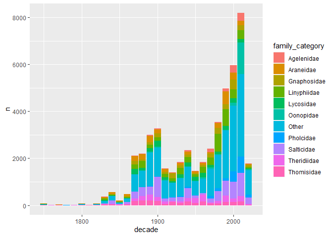

Spiders
================
Nick Cruickshank
12/11/2021

-   [Introduction](#introduction)
-   [Analysis](#analysis)
    -   [Exploratory Analysis](#exploratory-analysis)
        -   [Counts](#counts)
        -   [Publications Over Time](#publications-over-time)
    -   [Studying Others Work](#studying-others-work)
    -   [Visualization](#visualization)
    -   [Inspirational Analysis](#inspirational-analysis)


# Introduction

Data for this week’s [Tidy Tuesday
Project](https://github.com/rfordatascience/tidytuesday/tree/master/data/2021/2021-12-07)
comes from the [World Spider
Database](https://wsc.nmbe.ch/dataresources).

Image kudos to [Erop Kamelev](https://unsplash.com/@ekamelev)

# Analysis

``` r
# libraries
library(forcats)
library(ggforce)
library(ggridges)
library(ggtext)
library(glue)
library(lubridate)
library(readr)
library(tidyverse)
```

``` r
# data
spiders <- readr::read_csv('https://raw.githubusercontent.com/rfordatascience/tidytuesday/master/data/2021/2021-12-07/spiders.csv')
spiders
```

    ## # A tibble: 49,785 x 10
    ##    speciesId species_lsid      family   genus  species  subspecies author   year
    ##        <dbl> <chr>             <chr>    <chr>  <chr>    <chr>      <chr>   <dbl>
    ##  1         1 urn:lsid:nmbe.ch~ Actinop~ Actin~ caraiba  <NA>       Simon    1889
    ##  2         2 urn:lsid:nmbe.ch~ Actinop~ Actin~ crassip~ <NA>       Keyser~  1891
    ##  3         3 urn:lsid:nmbe.ch~ Actinop~ Actin~ cucutae~ <NA>       Mello-~  1941
    ##  4         4 urn:lsid:nmbe.ch~ Actinop~ Actin~ dubioma~ <NA>       Mello-~  1923
    ##  5         5 urn:lsid:nmbe.ch~ Actinop~ Actin~ echinus  <NA>       Mello-~  1949
    ##  6         6 urn:lsid:nmbe.ch~ Actinop~ Actin~ fractus  <NA>       Mello-~  1920
    ##  7         7 urn:lsid:nmbe.ch~ Actinop~ Actin~ harti    <NA>       Pocock   1895
    ##  8         8 urn:lsid:nmbe.ch~ Actinop~ Actin~ insignis <NA>       Holmbe~  1881
    ##  9         9 urn:lsid:nmbe.ch~ Actinop~ Actin~ liodon   <NA>       Ausser~  1875
    ## 10        10 urn:lsid:nmbe.ch~ Actinop~ Actin~ longipa~ <NA>       C. L. ~  1842
    ## # ... with 49,775 more rows, and 2 more variables: parentheses <dbl>,
    ## #   distribution <chr>

## Exploratory Analysis

### Counts

Family

``` r
count(spiders, family, sort = TRUE) %>%
  head(10)
```

    ## # A tibble: 10 x 2
    ##    family          n
    ##    <chr>       <int>
    ##  1 Salticidae   6387
    ##  2 Linyphiidae  4719
    ##  3 Araneidae    3084
    ##  4 Gnaphosidae  2583
    ##  5 Theridiidae  2538
    ##  6 Lycosidae    2440
    ##  7 Thomisidae   2152
    ##  8 Oonopidae    1888
    ##  9 Pholcidae    1849
    ## 10 Agelenidae   1350

``` r
top_families <- count(spiders, family, sort = TRUE) %>%
  head(10) %>%
  pull(family)
```

Genus

``` r
count(spiders, genus, sort = TRUE) %>%
  head(10)
```

    ## # A tibble: 10 x 2
    ##    genus           n
    ##    <chr>       <int>
    ##  1 Theridion     585
    ##  2 Araneus       570
    ##  3 Pardosa       535
    ##  4 Clubiona      517
    ##  5 Zelotes       396
    ##  6 Pholcus       361
    ##  7 Tetragnatha   323
    ##  8 Dysdera       294
    ##  9 Xysticus      293
    ## 10 Oxyopes       290

### Publications Over Time

If you want to plot something over time, it may be more meaningful to
rollup to the week level.

``` r
spiders %>%
  mutate(
    family_category = ifelse(family %in% top_families, family, "Other"),
    decade = year - year %% 10
  ) %>%
  count(family_category, decade) %>%
  ggplot(aes(decade, n)) + 
  geom_bar(aes(fill = family_category), stat = "identity")
```

<!-- -->

## Studying Others Work

Analysis inspired by [Ralitza
Soultanova](https://github.com/RalitzaSoultanova/TidyTuesday_DataViz/blob/main/2021_w_50/Spiders.r)

``` r
# # specific libraries
# library(treemap)
# library(data.tree)
# library(DiagrammeR)
# library(networkD3)
# 
# # data
# spiders_Balkans <- filter(spiders, grepl("Bulgaria|Albania|Greece|Bosnia|Kosovo|Macedonia|Montenegro|Romania|Serbia", distribution))
# 
# # can be a mutate paste0() function
# spiders_Balkans$pathString <- paste("spiders_Balkans", spiders_Balkans$family, spiders_Balkans$genus, sep = "/")
# 
# population <- as.Node(spiders_Balkans)
# print(population, "species", limit = 50)
# 
# # define hierarchy (family / genus)
# spiders_Balkans$pathString <- paste("Spiders", spiders_Balkans$family, spiders_Balkans$genus, sep = "|")
# 
# ## convert to node
# spiders_Balkans <- as.Node(spiders_Balkans, pathDelimiter = "|")
# useRtreeList <- ToListExplicit(spiders_Balkans, unname = TRUE)
# 
# radialNetwork(
#   useRtreeList,
#   fontSize = 7,
#   fontFamily = "sans serif", linkColour = "#ccc", nodeColour = "#fff",
#   nodeStroke = "steelblue", textColour = "#111", opacity = 1,
#   margin = NULL
# )
```

## Visualization

``` r
# tidy

## clean up the distributions and separate rows
spider_countries <- spiders %>%
  select(family, genus, species, year, distribution) %>%
  # clean up the distribution column
  mutate(
    ## make lower case for easier cleaning
    country = str_to_lower(distribution),
    country = str_remove(country, "introduced (to )?(both|the)?"), # remove this nonsense
    country = str_remove(country, "\\(.*\\)"), # remove everything between brackets
    country = str_replace(country, " (or|to) ", ", "), 
    country = str_replace_all(country, " (and|and\\/or) ", ", "),
    country = str_replace(country, "is\\.", "island"),
    country = str_remove(country, "\\?"),
    country = str_replace(country, "\\.", ","),
    ## return to upper case before moving forward
    country = str_to_title(country)
  ) %>%
  separate_rows(country, sep = ", ") %>%
  # further cleaning after separate_rows()
  mutate(
    country = str_trim(country),
    country = str_remove(country, "(\\?|,|\\.)"),
    country = ifelse(str_detect(country, "Canary Is"), "Canary Island", country),
    country = ifelse(str_detect(country, "Cape Verde"), "Cape Verde Island", country),
    country = ifelse(str_detect(country, "Austral"), "Australia", country)
  ) %>%
  filter(
    !(country %in% c("", "Europe", "Central Asia", "East Africa", "North America"))
  )

## create a list of countries to plot
plottable_countries <- spider_countries %>%
  count(country, sort = TRUE) %>%
  # THIS CONTROLS HOW MANY PLOT ROWS
  head(50) %>%
  #filter(n >= 200) %>% 
  pull(country)

deg_adj <- 360 / length(plottable_countries)

## create the relevant families
top_spider_families <- spider_countries %>%
  count(family, sort = TRUE) %>%
  head(3) %>% # THIS CONTROLS HOW MANY COLORS THERE ARE
  pull(family)

## create plottable dataframe
spider_countries2 <- spider_countries %>%
  filter(country %in% plottable_countries) %>%
  mutate(family2 = ifelse(family %in% top_spider_families, family, "Other")) %>%
  group_by(country) %>%
  mutate(
    min_year = min(year),
    n_total = n()
  ) %>%
  ungroup() %>%
  #mutate(country = fct_reorder(country, min_year)) %>%
  count(country, family2, n_total, min_year, year) %>%
  mutate(label = paste0(country, " (", n_total, ")"))

## create country year rankings for y axis
year_ranks <- spider_countries2 %>%
  count(country, min_year) %>%
  arrange(min_year, desc(n)) %>%
  select(-n) %>%
  mutate(rank = row_number())

## create years framework on which to plot
years <- data.frame(
  r = seq(
    1760 - min(spider_countries2$year) + 10,
    2020 - min(spider_countries2$year) + 10,
    20
  ),
  l = seq(1760, 2020, 20)
) %>%
  mutate(lt = ifelse(row_number() %% 2 == 0, "dotted", "solid"))

## creat final dataframe
spiders_final <- spider_countries2 %>%
  left_join(year_ranks, by = c("country", "min_year")) %>%
  mutate(
    country = ifelse(country == "Usa", "USA", country),
    label = str_replace(label, "Usa", "USA")
  )
```

``` r
# colors
areneidae_color <- "#B4B412"
linyphiidae_color <- "#B46312"
salticidae_color <- "#780C0C"
other_color <- "#999999"

# plot
spiders_final %>%
  ggplot(aes(year, fct_reorder(country, rank, .desc = TRUE))) + 
  geom_density_ridges(aes(fill = family2), rel_min_height = 0.01, alpha = 0.8) +
  labs(
    title = "Spiders!",
    subtitle = glue("Taxonomic publications over time ({min(spiders_final$min_year)} to {max(spiders_final$year)}) by country for the three most common families (and <b style=color:'{other_color}'>Other</b>): <b style=color:'{areneidae_color}'>Araneidae</b>, <b style=color:'{linyphiidae_color}'>Linyphiidae</b>, <b style=color:'{salticidae_color}'>Salticidae</b>"),
    caption = "Data Source: <b>World Spider Database</b> |  Visualization: <b>N. Cruickshank</b> | #TidyTuesday"
  ) +
  # scales, themes, etc
  scale_fill_manual(values = c(areneidae_color, linyphiidae_color, other_color, salticidae_color), name = NULL) + 
  scale_x_continuous(position = "top", limits = c(min(spiders_final$min_year), max(spiders_final$year)), expand = c(0,0), name = NULL) +
  scale_y_discrete(name = NULL) +
  theme_minimal() + 
  theme(
    plot.background = element_rect(fill = "grey10"),
    plot.title = element_textbox(hjust = 0.5, color = "grey80", size = 20, face = "bold"),
    plot.subtitle = element_textbox(hjust = 0.5, halign = 0.5, width = unit(1, "npc"), margin = margin(b = 15), color = "grey80", size = 14),
    plot.caption = element_textbox(hjust = 0.5, color = "grey80", size = 8),
    legend.position = "none",
    legend.text = element_text(color = "grey80"),
    panel.grid.minor.x = element_blank(),
    panel.grid.major.y = element_blank(),
    panel.grid.major.x = element_line(color = "grey80", linetype = "dashed"),
    axis.text = element_textbox(color = "grey80"),
    axis.text.x = element_text(size = 10, face = "bold")
  )
```

<!-- -->

## Inspirational Analysis

Inspiration from [Georgios
Karamanis](https://twitter.com/geokaramanis/status/1469294223300173829).

``` r
# plot
# spider_countries2 %>%
#   ggplot() + 
#   # year circles
#   geom_circle(data = years, aes(x0 = 0, y0 = 0, r = r, linetype = lt), size = 0.08, color = "grey50") + 
#   # year labels
#   geom_label(data = years, aes(x = 0, y = r, label = l), size = 3, label.padding = unit(0.25, "lines"), label.size = NA, fill = "grey95", color = "grey70") + 
#   # colored points THIS NEEDS TO BE SPREAD OUT MORE
#   geom_point(aes(x = x, y = y, size = n * 10, fill = family2), shape = 21, stroke = 0.15) + 
#   # country names and totals
#   geom_richtext(
#     aes(x = -305 * cos(a + pi/2.07), y = 305 * sin(a + pi/2.07), label = label, angle = label_a, hjust = h),
#     stat = "unique", size = 3.5, fill = NA, label.color = NA, color = "darkorange"
#   ) +
#   # annotations
#   annotate("text", 0, 293, label = "Total", color = "purple") + 
#   scale_size_continuous(range = c(0, 8)) + 
#   scale_color_viridis_c(option = "turbo") + 
#   scale_fill_manual(values = c(
#     "Salticidae" = "red", 
#     "Linyphiidae" = "green",
#     "Araneidae" = "yellow",
#     "Other" = "grey50"
#   )) + 
#   coord_fixed(clip = "off", xlim = c(-400, 400)) + 
#   theme_void() + 
#   theme(
#     legend.position = "bottom",
#     plot.background = element_rect(fill = "grey95", color = NA),
#     plot.margin = margin(0, 20, 20, 20)
#   )
```
