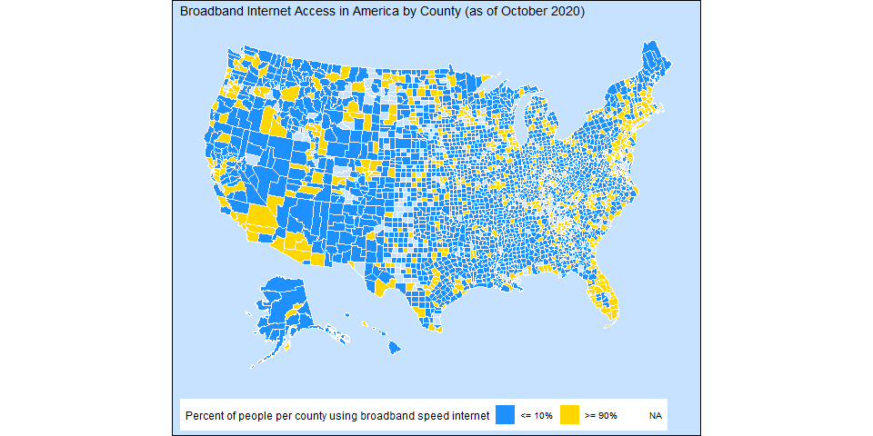

20210511 - Broadband
================
Nick Cruickshank
6/17/2021

``` r
# libraries
library(readr)
```

    ## Registered S3 methods overwritten by 'tibble':
    ##   method     from  
    ##   format.tbl pillar
    ##   print.tbl  pillar

``` r
library(rworldmap)
```

    ## Warning: package 'rworldmap' was built under R version 3.6.3

    ## Loading required package: sp

    ## Warning: package 'sp' was built under R version 3.6.3

    ## ### Welcome to rworldmap ###

    ## For a short introduction type :   vignette('rworldmap')

``` r
library(tidyverse)
```

    ## -- Attaching packages ------------------------------------------------------------------------------------------------------------------------------------ tidyverse 1.3.0 --

    ## v ggplot2 3.2.1     v dplyr   1.0.6
    ## v tibble  2.1.3     v stringr 1.4.0
    ## v tidyr   1.0.2     v forcats 0.4.0
    ## v purrr   0.3.3

    ## Warning: package 'dplyr' was built under R version 3.6.3

    ## -- Conflicts --------------------------------------------------------------------------------------------------------------------------------------- tidyverse_conflicts() --
    ## x dplyr::filter() masks stats::filter()
    ## x dplyr::lag()    masks stats::lag()

``` r
library(tigris)
```

    ## To enable 
    ## caching of data, set `options(tigris_use_cache = TRUE)` in your R script or .Rprofile.

``` r
library(usmap)
```

    ## Warning: package 'usmap' was built under R version 3.6.3

``` r
library(zipcodeR)
```

    ## Warning: no function found corresponding to methods exports from 'raster' for:
    ## 'wkt'

``` r
# data
broadband <- readr::read_csv('https://raw.githubusercontent.com/rfordatascience/tidytuesday/master/data/2021/2021-05-11/broadband.csv') 
```

    ## Parsed with column specification:
    ## cols(
    ##   ST = col_character(),
    ##   `COUNTY ID` = col_double(),
    ##   `COUNTY NAME` = col_character(),
    ##   `BROADBAND AVAILABILITY PER FCC` = col_character(),
    ##   `BROADBAND USAGE` = col_character()
    ## )

``` r
broadband <- broadband %>%
  janitor::clean_names()
broadband_zip <- readr::read_csv('https://raw.githubusercontent.com/rfordatascience/tidytuesday/master/data/2021/2021-05-11/broadband_zip.csv')
```

    ## Parsed with column specification:
    ## cols(
    ##   ST = col_character(),
    ##   `COUNTY NAME` = col_character(),
    ##   `COUNTY ID` = col_double(),
    ##   `POSTAL CODE` = col_double(),
    ##   `BROADBAND USAGE` = col_double(),
    ##   `ERROR RANGE (MAE)(+/-)` = col_double(),
    ##   `ERROR RANGE (95%)(+/-)` = col_double(),
    ##   MSD = col_double()
    ## )

``` r
broadband_zip <- broadband_zip %>%
  janitor::clean_names()
```

# Introduction

This weeks analysis comes from the [R Tidy Tuesday
Community 2021-05-11](https://github.com/rfordatascience/tidytuesday/tree/master/data/2021/2021-05-11)
project, which featured data provided by
[Microsoft](https://github.com/microsoft/USBroadbandUsagePercentages)
and [The
Verge](https://www.theverge.com/22418074/broadband-gap-america-map-county-microsoft-data)
on broadband data by country in America.

> If broadband access was a problem before 2020, the pandemic turned it
> into a crisis. As everyday businesses moved online, city council
> meetings or court proceedings became near-inaccessible to anyone whose
> connection couldn’t support a Zoom call. Some school districts started
> providing Wi-Fi hotspots to students without a reliable home
> connection. In other districts, kids set up in McDonald’s parking lots
> just to get a reliable enough signal to do their homework. After years
> of slowly widening, the broadband gap became impossible to ignore.

# Tidy Data

``` r
latlong <- geocode_zip(broadband_zip$postal_code)
bz <- broadband_zip %>%
  rename(c(
    "zipcode" = "postal_code",
    "state" = "st",
    "fips" = "county_id"
    )) %>%
  mutate(
    zipcode = as.character(zipcode),
    group = 1
    ) %>%
  left_join(latlong)
```

    ## Joining, by = "zipcode"

# Exploratory Analysis

## Broadband Distribution by Country

``` r
# this gets close, but can't figure out why it won't go by county
bz_map <- bz %>%
  select(fips, broadband_usage) 

plot_usmap(regions = "counties", data = bz_map, values = "broadband_usage") + 
  scale_fill_viridis_c() + 
  labs(
    title = "Broadband Internet Access in America by County (as of October 2020)",
    fill = "Percent of people per county using broadband speed internet"
  ) + 
  theme(legend.position = "bottom")
```

<!-- -->

``` r
# state_codes <- data.frame(states()) %>%
#   janitor::clean_names() %>%
#   select(name, stusps) %>%
#   rename(c("region" = "name",
#            "st" = "stusps"))
# 
# bz2 <- broadband_zip %>%
#   rename(c("subregion" = "county_name")) %>%
#   left_join(state_codes) %>%
#   mutate(
#     region = str_to_lower(region),
#     subregion = str_to_lower(subregion)
#     )
```

## Socioeconomic Status by County
