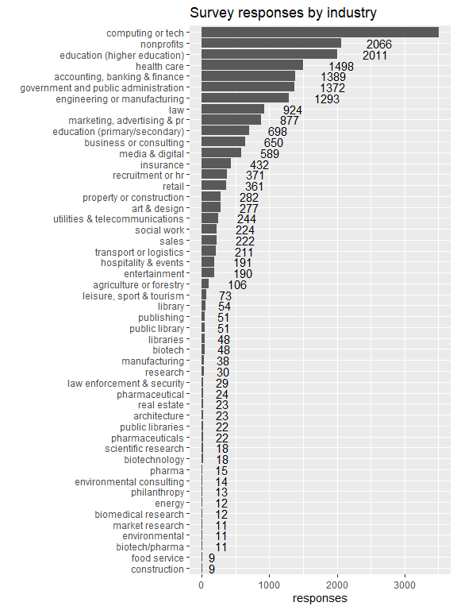
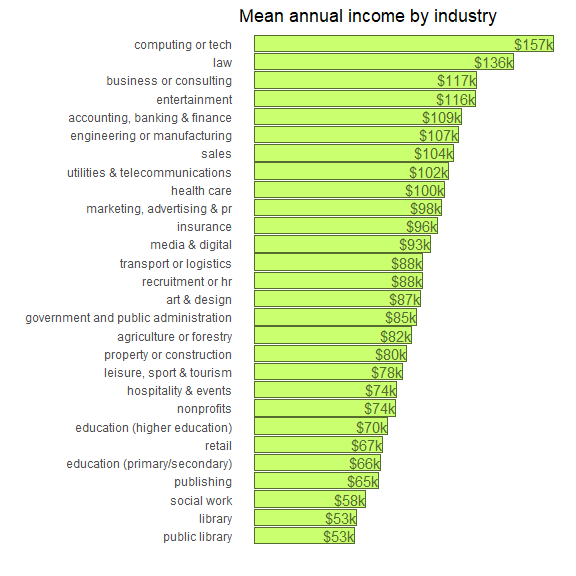
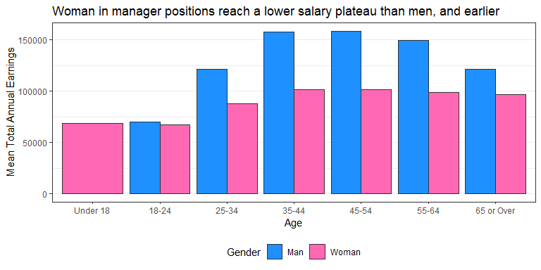

20210518 - Ask a Manager Survey
================
Nick Cruickshank
5/18/2021

``` r
# Load Libraries
library(cowplot)
library(forcats)
library(tidytuesdayR)
library(tidyverse)
```

``` r
# Get the Data
survey <- readr::read_csv('https://raw.githubusercontent.com/rfordatascience/tidytuesday/master/data/2021/2021-05-18/survey.csv')
```

    The salary survey a few weeks ago got a huge response — 24,000+ people shared their salaries and other info, which is a lot of raw data to sift through. Reader Elisabeth Engl kindly took the raw data and analyzed some of the trends in it and here’s what she found. (She asked me to note that she did this as a fun project to share some insights from the survey, rather than as a paid engagement.)
    
    This data does not reflect the general population; it reflects Ask a Manager readers who self-selected to respond, which is a very different group (as you can see just from the demographic breakdown below, which is very white and very female).

# Tidy Data Set

``` r
# filter for just America
survey$other_monetary_comp[is.na(survey$other_monetary_comp)] <- 0
sv <- survey %>%
  filter(currency == "USD") %>%
  mutate(
    # add additional salary columns
    other_monetary_comp = as.numeric(other_monetary_comp),
    total_annual_earnings = annual_salary + other_monetary_comp,
    bonus_proportion = other_monetary_comp / total_annual_earnings,
    # tidy industries
    industry = str_to_lower(industry)
    )
  
colnames(sv)
```

    ##  [1] "timestamp"                               
    ##  [2] "how_old_are_you"                         
    ##  [3] "industry"                                
    ##  [4] "job_title"                               
    ##  [5] "additional_context_on_job_title"         
    ##  [6] "annual_salary"                           
    ##  [7] "other_monetary_comp"                     
    ##  [8] "currency"                                
    ##  [9] "currency_other"                          
    ## [10] "additional_context_on_income"            
    ## [11] "country"                                 
    ## [12] "state"                                   
    ## [13] "city"                                    
    ## [14] "overall_years_of_professional_experience"
    ## [15] "years_of_experience_in_field"            
    ## [16] "highest_level_of_education_completed"    
    ## [17] "gender"                                  
    ## [18] "race"                                    
    ## [19] "total_annual_earnings"                   
    ## [20] "bonus_proportion"

# Exploratory Analysis

## Group by industry

Looks like the survey must have allowed for open response in the
industry field. I could manually group tidy the industries into to cut
out all the noise through use of a `case_when()` statement within a
`mutate()` clause (i.e. when `str_detect(industry, "academ(ia|ic|y)") ==
TRUE ~ "academia"`). However, that would require a lot of time to
carefully parse through the 800+ unique `industry` entries, and would
still likely be subject to my own biases. It’s likely easier (and more
meaningful) simply find a reasonable cutoff point to `filter()` the data
set by.

The following graph plots the top 50 industries by number of survey
responses. The number 50 is chosen somewhat arbitrarily, but serves to
show where a plausible cutoff point would be for trimming
difficult-to-use entries. From this graph, it looks like `filtering` for
industries with \> 50 responses should be appropriate.

``` r
sv %>%
  filter(!(is.na(industry))) %>%
  group_by(industry) %>%
  dplyr::summarise(responses = n()) %>%
  arrange(desc(responses)) %>%
  head(50) %>%
  ggplot(aes(fct_reorder(industry, responses), responses)) + 
  geom_bar(stat = "identity") + 
  geom_text(aes(label = responses), hjust = -1) +
  coord_flip() + 
  labs(
    title = "Survey responses by industry",
    x = ""
  )
```

<!-- -->

``` r
# create industries rollup df for plotting
industries <- sv %>%
  filter(
    total_annual_earnings < 100000000 # boxplot revealed a clear outlier here
  ) %>%
  group_by(industry) %>%
  dplyr::summarise(
    responses = n(),
    mean_salary = mean(total_annual_earnings),
    sd_salary = sd(total_annual_earnings),
    min_salary = min(total_annual_earnings),
    max_salary = max(total_annual_earnings),
    mean_proportional_bonus = mean(bonus_proportion, na.rm = TRUE)
  ) %>%
  filter(
    responses > 50 # to cut out the noisy free response entries
  )

industries_list <- unique(industries$industry)
```

``` r
income_plot <- industries %>%
  ggplot(aes(fct_reorder(industry, mean_salary), mean_salary)) + 
  geom_bar(stat = "identity", color = "darkolivegreen", fill = "darkolivegreen1") + 
  geom_text(aes(label = paste0("$", round(mean_salary/1000), "k")), hjust = 1, color = "darkolivegreen") +
  coord_flip() + 
  labs(
    title = "Total Annual Earnings",
    x = "",
    y = ""
  ) +
  theme_minimal() +
  theme(
    axis.text.x = element_blank(),
    axis.ticks.x = element_blank(),
    panel.grid = element_blank()
  )

bonus_plot <- industries %>%
  filter(
    mean_proportional_bonus > 0.02
  ) %>%
  ggplot(aes(fct_reorder(industry, mean_proportional_bonus), mean_proportional_bonus)) + 
  geom_bar(stat = "identity", color = "darkcyan", fill = "cyan") + 
  geom_text(aes(label = paste0(round(100*mean_proportional_bonus, 2), "%")), hjust = 1, color = "darkcyan") +
  coord_flip() + 
  labs(
    title = "Proportional Bonus",
    x = "",
    y = ""
  ) + 
  theme_minimal() +
  theme(
    axis.text.x = element_blank(),
    axis.ticks.x = element_blank(),
    panel.grid = element_blank()
  )

plot_row <- plot_grid(income_plot, bonus_plot)

title <- ggdraw() + 
  draw_label(
    "US Industry Comparisons of Mean Total Annual Earnings and Proportional Bonuses",
    fontface = 'bold',
    x = 0,
    hjust = 0
  ) +
  theme(
    # add margin on the left of the drawing canvas,
    # so title is aligned with left edge of first plot
    plot.margin = margin(0, 0, 0, 7)
  )

plot_grid(
  title, plot_row,
  ncol = 1,
  # rel_heights values control vertical title margins
  rel_heights = c(0.1, 1)
)
```

<!-- -->

### Which industries have the highest income?

### Which industries have the highest proporional bonuses?

The phrase “bonus” is used here as a shorthand for “other monetary
compensation”, as there is little difference for most industries.
However, there are some clear interesting trends here. “Sales” making
the top of the list is no surprise as commission is built into their
employment contracts. A similar principle stands for “retail” and
“property or construction” (i.e. real estate).

## What factors drive salary?

### How does age correlate with salary?

``` r
salaries <- sv %>%
  mutate(
    how_old_are_you = str_replace(how_old_are_you, "under 18", "18-18"),
    how_old_are_you = str_replace(how_old_are_you, "65 or over", "65-65")
  ) %>%
  separate(how_old_are_you, into = c("min_age", "max_age"), sep = "-", remove = FALSE) %>%
  mutate(
    mean_age = (as.numeric(min_age) + as.numeric(max_age))/2,
    years_of_experience_in_field = str_replace(years_of_experience_in_field, "\\s-\\s", "-"),
    years_of_experience_in_field = str_remove(years_of_experience_in_field, "\\syears"),
    years_of_experience_in_field = str_replace(years_of_experience_in_field, "1 year or less", "0-1")
  ) %>%
  separate(years_of_experience_in_field, into = c("min_years", "max_years"), sep = "-", remove = FALSE) %>%
  mutate(
    mean_years_of_experience = (as.numeric(min_years) + as.numeric(max_years))/2,
    how_old_are_you = str_replace(how_old_are_you, "18-18", "Under 18"),
    how_old_are_you = str_replace(how_old_are_you, "65-65", "65 or Over")
  )
```

``` r
salaries %>%
  filter(
    total_annual_earnings < 100000000,
    gender %in% c("Man", "Woman")
  ) %>%
  group_by(gender, how_old_are_you, mean_age) %>%
  dplyr::summarise(
    responses = n(),
    mean_annual_earnings = mean(total_annual_earnings)
  ) %>%
  ggplot(aes(fct_reorder(how_old_are_you, mean_age), mean_annual_earnings)) + 
  geom_bar(aes(fill = gender), stat = "identity", position = "dodge", color = "gray20") + 
  scale_fill_manual(values = c(
    "Man" = "dodgerblue",
    "Woman" = "hotpink"
  )) + 
  labs(
    title = "Woman in manager positions reach a lower salary plateau than men, and earlier",
    x = "Age",
    y = "Mean Total Annual Earnings",
    fill = "Gender"
  ) + 
  theme_bw() + 
  theme(
    legend.position = "bottom",
    panel.grid.major.x = element_blank()
  )
```

<!-- -->

### How does years of experience relate to salary?

### How does level of education relate to salary?

### Do men or women earn more money?

### Do white people make more money than non-white people?

## What areas of the country have the highest salary?

# Machine Learning: Predict Salary
