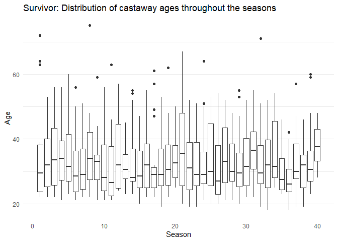
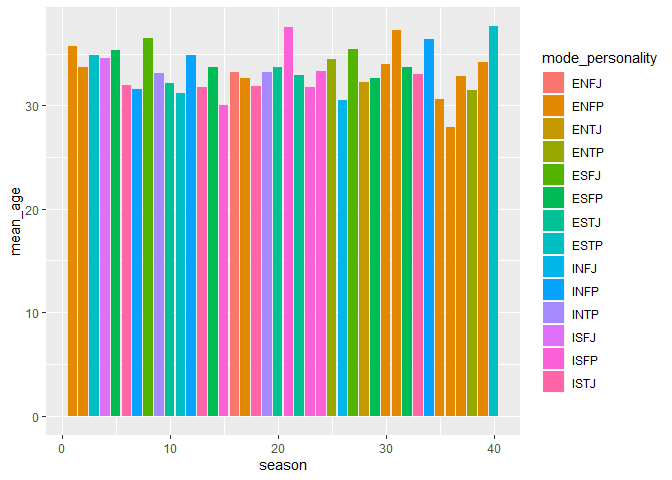
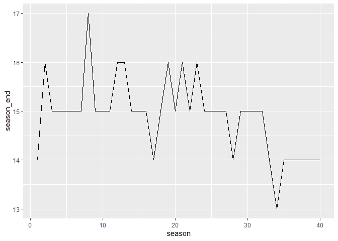
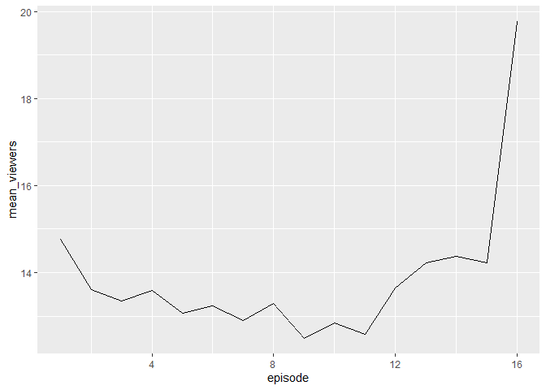
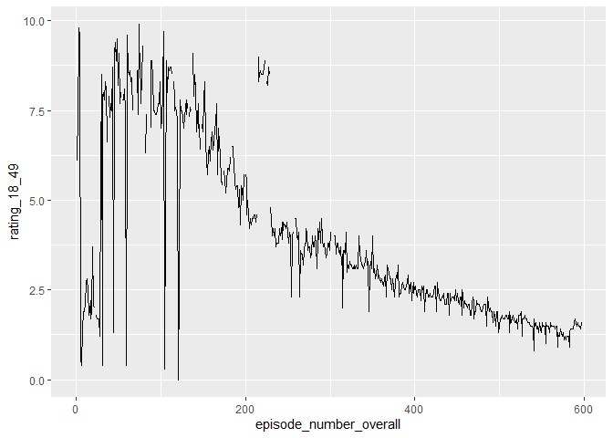
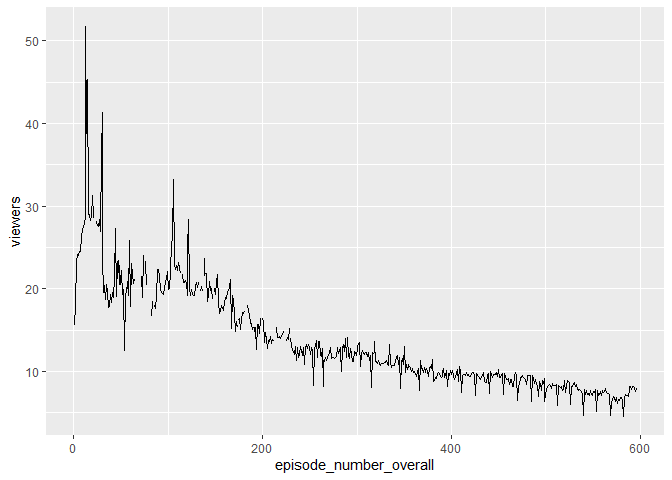
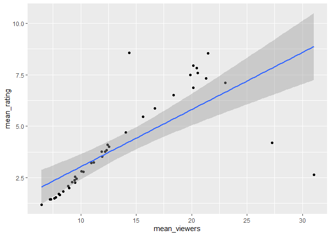

Tidy Tuesday 20210601 - SURVIVOR
================
Nick Cruickshank
6/1/2021

``` r
# libraries
library(cowplot)
library(forcats)
library(ggrepel)
library(readr)
library(tidytext)
library(tidyverse)
```

``` r
# data
summary <- readr::read_csv('https://raw.githubusercontent.com/rfordatascience/tidytuesday/master/data/2021/2021-06-01/summary.csv')
castaways <- readr::read_csv('https://raw.githubusercontent.com/rfordatascience/tidytuesday/master/data/2021/2021-06-01/castaways.csv')
jury_votes <- readr::read_csv('https://raw.githubusercontent.com/rfordatascience/tidytuesday/master/data/2021/2021-06-01/jury_votes.csv')
challenges <- readr::read_csv('https://raw.githubusercontent.com/rfordatascience/tidytuesday/master/data/2021/2021-06-01/challenges.csv')
viewers <- readr::read_csv('https://raw.githubusercontent.com/rfordatascience/tidytuesday/master/data/2021/2021-06-01/viewers.csv')
```

``` r
# functions
Mode <- function(x) {
  ux <- unique(x)
  ux[which.max(tabulate(match(x, ux)))]
}
```

# Exploratory Analysis

## Summary

``` r
head(summary)
```

    ## # A tibble: 6 x 19
    ##   season_name season location country tribe_setup full_name winner runner_ups
    ##   <chr>        <dbl> <chr>    <chr>   <chr>       <chr>     <chr>  <chr>     
    ## 1 Survivor: ~      1 Pulau T~ Malays~ Two tribes~ Richard ~ Richa~ Kelly Wig~
    ## 2 Survivor: ~      2 Herbert~ Austra~ Two tribes~ Tina Wes~ Tina   Colby Don~
    ## 3 Survivor: ~      3 Shaba N~ Kenya   Two tribes~ Ethan Zo~ Ethan  Kim Johns~
    ## 4 Survivor: ~      4 Nuku Hi~ Polyne~ Two tribes~ Vecepia ~ Vecep~ Neleh Den~
    ## 5 Survivor: ~      5 Ko Taru~ Thaila~ Two tribes~ Brian He~ Brian  Clay Jord~
    ## 6 Survivor: ~      6 Rio Neg~ Brazil  Two tribes~ Jenna Mo~ Jenna  Matthew V~
    ## # ... with 11 more variables: final_vote <chr>, timeslot <chr>,
    ## #   premiered <date>, ended <date>, filming_started <date>,
    ## #   filming_ended <date>, viewers_premier <dbl>, viewers_finale <dbl>,
    ## #   viewers_reunion <dbl>, viewers_mean <dbl>, rank <dbl>

Which season had the greatest disparity between viewers at premier vs at
finale?

``` r
# identify what the top five countries are for filling the graph
list_top5_countries <- head(arrange(count(summary, vars = country), desc(n)), 5)$vars

# reshape summary by country with "Other" category
sum_pie_df <- summary %>%
  mutate(
    country_category = ifelse(country %in% list_top5_countries, country, "Other")
  ) %>%
  group_by(country_category) %>%
  dplyr::summarise(value = n())

# colors to use by country
countries_colors <- c(
  "Brazil" = "limegreen",
  "Fiji" = "deepskyblue",
  "Nicaragua" = "royalblue",
  "Other" = "gray50",
  "Panama" = "red",
  "Philippines" = "gold"
)

# create plots
## pie chart and legen
sum_pie <- ggplot(sum_pie_df, aes(x = "", y = value, fill = country_category)) + 
  geom_bar(stat = "identity", color = "gray20") + 
  coord_polar("y", start = 0) + 
  scale_fill_manual(values = countries_colors) + 
  labs(title = "Location Breakdown", fill = "Country") +
  theme_void() + 
  theme(legend.position = "bottom")

## viewership delta
sum_delta_plot <- summary %>%
  mutate(
    viewer_delta = viewers_finale - viewers_premier,
    country_category = ifelse(country %in% list_top5_countries, country, "Other")
  ) %>%
  ggplot(aes(season, viewer_delta)) + 
  geom_line(aes(season, viewers_mean)) +
  ggrepel::geom_text_repel(
    data = filter(summary, season == 20),
    aes(season, viewers_mean), label = "Mean episode viewership\nper season"
    ) +
  geom_bar(aes(fill = country_category), stat = "identity", color = "gray20") +
  scale_fill_manual(values = countries_colors) +
  labs(
    title = "Difference between viewers at finale and viewers at premiere",
    x = "Season",
    y = "Viewers (millions)"
  ) + 
  theme_minimal() +
  theme(
    legend.position = "none",
    panel.grid.major.x = element_blank(),
    panel.grid.minor.x = element_blank()
  )

# put the two plots together
plots_row <- plot_grid(sum_pie, sum_delta_plot, rel_widths = c(1,2))

title <- ggdraw() + 
  draw_label(
    "Survivor summary throughout the seasons",
    fontface = 'bold',
    x = 0,
    hjust = 0
  ) +
  theme(
    # add margin on the left of the drawing canvas,
    # so title is aligned with left edge of first plot
    plot.margin = margin(0, 0, 0, 7)
  )

summary_plot <- plot_grid(
  title, plots_row,
  ncol = 1,
  # rel_heights values control vertical title margins
  rel_heights = c(0.1, 1)
)

summary_plot
```

<!-- -->

Looks like overall mean viewership declined throughout the seasons (no
surprise). Also, the variance in the delta between viewers at finale and
viewers at premiere dropped off over time. I interpret this as
demonstrating that the people who watched the later seasons of the show
were already enfranchised, and were thus more likely to commit to
finishing the season once started.

``` r
repeat_winners <- filter(count(summary, vars = full_name), n > 1)$vars
seasons_with_returns <- nrow(filter(summary, str_detect(tribe_setup, "(returning|past)")))
```

Looking at the winners from each season, it is clear that there were
only two repeat winners: Sandra Diaz-Twine, Tony Vlachos.

Of the 40 seasons of Survivor, there were 12 seasons where returning
players were allowed. From those 12 emerged 2 repeat winners: Sandra
Diaz-Twine, Tony Vlachos.

## Challenges

``` r
head(challenges)
```

    ## # A tibble: 6 x 8
    ##   season_name   season episode title    day challenge_type winners winning_tribe
    ##   <chr>          <dbl>   <dbl> <chr>  <dbl> <chr>          <chr>   <chr>        
    ## 1 Survivor: Wi~     40       1 Great~     2 reward         Amber   Dakal        
    ## 2 Survivor: Wi~     40       1 Great~     2 reward         Tyson   Dakal        
    ## 3 Survivor: Wi~     40       1 Great~     2 reward         Sandra  Dakal        
    ## 4 Survivor: Wi~     40       1 Great~     2 reward         Yul     Dakal        
    ## 5 Survivor: Wi~     40       1 Great~     2 reward         Wendell Dakal        
    ## 6 Survivor: Wi~     40       1 Great~     2 reward         Sophie  Dakal

``` r
count(challenges, vars = challenge_type)
```

    ## # A tibble: 2 x 2
    ##   vars         n
    ##   <chr>    <int>
    ## 1 immunity  2488
    ## 2 reward    2535

## Castaways

``` r
castaways
```

    ## # A tibble: 744 x 18
    ##    season_name season full_name castaway   age city  state personality_type
    ##    <chr>        <dbl> <chr>     <chr>    <dbl> <chr> <chr> <chr>           
    ##  1 Survivor: ~     40 Natalie ~ Natalie     33 Edge~ New ~ ESTP            
    ##  2 Survivor: ~     40 Amber Ma~ Amber       40 Pens~ Flor~ ISFP            
    ##  3 Survivor: ~     40 Danni Bo~ Danni       43 Shaw~ Kans~ ENFJ            
    ##  4 Survivor: ~     40 Ethan Zo~ Ethan       45 Hill~ New ~ ISFP            
    ##  5 Survivor: ~     40 Tyson Ap~ Tyson       39 Mesa  Ariz~ ESTP            
    ##  6 Survivor: ~     40 Rob Mari~ Rob         43 Pens~ Flor~ ESTJ            
    ##  7 Survivor: ~     40 Parvati ~ Parvati     36 Los ~ Cali~ ENFJ            
    ##  8 Survivor: ~     40 Sandra D~ Sandra      44 Rive~ Flor~ ESTP            
    ##  9 Survivor: ~     40 Yul Kwon  Yul         44 Los ~ Cali~ INTJ            
    ## 10 Survivor: ~     40 Wendell ~ Wendell     35 Phil~ Penn~ INFJ            
    ## # ... with 734 more rows, and 10 more variables: day <dbl>, order <dbl>,
    ## #   result <chr>, jury_status <chr>, original_tribe <chr>, swapped_tribe <chr>,
    ## #   swapped_tribe2 <chr>, merged_tribe <chr>, total_votes_received <dbl>,
    ## #   immunity_idols_won <dbl>

**Relevant features**

Primary: Age, state, personality\_type, result Secondary: Total Votes
Received, Immunity Idols Won

### Age by Season

``` r
castaways_sum <- castaways %>%
  group_by(season) %>%
  dplyr::summarise(
    players = n_distinct(full_name),
    mode_personality = Mode(personality_type),
    min_age = min(age),
    mean_age = mean(age),
    max_age = max(age)
  )
```

``` r
viewers %>%
  group_by(season) %>%
  dplyr::summarise(season_rating = round(mean(rating_18_49, na.rm = TRUE), 2)) %>%
  ggplot(aes(season, season_rating)) + 
  geom_point()
```

<!-- -->

``` r
castaways %>%
  ggplot(aes(season, age)) + 
  geom_boxplot(aes(group = season)) +
  labs(
    title = "Survivor: Distribution of castaway ages throughout the seasons",
    x = "Season",
    y = "Age"
  ) + 
  theme_minimal() + 
  theme(
    panel.grid.major.x = element_blank(),
    panel.grid.minor.x = element_blank()
  )
```

<!-- -->

``` r
  # color by ???
  ## personality type
```

### Personality Type by Season

``` r
castaways %>%
  filter(!(is.na(personality_type))) %>%
  count(season, personality_type) %>%
  ggplot(aes(season, n, fill = personality_type)) + 
  geom_bar(stat = "identity", position = "fill") + 
  labs(
    title = "Survivor: Distribution of personality types by season",
    fill = "Personality Type"
  ) + 
  theme_void()
```

<!-- -->

### Result by Personality Type

``` r
#df<-df%>%mutate(MyQuantileBins = cut(MyContinuous, 
#                                 breaks = unique(quantile(MyContinuous,probs=seq.int(0,1, by=1/numbers_of_bins))), 
#                                                 include.lowest=TRUE))

# as.numeric(cut2(das$wt, g=3))

castaway_result_noise <- filter(count(castaways, result), n < 10)$result
number_of_bins <- 3

castaway_personality <- castaways %>%
  filter(
    !(result %in% castaway_result_noise),
    !(is.na(personality_type))
    ) %>%
  group_by(personality_type) %>%
  dplyr::summarise(
    `Percent of castaways who won the season` = 100*(sum(result == "Sole Survivor") / n()),
    `Percent of castaways who were finalists (winners and runner-ups)` = 100*(sum(str_detect(str_to_lower(result), "(runner-up|sole survivor)")) / n()),
    `Staying Power (sum of order squared, divided by count)` = sum(order^2) / n(),
  )

castaway_personality %>%
  pivot_longer(cols = -personality_type, names_to = "success_metric", values_to = "rate") %>%
  ggplot(aes(reorder_within(personality_type, rate, success_metric), rate)) + 
  geom_bar(aes(fill = success_metric), stat = "identity") + 
  scale_x_reordered() + 
  facet_wrap(~ success_metric, ncol = 1, scales = "free") + 
  labs(
    title = "Survivor: Which personality type was most succesful?",
    x = "Personality Type",
    y = ""
  ) +
  theme_minimal() + 
  theme(
    legend.position = "none",
    panel.grid.major.x = element_blank(),
    panel.grid.minor.x = element_blank()
  )
```

<!-- -->

### Where did all the castaways come from?

Plot chloropleth map per capita.

## Viewers

``` r
viewers
```

    ## # A tibble: 596 x 9
    ##    season_name season episode_number_~ episode title episode_date viewers
    ##    <chr>        <dbl>            <dbl>   <dbl> <chr> <date>         <dbl>
    ##  1 Survivor: ~     40              583       1 Grea~ 2020-02-12      6.68
    ##  2 Survivor: ~     40              584       2 It's~ 2020-02-19      7.16
    ##  3 Survivor: ~     40              585       3 Out ~ 2020-02-26      7.14
    ##  4 Survivor: ~     40              586       4 I Li~ 2020-03-04      7.08
    ##  5 Survivor: ~     40              587       5 The ~ 2020-03-11      6.91
    ##  6 Survivor: ~     40              588       6 Quic~ 2020-03-18      7.83
    ##  7 Survivor: ~     40              589       7 We'r~ 2020-03-25      8.18
    ##  8 Survivor: ~     40              590       8 This~ 2020-04-01      8.23
    ##  9 Survivor: ~     40              591       9 War ~ 2020-04-08      7.85
    ## 10 Survivor: ~     40              592      10 The ~ 2020-04-15      8.14
    ## # ... with 586 more rows, and 2 more variables: rating_18_49 <dbl>,
    ## #   share_18_49 <dbl>

### Viewership over the course of a season

What is the average viewer ship pattern over the course of a season?

``` r
viewers %>%
  group_by(season) %>%
  dplyr::summarise(
    season_start = min(episode),
    season_end = max(episode)
  ) %>%
  ggplot(aes(season, season_end)) + 
  geom_line()
```

<!-- -->

``` r
viewers %>%
  filter(episode < 17) %>%
  group_by(episode) %>%
  dplyr::summarise(
    mean_viewers = mean(viewers, na.rm = TRUE) 
  ) %>%
  ggplot(aes(episode, mean_viewers)) + 
  geom_line()
```

<!-- -->

Same question, but for ratings

``` r
viewers %>%
  ggplot(aes(episode_number_overall, rating_18_49)) + 
  geom_line()
```

<!-- -->

``` r
viewers %>%
  ggplot(aes(episode_number_overall, viewers)) + 
  geom_line()
```

<!-- -->

``` r
viewers %>%
  group_by(season) %>%
  dplyr::summarise(
    mean_rating = mean(rating_18_49, na.rm = TRUE),
    mean_viewers = mean(viewers, na.rm = TRUE)
  ) %>%
  ggplot(aes(mean_viewers, mean_rating)) + 
  geom_point() + 
  geom_smooth(method = "lm")
```

<!-- -->

``` r
res <- lm(viewers$rating_18_49 ~ viewers$viewers)
RSS <- c(crossprod(res$residuals))
MSE <- RSS / length(res$residuals)
RMSE <- sqrt(MSE)
RMSE
```

    ## [1] 1.957598

## Jury Votes
