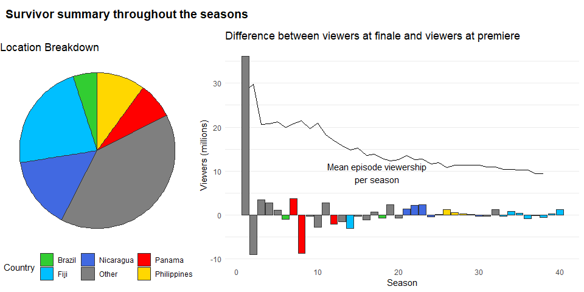

Tidy Tuesday 20210601 - SURVIVOR
================
Nick Cruickshank
6/1/2021

``` r
# libraries
library(cowplot)
library(ggrepel)
library(readr)
library(tidyverse)
```

``` r
# data
summary <- readr::read_csv('https://raw.githubusercontent.com/rfordatascience/tidytuesday/master/data/2021/2021-06-01/summary.csv')
castaways <- readr::read_csv('https://raw.githubusercontent.com/rfordatascience/tidytuesday/master/data/2021/2021-06-01/castaways.csv')
jury_votes <- readr::read_csv('https://raw.githubusercontent.com/rfordatascience/tidytuesday/master/data/2021/2021-06-01/jury_votes.csv')
challenges <- readr::read_csv('https://raw.githubusercontent.com/rfordatascience/tidytuesday/master/data/2021/2021-06-01/challenges.csv')
viewers <- readr::read_csv('https://raw.githubusercontent.com/rfordatascience/tidytuesday/master/data/2021/2021-06-01/viewers.csv')
```

# Exploratory Analysis

## Summary

``` r
head(summary)
```

    ## # A tibble: 6 x 19
    ##   season_name season location country tribe_setup full_name winner runner_ups
    ##   <chr>        <dbl> <chr>    <chr>   <chr>       <chr>     <chr>  <chr>     
    ## 1 Survivor: ~      1 Pulau T~ Malays~ Two tribes~ Richard ~ Richa~ Kelly Wig~
    ## 2 Survivor: ~      2 Herbert~ Austra~ Two tribes~ Tina Wes~ Tina   Colby Don~
    ## 3 Survivor: ~      3 Shaba N~ Kenya   Two tribes~ Ethan Zo~ Ethan  Kim Johns~
    ## 4 Survivor: ~      4 Nuku Hi~ Polyne~ Two tribes~ Vecepia ~ Vecep~ Neleh Den~
    ## 5 Survivor: ~      5 Ko Taru~ Thaila~ Two tribes~ Brian He~ Brian  Clay Jord~
    ## 6 Survivor: ~      6 Rio Neg~ Brazil  Two tribes~ Jenna Mo~ Jenna  Matthew V~
    ## # ... with 11 more variables: final_vote <chr>, timeslot <chr>,
    ## #   premiered <date>, ended <date>, filming_started <date>,
    ## #   filming_ended <date>, viewers_premier <dbl>, viewers_finale <dbl>,
    ## #   viewers_reunion <dbl>, viewers_mean <dbl>, rank <dbl>

Which season had the greatest disparity between viewers at premier vs at
finale?

``` r
# identify what the top five countries are for filling the graph
top5_countries <- summary %>%
  group_by(country) %>%
  dplyr::summarise(
    count = n()
  ) %>%
  arrange(desc(count)) %>%
  head(5)

list_top5_countries <- top5_countries$country

# reshape summary by country with "Other" category
sum_pie_df <- summary %>%
  mutate(
    country_category = ifelse(country %in% list_top5_countries, country, "Other")
  ) %>%
  group_by(country_category) %>%
  dplyr::summarise(value = n())

# colors to use by country
countries_colors <- c(
  "Brazil" = "limegreen",
  "Fiji" = "deepskyblue",
  "Nicaragua" = "royalblue",
  "Other" = "gray50",
  "Panama" = "red",
  "Philippines" = "gold"
)

# create plots
## pie chart and legen
sum_pie <- ggplot(sum_pie_df, aes(x = "", y = value, fill = country_category)) + 
  geom_bar(stat = "identity", color = "gray20") + 
  coord_polar("y", start = 0) + 
  scale_fill_manual(values = countries_colors) + 
  labs(title = "Location Breakdown", fill = "Country") +
  theme_void() + 
  theme(legend.position = "bottom")

## viewership delta
sum_delta_plot <- summary %>%
  mutate(
    viewer_delta = viewers_finale - viewers_premier,
    country_category = ifelse(country %in% list_top5_countries, country, "Other")
  ) %>%
  ggplot(aes(season, viewer_delta)) + 
  geom_line(aes(season, viewers_mean)) +
  ggrepel::geom_text_repel(
    data = filter(summary, season == 20),
    aes(season, viewers_mean), label = "Mean episode viewership\nper season"
    ) +
  geom_bar(aes(fill = country_category), stat = "identity", color = "gray20") +
  scale_fill_manual(values = countries_colors) +
  labs(
    title = "Difference between viewers at finale and viewers at premiere",
    x = "Season",
    y = "Viewers (millions)"
  ) + 
  theme_minimal() +
  theme(
    legend.position = "none",
    panel.grid.major.x = element_blank(),
    panel.grid.minor.x = element_blank()
  )

# put the two plots together
plots_row <- plot_grid(sum_pie, sum_delta_plot, rel_widths = c(1,2))

title <- ggdraw() + 
  draw_label(
    "Survivor summary throughout the seasons",
    fontface = 'bold',
    x = 0,
    hjust = 0
  ) +
  theme(
    # add margin on the left of the drawing canvas,
    # so title is aligned with left edge of first plot
    plot.margin = margin(0, 0, 0, 7)
  )

summary_plot <- plot_grid(
  title, plots_row,
  ncol = 1,
  # rel_heights values control vertical title margins
  rel_heights = c(0.1, 1)
)

summary_plot
```

<!-- -->

Looks like overall mean viewership declined throughout the seasons (no
surprise). Also, the variance in the delta between viewers at finale and
viewers at premiere dropped off over time. I interpret this as
demonstrating that the people who watched the later seasons of the show
were already enfranchised, and were thus more likely to commit to
finishing the season once started.

``` r
repeat_winners <- filter(count(summary, vars = full_name), n > 1)$vars
seasons_with_returns <- nrow(filter(summary, str_detect(tribe_setup, "returning")))
```

Looking at the winners from each season, it is clear that there were
only two repeat winners: Sandra Diaz-Twine, Tony Vlachos.

Of the 40 seasons of Survivor, there were 9 seasons where returning
players were allowed. From those 9 emerged 2 repeat winners: Sandra
Diaz-Twine, Tony Vlachos.

### Any repeat winners?

## Challenges

## Castaways

## Viewers

## Jury Votes
