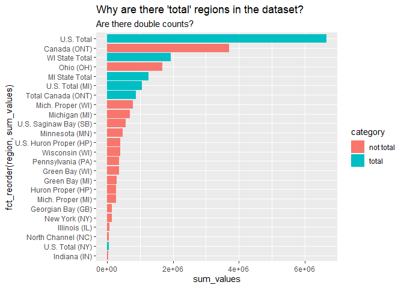
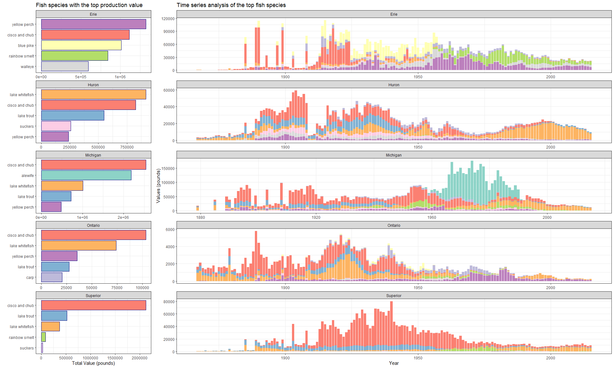

20210608 - Fishing
================
Nick Cruickshank
6/8/2021

``` r
# libraries
library(cowplot)
library(forcats)
library(readr)
library(tidytext)
library(tidyverse)
```

``` r
# data
fishing <- readr::read_csv('https://raw.githubusercontent.com/rfordatascience/tidytuesday/master/data/2021/2021-06-08/fishing.csv')
stocked <- readr::read_csv('https://raw.githubusercontent.com/rfordatascience/tidytuesday/master/data/2021/2021-06-08/stocked.csv')
```

``` r
# functions
Mode <- function(x) {
  ux <- unique(x)
  ux[which.max(tabulate(match(x, ux)))]
}
```

Why are “Total Canada (ONT)”, “U.S. Total (MI)”, and others included in
this dataset?

``` r
sort(unique(fishing$region))
```

    ##  [1] "Canada (ONT)"           "Georgian Bay (GB)"      "Green Bay (MI)"        
    ##  [4] "Green Bay (WI)"         "Huron Proper (HP)"      "Illinois (IL)"         
    ##  [7] "Indiana (IN)"           "MI State Total"         "Mich. Proper (MI)"     
    ## [10] "Mich. Proper (WI)"      "Michigan (MI)"          "Minnesota (MN)"        
    ## [13] "New York (NY)"          "North Channel (NC)"     "Ohio (OH)"             
    ## [16] "Pennsylvania (PA)"      "Total Canada (ONT)"     "U.S. Huron Proper (HP)"
    ## [19] "U.S. Saginaw Bay (SB)"  "U.S. Total"             "U.S. Total (MI)"       
    ## [22] "U.S. Total (NY)"        "WI State Total"         "Wisconsin (WI)"

``` r
fishing %>%
  group_by(region) %>%
  dplyr::summarise(
    sum_grand_total = sum(grand_total, na.rm = TRUE),
    sum_values = sum(values, na.rm = TRUE)) %>%
  mutate(category = ifelse(str_detect(region, "Total"), "total", "not total")) %>%
  ggplot(aes(fct_reorder(region, sum_values), sum_values)) +
  geom_bar(aes(fill = category), stat = "identity") + 
  coord_flip() + 
  labs(
    title = "Why are there 'total' regions in the dataset?",
    subtitle = "Are there double counts?"
  )
```

<!-- -->

I think we can cut the following regions: ‘U.S. Total’, ‘Canada (ONT)’,
‘WI State Total’, ‘MI State Total’, and ‘U.S. Total (MI)’. ‘Total
Canada (ONT)’ looks like a fishy name (pun intended), but the actual
count looks more legitimate than ‘Canada (ONT)’.

Preliminary exploratory analysis revealed that the species “cisco” and
“chub” were sometimes combined to “cisco and chub” or “cisco and
chubs”. Easiest way to handle this was to just combine all instances
of “cisco” and “chub” into the overarching group “cisco and”chub" (as
well as unifying the pluralization). This phase of the project also
revealed that the `lake` Saint Clair was vastly underrepresented in the
`fishing` dataset. Further, it kind of throws off the narrative of
comparing the five great lakes. As such, it was filtered out.

``` r
# tidy daya
fish_df <- fishing %>%
  filter(
    lake != "Saint Clair"
  ) %>%
  mutate(
    species = str_to_lower(species),
    species = ifelse(species %in% c("chubs", "cisco", "cisco and chubs"), "cisco and chub", species)
  )
```

# Exploratory Anaylsis

## Fishing Data

### Analysis of top species by lake

``` r
# top fish by lake
fishing_top_species_df <- fish_df %>%
  group_by(lake, species) %>%
  dplyr::summarise(
    sum_values = sum(values, na.rm = TRUE)
  ) %>%
  top_n(5, sum_values) %>%
  arrange(lake, desc(sum_values)) 

top_fish_list <- unique(fishing_top_species_df$species)

top_fish_plot <- fishing_top_species_df %>%
  ggplot(aes(reorder_within(species, sum_values, lake), sum_values)) + 
  geom_bar(aes(fill = species), stat = "identity", color = "navy") + 
  labs(
    title = "Fish species with the top production value",
    x = "",
    y = "Total Value (pounds)"
  ) +
  scale_x_reordered() +
  scale_fill_brewer(palette = "Set3") + 
  coord_flip() +
  facet_wrap(~ lake, scales = "free", ncol = 1) + 
  theme_bw() + 
  theme(
    legend.position = "none"
  )

# time series analysis of top fish by lake
## consider modifying the species column to replace all non-top species with "Other"
## will maybe improve data vis, but will also throw off the brewer palette.
fish_time_plot <- fish_df %>%
  filter(
    species %in% top_fish_list
  ) %>%
  #mutate(
  #  species = ifelse(species %in% top_fish_list, species, "Other")
  #) %>%
  ggplot(aes(year, values)) + 
  geom_bar(aes(group = species, fill = species), stat = "identity") + 
  scale_fill_brewer(palette = "Set3") + 
  labs(
    title = "Time series analysis of the top fish species",
    x = "Year",
    y = "Values (pounds)"
  ) +
  facet_wrap(~ lake, ncol = 1, scales = "free") + 
  theme_bw() + 
  theme(
    legend.position = "none"
  )

top_fish_plots <- plot_grid(top_fish_plot, fish_time_plot, rel_widths = c(1,3), ncol = 2)

top_fish_plots
```

<!-- -->

WHy have cisco and chub gone down in recent years?

## Stocked Data

``` r
stocked
```

    ## # A tibble: 56,232 x 31
    ##      SID  YEAR MONTH   DAY LAKE  STATE_PROV SITE  ST_SITE LATITUDE LONGITUDE
    ##    <dbl> <dbl> <dbl> <dbl> <chr> <chr>      <chr> <chr>   <lgl>    <lgl>    
    ##  1     1  1950    NA    NA MI    ON         PIE ~ PIE     NA       NA       
    ##  2     2  1952     4    29 SU    WI         APOS~ APOSTLE NA       NA       
    ##  3     3  1952     9    23 SU    WI         APOS~ APOSTLE NA       NA       
    ##  4     4  1952    NA    NA SU    MI         LAUG~ LAUGHI~ NA       NA       
    ##  5     5  1953     5    27 SU    WI         APOS~ APOSTLE NA       NA       
    ##  6     6  1953    10    10 SU    WI         APOS~ APOSTLE NA       NA       
    ##  7     7  1953    NA    NA SU    MI         LAUG~ LAUGHI~ NA       NA       
    ##  8     8  1953    NA    NA SU    MI         MARQ~ MARQUE~ NA       NA       
    ##  9     9  1953    NA    NA SU    ON         PIE ~ PIE     NA       NA       
    ## 10    10  1954     6     8 SU    WI         APOS~ APOSTLE NA       NA       
    ## # ... with 56,222 more rows, and 21 more variables: GRID <dbl>,
    ## #   STAT_DIST <chr>, LS_MGMT <chr>, SPECIES <chr>, STRAIN <chr>,
    ## #   NO_STOCKED <dbl>, YEAR_CLASS <dbl>, STAGE <chr>, AGEMONTH <dbl>,
    ## #   MARK <chr>, MARK_EFF <dbl>, TAG_NO <lgl>, TAG_RET <dbl>, LENGTH <dbl>,
    ## #   WEIGHT <dbl>, CONDITION <dbl>, LOT_CODE <chr>, STOCK_METH <chr>,
    ## #   AGENCY <chr>, VALIDATION <dbl>, NOTES <chr>
