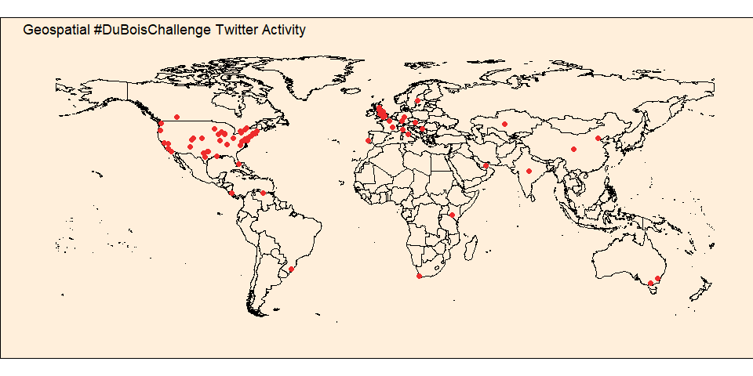
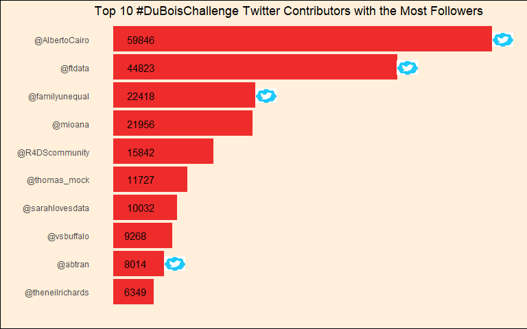
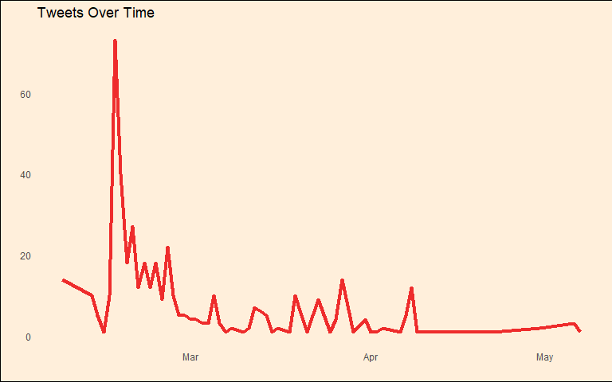

20210616 - DuBois Tweets
================
Nick Cruickshank
6/16/2021


``` r
# library
library(cowplot)
library(forcats)
library(ggimage)
library(rworldmap)
library(readr)
library(tidyverse)
```

``` r
# data
tweets <- readr::read_csv('https://raw.githubusercontent.com/rfordatascience/tidytuesday/master/data/2021/2021-06-15/tweets.csv')
knitr::kable(head(tweets),
             align = 'c',
             caption = "First six rows of the tweets dataframe")
```

|         datetime          |                                                                                                                 content                                                                                                                 |  retweet\_count   |  like\_count   | quote\_count  |                                         text                                         |   username   |   location    | followers |                              url                              | verified |   lat    |    long    |
| :-----------------------: | :-------------------------------------------------------------------------------------------------------------------------------------------------------------------------------------------------------------------------------------: | :---------------: | :------------: | :-----------: | :----------------------------------------------------------------------------------: | :----------: | :-----------: | :-------: | :-----------------------------------------------------------: | :------: | :------: | :--------: |
|    2021-05-07 11:42:29    |                                                                                  @sqlsekou You co-hosted the \#DuBoisChallenge. That had to be fun :)                                                                                   |         0         |       1        |       0       | <a href="http://twitter.com/download/android" rel="nofollow">Twitter for Android</a> | AlDatavizguy |   New York    |   1113    | <https://twitter.com/AlDatavizguy/status/1390633129203879937> |  FALSE   | 40.71273 | \-74.00602 |
|    2021-05-06 16:14:46    |                                                          \#DuBoisChallenge submission by Coleton Wood. @DocKevinElder \#MISatGCSU @Ebonyteach @WeitzmanSchool @GeorgiaCollege                                                           |                   |                |               |                                                                                      |              |               |           |                                                               |          |          |            |
| <https://t.co/rjynPGftGp> |                                                       0 0 0 <a href="https://mobile.twitter.com" rel="nofollow">Twitter Web App</a> AlDatavizguy New York 1113 <https://twitter>                                                        | .com/AlDatavizguy | /status/139033 | 9262349029376 |                               FALSE 40.71273 -74.00602                               |              |               |           |                                                               |          |          |            |
|    2021-05-06 16:14:45    |                                                     \#DuBoisChallenge submission by Lucy Sillito \#dataviz @michael\_Nutter @drshaunharper @Opportunity1 <https://t.co/byGCfaSUIN>                                                      |         0         |       0        |       0       |       <a href="https://mobile.twitter.com" rel="nofollow">Twitter Web App</a>        | AlDatavizguy |   New York    |   1113    | <https://twitter.com/AlDatavizguy/status/1390339261338161152> |  FALSE   | 40.71273 | \-74.00602 |
|    2021-05-06 16:14:45    | Was doing a @tableaupublic search for \#DuBoisChallenge and came across some honorable mentions\! @datadzif may be on a social media break but she submitted a few submissions\! @PhillyHistory @JulieBusby \#dataviz \#datafam @PacSci |                   |                |               |                                                                                      |              |               |           |                                                               |          |          |            |
| <https://t.co/KG5UXf0wRZ> |                              0 4 0 <a href="https://mobile.twitter.com" rel="nofollow">Twitter Web App</a> AlDatavizguy New York 1113 <https://twitter.com/AlDatavizguy/status/1390339260239204353> FALSE                               |    40.71273 -     |    74.00602    |               |                                                                                      |              |               |           |                                                               |          |          |            |
|    2021-04-30 18:48:18    |                                        @ClintSmithIII @TheCrashCourse This sounds awesome\! Would love for W.E.B. DuBois and his data visualizations to get a cameo\! Follow \#DuBoisChallenge.                                         |         0         |       11       |       0       |       <a href="https://mobile.twitter.com" rel="nofollow">Twitter Web App</a>        | AlDatavizguy |   New York    |   1113    | <https://twitter.com/AlDatavizguy/status/1388203573968789508> |  FALSE   | 40.71273 | \-74.00602 |
|    2021-04-30 14:41:53    |                                            @johnspacemuller Check out \#DuBoisChallenge from a \#TidyTuesday a few months back. Some really great stuff there on reproducing Du Bois’ work.                                             |         0         |       0        |       0       |       <a href="https://mobile.twitter.com" rel="nofollow">Twitter Web App</a>        |  etmckinley  | Nashville, TN |   5413    |  <https://twitter.com/etmckinley/status/1388141561502969856>  |  FALSE   | 36.22061 | \-86.69564 |

First six rows of the tweets dataframe

# Introduction

This weeks challenge comes from tweets aggregated by [Anthony
Starks](https://twitter.com/ajstarks) and company on the
\#DuBoisChallenge tweets from 2021 following the [TidyTuesday challenge
from 2021
week 8](https://github.com/rfordatascience/tidytuesday/blob/master/data/2021/2021-02-16/readme.md).

The \#DuBoisChallenge was a celebration of the data visualization legacy
of [W.E.B. DuBois](https://en.wikipedia.org/wiki/W._E._B._Du_Bois) by
recreating the visualizations from the [1900s Paris
Exposition](https://en.wikipedia.org/wiki/Exposition_Universelle_\(1900\))
using modern tools.

# Tidy Data

``` r
df <- tweets %>%
  mutate(
    date = as.Date(datetime)
  )
```

# Exploratory Analysis

``` r
total_tweets <- nrow(df)
unique_contributors <- length(unique(df$username))

daily_activity <- df %>%
  group_by(date) %>%
  dplyr::summarise(activity = n()) %>%
  arrange(desc(activity))

most_active_day <- strftime(head(daily_activity, 1)$date, format = "%B %d, %Y")
```

**Total Tweets:** 445  
**Contributors:** 167  
**Most Active Day:** February 16, 2021

## Twitter Activity by Geographical Location

``` r
world <- getMap(resolution = "low")
saf_continents <- c("Africa", "Asia", "Australia", "Europe", "North America", "South America")
world_saf <- world[world@data$REGION %in% saf_continents, ]

twitter_activity_plot <- df %>%
  ggplot() + 
  geom_polygon(data = world_saf,
               aes(x = long, y = lat, group = group),
               fill = NA, color = "black") + 
  geom_point(data = df,
             aes(long, lat),
             size = 2, color = "firebrick2") + 
  coord_quickmap() + 
  labs(
    title = "Geospatial #DuBoisChallenge Twitter Activity",
    x = "",
    y = ""
  ) + 
  theme_minimal() + 
  theme(
    panel.grid = element_blank(),
    axis.text = element_blank(),
    plot.background = element_rect(fill = "antiquewhite1")
  )

twitter_activity_plot
```

<!-- -->

## Top 10 Users with the Highest Follower Count

``` r
top_users <- df %>%
  mutate(username = paste0("@", username)) %>%
  group_by(username, verified) %>%
  dplyr::summarise(followers = mean(followers)) %>%
  arrange(desc(followers)) %>%
  head(10)

top_users_plot <- top_users %>%
  ggplot(aes(fct_reorder(username, followers), followers)) + 
  geom_bar(stat = "identity", fill = "firebrick2") + 
  geom_text(aes(y = 0, label = followers), hjust = -0.5) +
  geom_image(
    data = filter(top_users, verified == TRUE),
    aes(username, followers + 1600),
    image = sample("images/twitter_verified.jpg")
    ) +
  coord_flip() + 
  labs(
    title = "Top 10 #DuBoisChallenge Twitter Contributors with the Most Followers",
    x = "",
    y = ""
  ) +
  theme_minimal() + 
  theme(
    axis.text.x = element_blank(),
    panel.grid = element_blank(),
    plot.background = element_rect(fill = "antiquewhite1")
  )
  
top_users_plot
```

<!-- -->

## Tweets Over Time

``` r
tweet_time_plot <- df %>%
  group_by(date) %>%
  dplyr::summarise(tweets = n()) %>%
  ggplot(aes(date, tweets)) + 
  geom_line(color = "firebrick2", size = 1.5) + 
  labs(
    title = "Tweets Over Time",
    x = "",
    y = ""
  ) + 
  theme_minimal() + 
  theme(
    panel.grid = element_blank(),
    plot.background = element_rect(fill = "antiquewhite1")
  )

tweet_time_plot
```

<!-- -->
