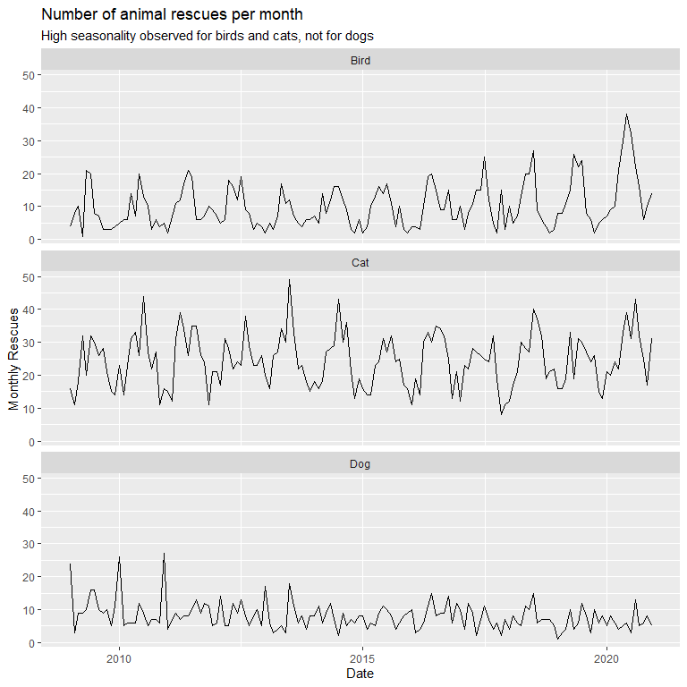

20210629 - Rescue Animals
================
Nick Cruickshank
6/30/2021

  - [Introduction](#introduction)
  - [Exploratory Data Analysis](#exploratory-data-analysis)
      - [Notes](#notes)
  - [Data Visualization Projects](#data-visualization-projects)
      - [Choropleth of animal rescues](#choropleth-of-animal-rescues)
      - [Timeline of animal rescue](#timeline-of-animal-rescue)
          - [Average Year of Animal
            Rescues](#average-year-of-animal-rescues)
          - [Average Day of Animal
            Rescues](#average-day-of-animal-rescues)
          - [Paste Years and Hours
            Together](#paste-years-and-hours-together)
      - [What propery types do most rescues occur
        at?](#what-propery-types-do-most-rescues-occur-at)
      - [Where do animals get rescued from the
        most?](#where-do-animals-get-rescued-from-the-most)
      - [What animals cost the most to
        rescue?](#what-animals-cost-the-most-to-rescue)
      - [What kind of properties do animals most routinely get trapped
        in?](#what-kind-of-properties-do-animals-most-routinely-get-trapped-in)

``` r
# libraries
library(cowplot)
library(forcats)
library(glue)
library(lubridate)
library(patchwork)
library(readr)
library(tidyverse)
```

``` r
# data
animal_rescues <- readr::read_csv('https://raw.githubusercontent.com/rfordatascience/tidytuesday/master/data/2021/2021-06-29/animal_rescues.csv')
```

# Introduction

Data this week comes from
[London.gov](https://data.london.gov.uk/dataset/animal-rescue-incidents-attended-by-lfb).

> Fox in bedroom, dog trapped in wall. The London Fire Brigade responds
> to hundreds of requests to rescue animals each year. Its
> monthly-updated spreadsheet of such events goes back to 2009; it lists
> the location and type of property, the kind of animal and rescue,
> hours spent, a (very) brief description, and more. \[h/t Soph Warnes\]

Another
[article](https://www.theguardian.com/world/2021/jan/08/animal-rescues-london-fire-brigade-rise-2020-pandemic-year)
found that animals rescues increased by 20% in the year of the pandemic
(2020).

> The London fire brigade (LFB) was involved in 755 such incidents –
> more than two a day. The number of rescues rose by 20% compared with
> 2019 when there were 602, with the biggest rise coming in the number
> of non-domestic animals rescued, according to the data.

``` r
# tidy
## prominent species
top_species <- animal_rescues %>%
  mutate(animal_group_parent = str_to_lower(animal_group_parent)) %>%
  filter(!(str_detect(animal_group_parent, "unknown"))) %>%
  count(animal_group_parent) %>%
  arrange(desc(n)) %>%
  head(6) # very steep drop off after 6 species

top_species_list <- top_species$animal_group_parent
top3_species_list <- head(top_species, 3)$animal_group_parent

## final tidy
ar <- animal_rescues %>%
  filter(
    cal_year != 2021 # this year isn't complete, and therefore might throw off visualization
  ) %>%
  mutate(
    animal_group_parent = str_to_lower(animal_group_parent),
    
    # time
    date_time_of_call = as.POSIXct(date_time_of_call, format = "%d/%m/%Y %H:%M"),
    date = as.Date(date_time_of_call, format = "%d/%m/%Y"),
    floor_year_month = floor_date(date, "months"),
    hour_of_day = hour(date_time_of_call),
    month_day = strftime(date_time_of_call, "%m-%d"),
    month = strftime(date_time_of_call, format = "%b"),
    week = week(date_time_of_call),
    day = day(date_time_of_call),
    
    # special service categories
    special_service_type_category = str_to_lower(special_service_type_category),
    service_category = str_to_title(str_remove(special_service_type_category, "animal rescue from "))
  )

unredacted <- ar %>%
  filter(final_description != "Redacted")
```

``` r
# values
min_date <- strftime(min(ar$date), format = "%b %d, %Y")
max_date <- strftime(max(ar$date), format = "%b %d, %Y")
```

``` r
# functions
Mode <- function(x) {
  ux <- unique(x)
  ux[which.max(tabulate(match(x, ux)))]
}
```

# Exploratory Data Analysis

## Notes

``` r
count(ar, cal_year)
```

    ## # A tibble: 12 x 2
    ##    cal_year     n
    ##       <dbl> <int>
    ##  1     2009   568
    ##  2     2010   611
    ##  3     2011   620
    ##  4     2012   603
    ##  5     2013   585
    ##  6     2014   583
    ##  7     2015   540
    ##  8     2016   604
    ##  9     2017   539
    ## 10     2018   610
    ## 11     2019   604
    ## 12     2020   758

`type_of_incident`: Only ‘Special Service’ represented.

`pump` = truck / unit deployed.

``` r
count(ar, originof_call) %>%
  arrange(desc(n))
```

    ## # A tibble: 8 x 2
    ##   originof_call             n
    ##   <chr>                 <int>
    ## 1 Person (mobile)        4005
    ## 2 Person (land line)     3032
    ## 3 Police                  131
    ## 4 Other FRS                49
    ## 5 Ambulance                 2
    ## 6 Coastguard                2
    ## 7 Not known                 2
    ## 8 Person (running call)     2

I don’t think there is much insight to be gleaned from whether the call
was made from a landline or mobile device.

# Data Visualization Projects

## Choropleth of animal rescues

## Timeline of animal rescue

``` r
ar %>%
  filter(animal_group_parent %in% top3_species_list) %>%
  mutate(animal_group_parent = str_to_title(animal_group_parent)) %>%
  count(floor_year_month, animal_group_parent) %>%
  ggplot(aes(floor_year_month, n)) + 
  geom_line() + 
  facet_wrap(~ animal_group_parent, ncol = 1) + 
  labs(
    title = "Number of animal rescues per month",
    subtitle = "High seasonality observed for birds and cats, not for dogs",
    x = "Date",
    y = "Monthly Rescues"
  )
```

<!-- -->

### Average Year of Animal Rescues

``` r
ar_monthly_species_mode <- ar %>%
  filter(
    animal_group_parent %in% top3_species_list,
    service_category != "Other Animal Assistance"
  ) %>%
  group_by(month, animal_group_parent) %>%
  dplyr::summarise(mode_service = Mode(service_category))

ar_monthly_species_mode %>%
  filter(animal_group_parent == "dog")
```

    ## # A tibble: 12 x 3
    ## # Groups:   month [12]
    ##    month animal_group_parent mode_service
    ##    <chr> <chr>               <chr>       
    ##  1 Apr   dog                 Below Ground
    ##  2 Aug   dog                 Height      
    ##  3 Dec   dog                 Water       
    ##  4 Feb   dog                 Water       
    ##  5 Jan   dog                 Water       
    ##  6 Jul   dog                 Height      
    ##  7 Jun   dog                 Height      
    ##  8 Mar   dog                 Below Ground
    ##  9 May   dog                 Height      
    ## 10 Nov   dog                 Water       
    ## 11 Oct   dog                 Below Ground
    ## 12 Sep   dog                 Below Ground

``` r
month_levels <- c("Jan", "Feb", "Mar", "Apr",
                  "May", "Jun", "Jul", "Aug",
                  "Sep", "Oct", "Nov", "Dec")

df_duration <- round(as.numeric(difftime(max(ar$date_time_of_call), 
                                         min(ar$date_time_of_call), 
                                         unit = "weeks")) / 52.25)

plot_animal_rescue_year_by_species <- function(df = ar, species) {
  plot_title = paste0(str_to_title(species), "s")
  
  plot <- df %>%
    filter(animal_group_parent == species) %>%
    group_by(cal_year, month, week, animal_group_parent) %>%
    dplyr::summarise(n = n()) %>%
    group_by(month, week, animal_group_parent) %>%
    dplyr::summarise(
      avg = mean(n),
      sd = sd(n),
      min = min(n),
      max = max(n)
    ) %>%
    left_join(ar_monthly_species_mode) %>%
    ggplot(aes(week, avg)) +
    geom_line(aes(color = mode_service), size = 1.5) +
    geom_point(aes(color = mode_service), size = 3) + 
    geom_area(aes(fill = mode_service), alpha = 0.75) +
    scale_color_manual(values = c(
      "Below Ground"= "burlywood3",
      "Height" = "lightskyblue1",
      "Water" = "royalblue"
    ), drop = FALSE) +
    scale_fill_manual(values = c(
      "Below Ground"= "burlywood3",
      "Height" = "lightskyblue1",
      "Water" = "royalblue"
    )) +
    facet_wrap(~ factor(month, levels = month_levels), ncol = 12, scales = "free_x") + 
    labs(
      title = plot_title,
      x = "",
      y = "Rescues",
      fill = "Rescued From (Mode)",
      color = "Rescued From (Mode)"
    ) + 
    theme_dark() + 
    theme(
      plot.background = element_rect(fill = "gray50", color = "gray50"),
      panel.grid.major.x = element_blank(),
      panel.grid.minor.x = element_blank(),
      axis.ticks.x = element_blank(),
      panel.grid.minor.y = element_blank(),
      axis.text.x = element_blank(),
      legend.position = ifelse(species == "dog", "bottom", "none"),
      #legend.position = "bottom",
      legend.background = element_rect(fill = "grey50"),
      plot.title = element_text(hjust = 0.5, size = 14)
    )
  
  plot
}

## PATCHWORK Legend Position "Bottom" is bugged
# plot_animal_rescue_year_by_species(ar, "cat") + 
#   plot_animal_rescue_year_by_species(ar, "bird") + 
#   plot_animal_rescue_year_by_species(ar, "dog") +
#   plot_annotation(
#     title = glue("Average Weekly Animal Rescues in London over the past {df_duration} years"),
#     theme = theme(
#       plot.background = element_rect(fill = "grey50"),
#       plot.title = element_text(size = 18)
#     )
#   ) +
#   plot_layout(
#     ncol = 1,
#     guides = "collect"
#   ) &  theme(legend.direction = "vertical")
```

``` r
cat_year <- plot_animal_rescue_year_by_species(ar, "cat")
bird_year <- plot_animal_rescue_year_by_species(ar, "bird")
dog_year <- plot_animal_rescue_year_by_species(ar, "dog")

year_plots <- plot_grid(cat_year, bird_year, dog_year,
                        ncol = 1)
years_title <- ggdraw() + 
  draw_label("Average Weekly Rescues", size = 20, fontface = "bold") + 
  theme(
    plot.margin = margin(0,0,0,7),
    plot.background = element_rect(fill = "grey50", color = "grey50")
  )

year_grid <- plot_grid(years_title, year_plots, ncol = 1, rel_heights = c(0.1,1))

year_grid
```

<!-- -->

### Average Day of Animal Rescues

``` r
ar_hourly_species_mode <- ar %>%
  filter(
    animal_group_parent %in% top3_species_list,
    service_category != "Other Animal Assistance"
  ) %>%
  group_by(hour_of_day, animal_group_parent) %>%
  dplyr::summarise(mode_service = Mode(service_category))

plot_animal_rescues_hourly_by_species <- function(df = ar, species) {
  df %>%
    filter(animal_group_parent == species) %>%
    count(animal_group_parent, cal_year, hour_of_day) %>%
    group_by(animal_group_parent, hour_of_day) %>%
    dplyr::summarise(avg = mean(n)) %>%
    left_join(ar_hourly_species_mode) %>%
    replace_na(list(mode_service = "Other")) %>%
    #mutate(species = paste0(str_to_title(animal_group_parent)), "s") %>%
    ggplot(aes(hour_of_day, avg)) + 
    geom_bar(aes(fill = mode_service, color = mode_service), alpha = 0.75, stat = "identity", size = 1.5) + 
    scale_fill_manual(values = c(
      "Below Ground"= "burlywood3",
      "Height" = "lightskyblue1",
      "Water" = "royalblue",
      "Other" = "gray10"
    )) + 
    scale_color_manual(values = c(
      "Below Ground"= "burlywood3",
      "Height" = "lightskyblue1",
      "Water" = "royalblue",
      "Other" = "gray10"
    )) + 
    labs(
      title = paste0(str_to_title(species), "s"),
      x = "",
      y = "",
      fill = "Rescued From (Mode)",
      color = "Rescued From (Mode)"
    ) +
    facet_wrap(~ hour_of_day, scales = "free_x", ncol = 24) + 
    theme_dark() + 
    theme(
      legend.position = ifelse(species == "dog", "bottom", "none"),
      #legend.position =  "bottom",
      legend.background = element_rect(fill = "grey50"),
      plot.background = element_rect(fill = "grey50", color = "grey50"),
      panel.grid.minor.x = element_blank(),
      panel.grid.major.x = element_blank(),
      panel.grid.minor.y = element_blank(),
      axis.ticks.x = element_blank(),
      axis.text.x = element_blank(),
      plot.title = element_text(hjust = 0.5, size = 14)
    )
}
```

``` r
cat_hours <- plot_animal_rescues_hourly_by_species(ar, "cat")
bird_hours <- plot_animal_rescues_hourly_by_species(ar, "bird")
dog_hours <- plot_animal_rescues_hourly_by_species(ar, "dog")

hour_plots <- plot_grid(cat_hours, bird_hours, dog_hours, ncol = 1)

hours_title <- ggdraw() + 
  draw_label("Average Hourly Rescues", fontface = "bold", size = 20) + 
  theme(
    plot.margin = margin(0,0,0,0),
    plot.background = element_rect(fill = "grey50", color = "grey50")
  )

hour_grid <- plot_grid(hours_title, hour_plots, ncol = 1, rel_heights = c(0.1, 1))

hour_grid
```

<!-- -->

### Paste Years and Hours Together

``` r
plot_grid(year_grid, hour_grid)
```

<!-- -->

## What propery types do most rescues occur at?

``` r
count(ar, property_type) %>%
  arrange(desc(n))
```

    ## # A tibble: 179 x 2
    ##    property_type                                         n
    ##    <chr>                                             <int>
    ##  1 House - single occupancy                           1867
    ##  2 Purpose Built Flats/Maisonettes - Up to 3 storeys   599
    ##  3 Purpose Built Flats/Maisonettes - 4 to 9 storeys    587
    ##  4 Tree scrub                                          321
    ##  5 Animal harm outdoors                                280
    ##  6 Converted Flat/Maisonettes - 3 or more storeys      254
    ##  7 Car                                                 241
    ##  8 Domestic garden (vegetation not equipment)          221
    ##  9 Converted Flat/Maisonette - Up to 2 storeys         207
    ## 10 Park                                                180
    ## # ... with 169 more rows

## Where do animals get rescued from the most?

## What animals cost the most to rescue?

Normalize by hours spent?

## What kind of properties do animals most routinely get trapped in?
