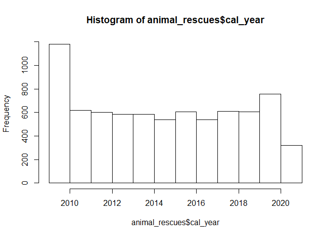
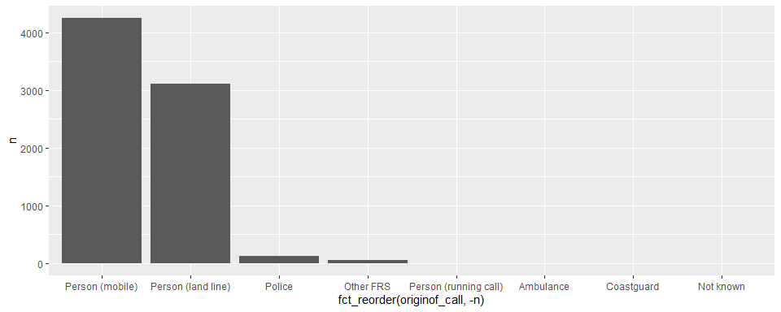

20210629 - Rescue Animals
================
Nick Cruickshank
6/30/2021

  - [Introduction](#introduction)
  - [Exploratory Data Analysis](#exploratory-data-analysis)
      - [Notes](#notes)
  - [Data Visualization Projects](#data-visualization-projects)
      - [Choropleth of animal rescues](#choropleth-of-animal-rescues)
      - [Timeline of animal rescue](#timeline-of-animal-rescue)

``` r
# libraries
library(forcats)
library(lubridate)
library(readr)
library(tidyverse)
```

``` r
# data
animal_rescues <- readr::read_csv('https://raw.githubusercontent.com/rfordatascience/tidytuesday/master/data/2021/2021-06-29/animal_rescues.csv')
```

# Introduction

Data this week comes from
[London.gov](https://data.london.gov.uk/dataset/animal-rescue-incidents-attended-by-lfb).

> Fox in bedroom, dog trapped in wall. The London Fire Brigade responds
> to hundreds of requests to rescue animals each year. Its
> monthly-updated spreadsheet of such events goes back to 2009; it lists
> the location and type of property, the kind of animal and rescue,
> hours spent, a (very) brief description, and more. \[h/t Soph Warnes\]

Another
[article](https://www.theguardian.com/world/2021/jan/08/animal-rescues-london-fire-brigade-rise-2020-pandemic-year)
found that animals rescues increased by 20% in the year of the pandemic
(2020).

> The London fire brigade (LFB) was involved in 755 such incidents –
> more than two a day. The number of rescues rose by 20% compared with
> 2019 when there were 602, with the biggest rise coming in the number
> of non-domestic animals rescued, according to the data.

``` r
# tidy
animal_rescues
```

    ## # A tibble: 7,544 x 31
    ##    incident_number date_time_of_ca~ cal_year fin_year type_of_incident
    ##              <dbl> <chr>               <dbl> <chr>    <chr>           
    ##  1          139091 01/01/2009 03:01     2009 2008/09  Special Service 
    ##  2          275091 01/01/2009 08:51     2009 2008/09  Special Service 
    ##  3         2075091 04/01/2009 10:07     2009 2008/09  Special Service 
    ##  4         2872091 05/01/2009 12:27     2009 2008/09  Special Service 
    ##  5         3553091 06/01/2009 15:23     2009 2008/09  Special Service 
    ##  6         3742091 06/01/2009 19:30     2009 2008/09  Special Service 
    ##  7         4011091 07/01/2009 06:29     2009 2008/09  Special Service 
    ##  8         4211091 07/01/2009 11:55     2009 2008/09  Special Service 
    ##  9         4306091 07/01/2009 13:48     2009 2008/09  Special Service 
    ## 10         4715091 07/01/2009 21:24     2009 2008/09  Special Service 
    ## # ... with 7,534 more rows, and 26 more variables: pump_count <chr>,
    ## #   pump_hours_total <chr>, hourly_notional_cost <dbl>,
    ## #   incident_notional_cost <chr>, final_description <chr>,
    ## #   animal_group_parent <chr>, originof_call <chr>, property_type <chr>,
    ## #   property_category <chr>, special_service_type_category <chr>,
    ## #   special_service_type <chr>, ward_code <chr>, ward <chr>,
    ## #   borough_code <chr>, borough <chr>, stn_ground_name <chr>, uprn <chr>,
    ## #   street <chr>, usrn <chr>, postcode_district <chr>, easting_m <chr>,
    ## #   northing_m <chr>, easting_rounded <dbl>, northing_rounded <dbl>,
    ## #   latitude <chr>, longitude <chr>

``` r
unredacted <- animal_rescues %>%
  filter(final_description != "Redacted")
```

# Exploratory Data Analysis

## Notes

``` r
hist(animal_rescues$cal_year)
```

<!-- -->

`type_of_incident`: Only ‘Special Service’ represented.

`pump` = truck / unit deployed.

``` r
animal_rescues %>%
  count(originof_call) %>%
  ggplot(aes(fct_reorder(originof_call, -n), n)) + 
  geom_bar(stat = "identity")
```

<!-- -->

# Data Visualization Projects

## Choropleth of animal rescues

## Timeline of animal rescue

By species?
