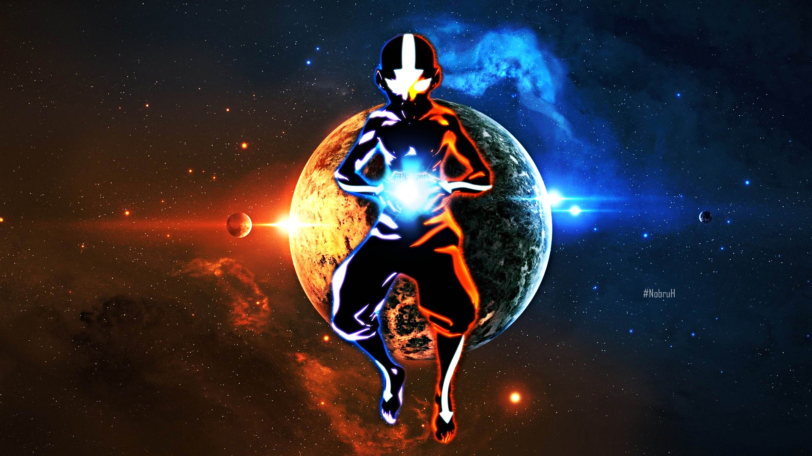

```{r setup, include=FALSE}
knitr::opts_chunk$set(echo = TRUE)
```



The following analysis was performed on the Avatar: the Last Airbender (ATLA) script, as compiled by the r4ds tidytuesday community. The core dataset (`avatar.csv`), consists of the following variables:

variable        | class     | description
----------------|-----------|-----------------
id              | integer   | Unique Row identifier
book            | character | Book name
book_num        | integer   | Book number
chapter         | character | Chapter name
chapter_num     | integer   | Chapter number
character       | character | Character speaking
full_text       | character | Full text (scene description, character text)
character_words | character | Text coming from characters
writer          | character | Writer of book
director        | character | Director of episode
imdb_rating     | double    | IMDB rating for episode

For those who are unfamiliar with the well-loved Nickelodeon TV show, [Wikipedia](https://en.wikipedia.org/wiki/Avatar:_The_Last_Airbender) has provided a good summary:

> Avatar: The Last Airbender (Avatar: The Legend of Aang in some regions) is an American animated television series created by Michael Dante DiMartino and Bryan Konietzko, with Aaron Ehasz as head writer. The series is also referred to as Avatar or ATLA by fans. It aired on Nickelodeon for three seasons, from February 2005 to July 2008.[2] Avatar is set in an Asiatic-like world in which some people can manipulate one of the four elements—water, earth, fire, or air—with telekinetic variants of the Chinese martial arts known as "bending". The only individual who can bend all four elements, the "Avatar", is responsible for maintaining harmony between the world's four nations, and serves as the bridge between the spirit world and the physical world. The show is presented in a style that combines anime with American cartoons, and relies on the imagery of mainly East Asian culture, with some South Asian, New World, and Inuit and Sireniki influences.

> The series is centered around the journey of 12-year-old Aang, the current Avatar and last survivor of his nation, the Air Nomads, along with his friends Sokka, Katara, and later Toph, as they strive to end the Fire Nation's war against the other nations of the world. It also follows the story of Zuko—the exiled prince of the Fire Nation, seeking to restore his lost honor by capturing Aang, accompanied by his wise uncle Iroh—and later, that of his ambitious sister Azula.

## Load Information

```{r load libraries, message=FALSE, warning=FALSE}
# load libraries
library(extrafont)
library(forcats)
library(ggrepel)
library(glmnet)
library(glue)
library(janitor)
library(ngram)
library(readr)
library(shadowtext)
library(tidyverse)
library(tidymodels)
library(tidytext)
library(tvthemes)
library(vip)
loadfonts(device = "win")
```

```{r load data, message=FALSE, warning=FALSE}
# load data
avatar <- readr::read_csv('https://raw.githubusercontent.com/rfordatascience/tidytuesday/master/data/2020/2020-08-11/avatar.csv')
scene_description <- readr::read_csv('https://raw.githubusercontent.com/rfordatascience/tidytuesday/master/data/2020/2020-08-11/scene_description.csv')
```


```{r tidy df, message=FALSE, warning=FALSE}
# create ep list
eps <- avatar %>%
  distinct(book, book_num, chapter, chapter_num, writer, director, imdb_rating) %>%
  #mutate(writer = str_remove(writer, "<U+200E>")) %>%
  separate(writer, into = c("writer1","writer2","writer3","writer4","writer5",
                            "writer6","writer7","writer8","writer9","writer10"),
           sep = ", ")
# for each character, create a column with percent of spoke lines

eps$imdb_rating[is.na(eps$imdb_rating)] <- 9.4

books <- unique(avatar$book)
```

## Describe DF

```{r}
as_tibble(avatar) %>% head(5)
```

## Exploratory Data Analysis

### Episode Breakdown by IMDB Rating

#### IMDb Rating Distribution

```{r}
# font used in Avatar: the Last Airbender
##font_import(pattern = "herculanum.ttf")

# values to be expressed in the following plot
# worst episode
worst_ep <- eps %>%
  arrange(imdb_rating) %>%
  select(chapter, imdb_rating) %>%
  head(1)

worst_chap <- worst_ep$chapter
worst_chap_rating <- worst_ep$imdb_rating

# best episode
best_ep <- eps %>%
  arrange(desc(imdb_rating)) %>%
  select(chapter, imdb_rating) %>%
  head(1)

best_chap <- best_ep$chapter
best_chap_rating <- best_ep$imdb_rating
```

```{r episode breakdown, fig.height=8, fig.width=10, message=FALSE, warning=FALSE}
# create a graph visualizing the episodes by imbd_rating
eps %>%
  ggplot(aes(fct_reorder(as.factor(book), book_num), chapter_num)) + 
  geom_tile(aes(fill = imdb_rating), color = "black") + 
  scale_fill_viridis_c(option = "magma") + 
  geom_shadowtext(
    aes(label = paste0(book_num, sep = ".", chapter_num, sep = ": ", chapter)), size = 3) + 
  labs(
    title = "Avatar Episode IMDb Ratings",
    subtitle = glue("Best episode: '{best_chap}' (IMDb Rating - {best_chap_rating})\n
                    Worst episode: '{worst_chap}' (IMDb Rating {worst_chap_rating})"),
    x = "Book",
    y = "",
    fill = "IMBd Rating"
  ) +
  theme_avatar(title.font = "Herculanum",
               text.font = "Herculanum") + 
  theme(
    legend.position = c(0.85,1.05),
    legend.direction = "horizontal",
    legend.box.background = element_rect(),
    panel.grid = element_blank(),
    axis.text.y = element_blank()
  )
```

#### IMDb Ratings Over Time

```{r ratings over time, fig.height=6, fig.width=10, message=FALSE, warning=FALSE}
eps %>%
  mutate(chapter = fct_inorder(chapter)) %>%
  ggplot(aes(chapter, imdb_rating)) + 
  geom_line(group = 1) + 
  geom_point(aes(color = factor(book)), size = 2) +
  scale_color_manual(values = c(
    "Earth" = "tan2",
    "Fire" = "firebrick",
    "Water" = "royalblue2"
  )) +
  ggrepel::geom_label_repel(
    data = filter(eps, imdb_rating >= 9.4),
    aes(label = paste0(book_num, sep = ".", chapter_num, sep = ": ", chapter)),
    size = 3,
    alpha = 0.5,
    color = "forestgreen"
  ) +
  ggrepel::geom_label_repel(
    data = filter(eps, imdb_rating <= 7.8),
    aes(label = paste0(book_num, sep = ".", chapter_num, sep = ": ", chapter)),
    size = 3,
    alpha = 0.5,
    color = "firebrick"
  ) +
  labs(
    title = "Avatar the Last Airbender: IMDb Ratings by Epsiode",
    x = "Chapter",
    y = "IMDb Rating"
  ) + 
  theme_avatar(title.font = "Herculanum",
               text.font = "Herculanum") +
  theme(
    #axis.text.x = element_text(angle = 90, hjust = 1),
    axis.text.x = element_blank(),
    panel.grid.major.x = element_blank(),
    legend.position = "none"
  )
```

### Which characters had the most lines?

```{r create df for word count by character, message=FALSE, warning=FALSE}
# define strings to trim from dataset.
intro1 <- "Water. Earth. Fire. Air. My grandmother used to tell me"
intro2 <- "Long ago, the four nations lived together in harmony."

character_words <- avatar %>%
  filter(!(grepl(c(intro1,intro2), character_words)),
         character != "Scene Description") %>%
  group_by(book, book_num, chapter, chapter_num, character, writer, director, imdb_rating) %>%
  dplyr::summarise(
    words = wordcount(character_words)
  )
```

Given that Aang, Katara, and Sokka are the main characters throughout the entire series, it is no surprise that they have the most overall words spoken throughout the show. Zuko fetured much more prominently in Book 3 because (SPOILER) he joined "Team Avatar" and became a good guy. Conversely Iroh was featured _less_ prominently in Book 3 due in part to the direction the story took and in part to the fact that the original voice actor [died](https://en.wikipedia.org/wiki/Mako_(actor)) and was replaced with Greg Baldwin for Book 3. 

```{r word count distribution, fig.height=5, fig.width=10, message=FALSE, warning=FALSE}
main_characters <- c("Aang", "Azula", "Iroh", "Katara", "Sokka", "Toph", "Zuko")

character_words %>%
  filter(character %in% main_characters) %>%
  group_by(book, character) %>%
  dplyr::summarise(
    total_words = sum(words)
  ) %>%
  ggplot(aes(fct_reorder(character, total_words, .desc = TRUE), total_words)) + 
  geom_bar(aes(fill = book), stat = "identity", color = "black") + 
  scale_fill_manual(values = c(
    "Earth" = "tan4",
    "Fire" = "firebrick",
    "Water" = "royalblue2"
  )) +
  labs(
    title = "Avatar: Word Count By Character",
    x = "Character",
    y = "Total Words"
  ) +
  theme_avatar(title.font = "Herculanum",
               text.font = "Herculanum") + 
  theme(
    panel.grid = element_blank()
  )
```

### TF-IDF Analysis

TF-IDF (term frequency-inverse document frequency) is one of the most popular term-weighing schemes used in text mining today. Briefly, it is a statistical measure of how import a term is in a document (i.e. the lines of a character in a TV show) relatve to the entire corpus (i.e. the entire script of that TV show) the document resides in. The 'inverse document frequency' aspect of the measure helps to devalue words which appear commonly in general throughout the entire corpus and are not specific to any one document. For example, all characters in ATLA are likely to use the word "bending" (the magic system in the ATLA universe), so that word would be unlikely to have a high TF-IDF score for any given characer. In general, the top terms as ranked by TF-IDF value can be considered "signature" phrases for that character.

```{r message=FALSE, warning=FALSE}
#additional words to add to the list of stop_words
blacklist <- c("hey", "yeah", "guys", "gonna")

#reshape the dataframe for TF-IDF analysis
script_words <- avatar %>%
  add_count(character) %>% #add a column adding all lines per character
  filter(n >= 50) %>% #filter out any characters who have too few lines
  select(-full_text) %>% #trim duplicate less-tidy column for script
  filter(!(grepl(c(intro1,intro2), character_words)),
         character != "Scene Description") %>% #filter misleading lines
  unnest_tokens(word, character_words) %>% #separate each line into individual tokens (words)
  anti_join(stop_words, by = "word") %>% #remove stopwords
  filter(!(word %in% blacklist)) #remove extra stopwords

character_tf_idf <- script_words %>%
  add_count(word) %>% #add count for how often each word appears
  filter(n >= 5) %>% #filter out words that occur infrequently
  count(word, character) %>% #create a column counting each token by character
  bind_tf_idf(word, character, n) %>% #create TF-IDF scores
  arrange(desc(tf_idf)) #rearrange rows
```

```{r tf_idf by main character, fig.height=8, fig.width=10, message=FALSE, warning=FALSE}
character_tf_idf %>%
  filter(character %in% main_characters) %>%
  mutate(nation = case_when(
    character %in% c("Aang") ~ "Air Nomads",
    character %in% c("Azula", "Iroh", "Zuko") ~ "Fire Nation",
    character %in% c("Toph") ~ "Earth Kingdom",
    character %in% c("Katara", "Sokka") ~ "Water Tribe"
  )) %>%
  group_by(character) %>%
  top_n(10, tf_idf) %>%
  ungroup() %>%
  mutate(word = reorder_within(word, tf_idf, character)) %>%
  ggplot(aes(word, tf_idf)) + 
  geom_bar(aes(fill = nation), stat = "identity") + 
  scale_fill_manual(values = c(
    "Earth Kingdom" = "tan4",
    "Fire Nation" = "firebrick",
    "Water Tribe" = "royalblue2",
    "Air Nomads" = "gold2"
  )) +
  geom_text(aes(label = round(tf_idf, 3)), size = 2.5, hjust = 1) +
  coord_flip() + 
  scale_x_reordered() +
  facet_wrap(~ character, scales = "free_y", ncol = 4) + 
  labs(
    title = "Avatar: the Last Airbender - TF-IDF Character Analysis",
    subtitle = "What are the signature words for each character?",
    x = "",
    y = "TF-IDF of character-word pairs"
  ) + 
  theme_avatar(title.font = "Herculanum",
               text.font = "Herculanum") + 
  theme(
    #axis.text.x = element_text(angle = 45, hjust = 1),
    panel.grid = element_blank(),
    axis.text.x = element_blank()
  )
```

## Machine Learning

Inspired by Julia Silge: https://juliasilge.com/blog/lasso-the-office/

```{r}
remove_regex <- "[:punct:]|[:digit:]|parts |parts |part |the |and" # be careful defining this

# create df to tidy up chapter names
avatar_info <- avatar %>%
  mutate(
    chap = str_to_lower(chapter),
    chap = str_remove_all(chap, remove_regex),
    chap = str_trim(chap),
    imdb_rating
  )

avatar_info
```

```{r}
avatar_ratings <- avatar_info %>%
  distinct(chap, imdb_rating)
```


How many times did each character speak per episode?

```{r}
characters <- avatar_info %>%
  count(chap, character) %>%
  add_count(character, wt = n, name = "character_count") %>%
  filter(character_count > 50,
         character != "Scene Description") %>%
  select(-character_count) %>%
  pivot_wider(
    names_from = character,
    values_from = n,
    values_fill = list(n = 0)
    )

characters
```

Which writers/directors were involved in each episode?

```{r}
creators <- avatar_info %>%
  distinct(chap, director, writer) %>%
  pivot_longer(director:writer, names_to = "role", values_to = "person") %>%
  separate_rows(person, sep = ",(\\s)?") %>%
  add_count(person) %>%
  filter(n > 1) %>%
  distinct(chap, person) %>%
  mutate(person_value = 1) %>%
  pivot_wider(
    names_from = person,
    values_from = person_value,
    values_fill = list(person_value = 0)
  )

creators
```

Join everything together

```{r}
df <- avatar_info %>%
  distinct(book, book_num, chap, chapter_num) %>%
  inner_join(characters) %>%
  inner_join(creators) %>%
  inner_join(avatar_ratings %>%
               select(chap, imdb_rating)) %>%
  janitor::clean_names()

df$imdb_rating[is.na(df$imdb_rating)] <- 9.4

df
```

Some brief exploratory data analysis (EDA)

```{r message=FALSE, warning=FALSE}
df %>%
  ggplot(aes(chapter_num, imdb_rating, fill = as.factor(chapter_num))) + 
  geom_boxplot(show.legend = FALSE) + 
  labs(
    title  = "Prelim Avatar EDA"
  ) + 
  theme_avatar(title.font = "Herculanum",
               text.font = "Herculanum")
```

## Training the model

Perform initial split.

```{r}
df_split <- initial_split(df, strata = book_num)
df_train <- training(df_split)
df_test <- training(df_split)
```

Preprocessing. Mainly setting index.

```{r}
df_rec <- recipe(imdb_rating ~ ., data = df_train) %>%
  update_role(book, new_role = "ID") %>%
  update_role(book_num, new_role = "ID") %>%
  update_role(chap, new_role = "ID") %>%
  update_role(chapter_num, new_role = "ID") %>%
  step_zv(all_predictors(), -all_outcomes()) %>%
  step_normalize(all_predictors(), -all_outcomes())

df_prep <- df_rec %>%
  prep(strings_as_factors = FALSE)

#recipe(imdb_rating ~ ., data = df_train) %>%
  #update_role(book, new_role = "ID") %>%
  #update_role(book_num, new_role = "ID") %>%
  #update_role(chap, new_role = "ID") %>%
  #update_role(chapter_num, new_role = "ID") %>%
  #step_zv(all_predictors(), -all_outcomes()) %>%
  #step_normalize(all_predictors(), -all_outcomes())
```

assign model (linear_reg lasso) and fit the training data to it.

```{r}
lasso <- linear_reg(penalty = 0.1, mixture = 1) %>%
  set_engine("glmnet")

wf <- workflow() %>%
  add_recipe(df_rec)

lasso_fit <- wf %>%
  add_model(lasso) %>%
  fit(data = df_train)

lasso_fit %>%
  pull_workflow_fit() %>%
  tidy()
```

tune the lasso model

define parameters to tune by

```{r}
set.seed(1494)
df_boot <- bootstraps(df_train, stata = book_num)

tune_spec <- linear_reg(penalty = tune(), mixture = 1) %>%
  set_engine("glmnet")

lambda_grid <- grid_regular(penalty(), levels = 50)
```

tune the grid using workflow objects

```{r}
doParallel::registerDoParallel()
```

```{r}
set.seed(1994)

# is this like GridSearchCV?
lasso_grid <- tune_grid(
  wf %>% add_model(tune_spec),
  resamples = df_boot,
  grid = lambda_grid
)
```

Here are the results

```{r}
lasso_grid %>%
  collect_metrics()
```

Visualize the results

```{r}
lasso_grid %>%
  collect_metrics() %>%
  ggplot(aes(penalty, mean, color = .metric)) + 
  geom_errorbar(aes(
    ymin = mean - std_err,
    ymax = mean - std_err
  ),
  alpha = 0.5
  ) + 
  geom_line(size = 1.5) + 
  facet_wrap(~.metric, scales = "free", nrow = 2) + 
  scale_x_log10() + 
  theme_avatar() +
  theme(legend.position = "none")

```

select best penalty value

```{r message=FALSE, warning=FALSE}
lowest_rmse <- lasso_grid %>% 
  select_best("rmse", maximize = FALSE)

final_lasso <- finalize_workflow(
  wf %>% add_model(tune_spec),
  lowest_rmse
)
```

finalize workflow and visualize training data

```{r feature importance, fig.height=8, fig.width=8, message=FALSE, warning=FALSE}
final_lasso %>%
  fit(df_train) %>%
  pull_workflow_fit() %>%
  vi(lambda = lowest_rmse$penalty) %>%
  mutate(
    Importance = abs(Importance),
    Variable = fct_reorder(Variable, Importance)
  ) %>%
  ggplot(aes(Variable, Importance)) + 
  geom_bar(aes(fill = Sign), stat = "Identity") + 
  scale_fill_manual(values = c(
    "NEG" = "firebrick",
    "POS" = "forestgreen"
  )) +
  coord_flip() + 
  scale_y_continuous(expand = c(0,0)) + 
  labs(
    title = "Avatar the Last Airbender: Importance of Characters\nand Creators on IMDb Rating",
    subtitle = "Which characters should be featured most prominently?\nWhich creators should be involved?",
    x = NULL,
    caption = "Feature importance for IMDb rating evaluated based on lasso regression analysis."
    ) +
  theme_avatar(title.font = "Herculanum",
               text.font = "Herculanum") + 
  theme(
    legend.position = c(0.9,0.1)
  )
```

fit model to test data

```{r}
last_fit(
  final_lasso,
  df_split
  ) %>%
  collect_metrics()
```

