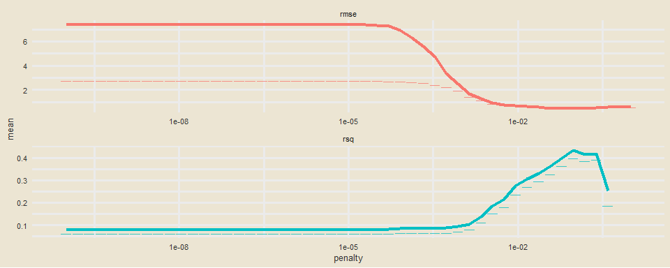

Avatar: The Last Airbender Analysis
================
Nick Cruickshank


The following analysis was performed on the Avatar: the Last Airbender
(ATLA) script, as compiled by the r4ds tidytuesday community. The core
dataset (`avatar.csv`), consists of the following variables:

| variable         | class     | description                                   |
| ---------------- | --------- | --------------------------------------------- |
| id               | integer   | Unique Row identifier                         |
| book             | character | Book name                                     |
| book\_num        | integer   | Book number                                   |
| chapter          | character | Chapter name                                  |
| chapter\_num     | integer   | Chapter number                                |
| character        | character | Character speaking                            |
| full\_text       | character | Full text (scene description, character text) |
| character\_words | character | Text coming from characters                   |
| writer           | character | Writer of book                                |
| director         | character | Director of episode                           |
| imdb\_rating     | double    | IMDB rating for episode                       |

For those who are unfamiliar with the well-loved Nickelodeon TV show,
[Wikipedia](https://en.wikipedia.org/wiki/Avatar:_The_Last_Airbender)
has provided a good summary:

> Avatar: The Last Airbender (Avatar: The Legend of Aang in some
> regions) is an American animated television series created by Michael
> Dante DiMartino and Bryan Konietzko, with Aaron Ehasz as head writer.
> The series is also referred to as Avatar or ATLA by fans. It aired on
> Nickelodeon for three seasons, from February 2005 to July 2008.\[2\]
> Avatar is set in an Asiatic-like world in which some people can
> manipulate one of the four elements—water, earth, fire, or air—with
> telekinetic variants of the Chinese martial arts known as “bending”.
> The only individual who can bend all four elements, the “Avatar”, is
> responsible for maintaining harmony between the world’s four nations,
> and serves as the bridge between the spirit world and the physical
> world. The show is presented in a style that combines anime with
> American cartoons, and relies on the imagery of mainly East Asian
> culture, with some South Asian, New World, and Inuit and Sireniki
> influences.

> The series is centered around the journey of 12-year-old Aang, the
> current Avatar and last survivor of his nation, the Air Nomads, along
> with his friends Sokka, Katara, and later Toph, as they strive to end
> the Fire Nation’s war against the other nations of the world. It also
> follows the story of Zuko—the exiled prince of the Fire Nation,
> seeking to restore his lost honor by capturing Aang, accompanied by
> his wise uncle Iroh—and later, that of his ambitious sister Azula.

## Load Information

``` r
# load libraries
library(extrafont)
library(forcats)
library(ggrepel)
library(glmnet)
library(glue)
library(janitor)
library(ngram)
library(readr)
library(shadowtext)
library(tidyverse)
library(tidymodels)
library(tidytext)
library(tvthemes)
library(vip)
loadfonts(device = "win")
```

``` r
# load data
avatar <- readr::read_csv('https://raw.githubusercontent.com/rfordatascience/tidytuesday/master/data/2020/2020-08-11/avatar.csv')
scene_description <- readr::read_csv('https://raw.githubusercontent.com/rfordatascience/tidytuesday/master/data/2020/2020-08-11/scene_description.csv')
```

``` r
# create ep list
eps <- avatar %>%
  distinct(book, book_num, chapter, chapter_num, writer, director, imdb_rating) %>%
  #mutate(writer = str_remove(writer, "<U+200E>")) %>%
  separate(writer, into = c("writer1","writer2","writer3","writer4","writer5",
                            "writer6","writer7","writer8","writer9","writer10"),
           sep = ", ")
# for each character, create a column with percent of spoke lines

eps$imdb_rating[is.na(eps$imdb_rating)] <- 9.4

books <- unique(avatar$book)
```

## Describe DF

``` r
as_tibble(avatar) %>% head(5)
```

    ## # A tibble: 5 x 11
    ##      id book  book_num chapter chapter_num character full_text character_words
    ##   <dbl> <chr>    <dbl> <chr>         <dbl> <chr>     <chr>     <chr>          
    ## 1     1 Water        1 The Bo~           1 Katara    "Water. ~ Water. Earth. ~
    ## 2     2 Water        1 The Bo~           1 Scene De~ "As the ~ <NA>           
    ## 3     3 Water        1 The Bo~           1 Sokka     "It's no~ It's not getti~
    ## 4     4 Water        1 The Bo~           1 Scene De~ "The sho~ <NA>           
    ## 5     5 Water        1 The Bo~           1 Katara    "[Happil~ Sokka, look!   
    ## # ... with 3 more variables: writer <chr>, director <chr>, imdb_rating <dbl>

## Exploratory Data Analysis

### Episode Breakdown by IMDB Rating

#### IMDb Rating Distribution

``` r
# font used in Avatar: the Last Airbender
##font_import(pattern = "herculanum.ttf")

# values to be expressed in the following plot
# worst episode
worst_ep <- eps %>%
  arrange(imdb_rating) %>%
  select(chapter, imdb_rating) %>%
  head(1)

worst_chap <- worst_ep$chapter
worst_chap_rating <- worst_ep$imdb_rating

# best episode
best_ep <- eps %>%
  arrange(desc(imdb_rating)) %>%
  select(chapter, imdb_rating) %>%
  head(1)

best_chap <- best_ep$chapter
best_chap_rating <- best_ep$imdb_rating
```

``` r
# create a graph visualizing the episodes by imbd_rating
eps %>%
  ggplot(aes(fct_reorder(as.factor(book), book_num), chapter_num)) + 
  geom_tile(aes(fill = imdb_rating), color = "black") + 
  scale_fill_viridis_c(option = "magma") + 
  geom_shadowtext(
    aes(label = paste0(book_num, sep = ".", chapter_num, sep = ": ", chapter)), size = 3) + 
  labs(
    title = "Avatar Episode IMDb Ratings",
    subtitle = glue("Best episode: '{best_chap}' (IMDb Rating - {best_chap_rating})\n
                    Worst episode: '{worst_chap}' (IMDb Rating {worst_chap_rating})"),
    x = "Book",
    y = "",
    fill = "IMBd Rating"
  ) +
  theme_avatar(title.font = "Herculanum",
               text.font = "Herculanum") + 
  theme(
    legend.position = c(0.85,1.05),
    legend.direction = "horizontal",
    legend.box.background = element_rect(),
    panel.grid = element_blank(),
    axis.text.y = element_blank()
  )
```

<!-- -->

#### IMDb Ratings Over Time

``` r
eps %>%
  mutate(chapter = fct_inorder(chapter)) %>%
  ggplot(aes(chapter, imdb_rating)) + 
  geom_line(group = 1) + 
  geom_point(aes(color = factor(book)), size = 2) +
  scale_color_manual(values = c(
    "Earth" = "tan2",
    "Fire" = "firebrick",
    "Water" = "royalblue2"
  )) +
  ggrepel::geom_label_repel(
    data = filter(eps, imdb_rating >= 9.4),
    aes(label = paste0(book_num, sep = ".", chapter_num, sep = ": ", chapter)),
    size = 3,
    alpha = 0.5,
    color = "forestgreen"
  ) +
  ggrepel::geom_label_repel(
    data = filter(eps, imdb_rating <= 7.8),
    aes(label = paste0(book_num, sep = ".", chapter_num, sep = ": ", chapter)),
    size = 3,
    alpha = 0.5,
    color = "firebrick"
  ) +
  labs(
    title = "Avatar the Last Airbender: IMDb Ratings by Epsiode",
    x = "Chapter",
    y = "IMDb Rating"
  ) + 
  theme_avatar(title.font = "Herculanum",
               text.font = "Herculanum") +
  theme(
    #axis.text.x = element_text(angle = 90, hjust = 1),
    axis.text.x = element_blank(),
    panel.grid.major.x = element_blank(),
    legend.position = "none"
  )
```

<!-- -->

### Which characters had the most lines?

``` r
# define strings to trim from dataset.
intro1 <- "Water. Earth. Fire. Air. My grandmother used to tell me"
intro2 <- "Long ago, the four nations lived together in harmony."

character_words <- avatar %>%
  filter(!(grepl(c(intro1,intro2), character_words)),
         character != "Scene Description") %>%
  group_by(book, book_num, chapter, chapter_num, character, writer, director, imdb_rating) %>%
  dplyr::summarise(
    words = wordcount(character_words)
  )
```

Given that Aang, Katara, and Sokka are the main characters throughout
the entire series, it is no surprise that they have the most overall
words spoken throughout the show. Zuko fetured much more prominently in
Book 3 because (SPOILER) he joined “Team Avatar” and became a good guy.
Conversely Iroh was featured *less* prominently in Book 3 due in part to
the direction the story took and in part to the fact that the original
voice actor [died](https://en.wikipedia.org/wiki/Mako_\(actor\)) and was
replaced with Greg Baldwin for Book 3.

``` r
main_characters <- c("Aang", "Azula", "Iroh", "Katara", "Sokka", "Toph", "Zuko")

character_words %>%
  filter(character %in% main_characters) %>%
  group_by(book, character) %>%
  dplyr::summarise(
    total_words = sum(words)
  ) %>%
  ggplot(aes(fct_reorder(character, total_words, .desc = TRUE), total_words)) + 
  geom_bar(aes(fill = book), stat = "identity", color = "black") + 
  scale_fill_manual(values = c(
    "Earth" = "tan4",
    "Fire" = "firebrick",
    "Water" = "royalblue2"
  )) +
  labs(
    title = "Avatar: Word Count By Character",
    x = "Character",
    y = "Total Words"
  ) +
  theme_avatar(title.font = "Herculanum",
               text.font = "Herculanum") + 
  theme(
    panel.grid = element_blank()
  )
```

<!-- -->

### TF-IDF Analysis

[TF-IDF](https://en.wikipedia.org/wiki/Tf%E2%80%93idf) (term
frequency-inverse document frequency) is one of the most popular
term-weighing schemes used in text mining today. Briefly, it is a
statistical measure of how import a term is in a document (i.e. the
lines of a character in a TV show) relatve to the entire corpus
(i.e. the entire script of that TV show) the document resides in. The
‘inverse document frequency’ aspect of the measure helps to devalue
words which appear commonly in general throughout the entire corpus and
are not specific to any one document. For example, all characters in
ATLA are likely to use the word “bending” (the magic system in the ATLA
universe), so that word would be unlikely to have a high TF-IDF score
for any given characer. In general, the top terms as ranked by TF-IDF
value can be considered “signature” phrases for that character.

``` r
#additional words to add to the list of stop_words
blacklist <- c("hey", "yeah", "guys", "gonna")

#reshape the dataframe for TF-IDF analysis
## tokens
token_blacklist <- c("yip", "gran", "dai", "li", "ty", "lee", "kai", "agni",
                     "father", "raiders", "twinkle", "toes")

script_words <- avatar %>%
  add_count(character) %>% #add a column adding all lines per character
  filter(n >= 50) %>% #filter out any characters who have too few lines
  select(-full_text) %>% #trim duplicate less-tidy column for script
  filter(!(grepl(c(intro1,intro2), character_words)),
         character != "Scene Description") %>% #filter misleading lines
  unnest_tokens(word, character_words) %>% #separate each line into individual tokens (words)
  anti_join(stop_words, by = "word") %>% #remove stopwords
  filter(!(word %in% blacklist),
         !(word %in% token_blacklist)) #remove extra stopwords

##bigrams
bigram_blacklist <- c("the dai", "aang i", "uncle i", "zuko you")

script_bigrams <- avatar %>%
  add_count(character) %>% #add a column adding all lines per character
  filter(n >= 50) %>% #filter out any characters who have too few lines
  select(-full_text) %>% #trim duplicate less-tidy column for script
  filter(!(grepl(c(intro1,intro2), character_words)),
         character != "Scene Description") %>% #filter misleading lines
  unnest_tokens(word, character_words, token = "ngrams", n = 2) %>% #separate each line into BIGRAMS
  anti_join(stop_words, by = "word") %>% #remove stopwords
  filter(!(word %in% blacklist),
         !(word %in% bigram_blacklist)) #remove extra stopwords

character_tf_idf <- script_words %>%
  rbind(script_bigrams) %>%
  add_count(word) %>% #add count for how often each word appears
  filter(n >= 5) %>% #filter out words that occur infrequently
  count(word, character) %>% #create a column counting each token by character
  bind_tf_idf(word, character, n) %>% #create TF-IDF scores
  arrange(desc(tf_idf)) #rearrange rows
```

The following graph displays the top 10 terms for each of the main
characters of ATLA, where the color of the bars is used to denote the
characters nationality. As with most TF-IDF analysis for a TV show, a
lot of each characters top terms are simply the name of another
character. There are some interesting terms which fall into this
category, which at first glance would not appear to. For example,
Azula’s top term is “Zuzu”, which is actually a childhood pet name for
her brother Zuko, which she frequently uses throughout the show in a
condescending way. Additionally, Toph’s top term is “Twinkle Toes”,
which is a pet nickname for Aang. Names and nicknames aside, many of
each characters top terms provide a good succint summary of what that
character is about. Some of the top terms were somewhat surprising
(Azula: Tides, Zuko: Southern Raiders).

``` r
character_tf_idf %>%
  filter(character %in% main_characters) %>%
  mutate(nation = case_when(
    character %in% c("Aang") ~ "Air Nomads",
    character %in% c("Azula", "Iroh", "Zuko") ~ "Fire Nation",
    character %in% c("Toph") ~ "Earth Kingdom",
    character %in% c("Katara", "Sokka") ~ "Water Tribe"
  )) %>%
  group_by(character) %>%
  top_n(10, tf_idf) %>%
  ungroup() %>%
  mutate(word = reorder_within(word, tf_idf, character)) %>%
  ggplot(aes(word, tf_idf)) + 
  geom_bar(aes(fill = nation), stat = "identity") + 
  scale_fill_manual(values = c(
    "Earth Kingdom" = "tan4",
    "Fire Nation" = "firebrick",
    "Water Tribe" = "royalblue2",
    "Air Nomads" = "gold2"
  )) +
  geom_text(aes(label = round(tf_idf, 3)), size = 2.5, hjust = 1) +
  coord_flip() + 
  scale_x_reordered() +
  facet_wrap(~ character, scales = "free_y", ncol = 4) + 
  labs(
    title = "Avatar: the Last Airbender - TF-IDF Character Analysis",
    subtitle = "What are the signature terms for each character?",
    x = "",
    y = "TF-IDF of character-word pairs"
  ) + 
  theme_avatar(title.font = "Herculanum",
               text.font = "Herculanum") + 
  theme(
    panel.grid = element_blank(),
    axis.text.x = element_blank()
  )
```

<!-- -->

## Machine Learning: Lasso Regression

### Introduction

With some exploratory data anlysis performed, there is a possibility for
some machine learning to be applied to the dataset provided.
Specifically, the entire script is provided for each episode
(predictor), alongside an IMDb rating (outcome). After reshaping the
dataset to create columns for how prevalent each character is in each
episode, alongside which creators (writers and directors) were involved
or not, the implementation of lasso regression analysis should be able
to create a model to predict the IMDb rating.

Lasso (least absolute shrinkage and selection operator) regression is a
type of linear regression which is good for simple sparse models. It is
a type of linear regression which employs a penalty value equal to the
absolute value of the magnitude of coefficients. This penalty score has
the effect of setting parameter weights to zero for the least
influential variables.

### Pre-Lasso Data Manipulation

The first step in the lasso regression is to tidy up the data to prepare
it for modeling.

First, the episode names need to be trimmed and tidied. Removing all
punctuations, parts, and capitalization.

``` r
remove_regex <- "[:punct:]|[:digit:]|parts |parts |part |the |and" # be careful defining this

# create df to tidy up chapter names
avatar_info <- avatar %>%
  mutate(
    chap = str_to_lower(chapter),
    chap = str_remove_all(chap, remove_regex),
    chap = str_trim(chap),
    imdb_rating
  )

avatar_ratings <- avatar_info %>%
  distinct(chap, imdb_rating)

avatar_info
```

    ## # A tibble: 13,385 x 12
    ##       id book  book_num chapter chapter_num character full_text character_words
    ##    <dbl> <chr>    <dbl> <chr>         <dbl> <chr>     <chr>     <chr>          
    ##  1     1 Water        1 The Bo~           1 Katara    "Water. ~ Water. Earth. ~
    ##  2     2 Water        1 The Bo~           1 Scene De~ "As the ~ <NA>           
    ##  3     3 Water        1 The Bo~           1 Sokka     "It's no~ It's not getti~
    ##  4     4 Water        1 The Bo~           1 Scene De~ "The sho~ <NA>           
    ##  5     5 Water        1 The Bo~           1 Katara    "[Happil~ Sokka, look!   
    ##  6     6 Water        1 The Bo~           1 Sokka     "[Close-~ Sshh! Katara, ~
    ##  7     7 Water        1 The Bo~           1 Scene De~ "Behind ~ <NA>           
    ##  8     8 Water        1 The Bo~           1 Katara    "[Strugg~ But, Sokka! I ~
    ##  9     9 Water        1 The Bo~           1 Scene De~ "The bub~ <NA>           
    ## 10    10 Water        1 The Bo~           1 Katara    "[Exclai~ Hey!           
    ## # ... with 13,375 more rows, and 4 more variables: writer <chr>,
    ## #   director <chr>, imdb_rating <dbl>, chap <chr>

Next, a count is made for each character for each they spoke per
episode. Characters who have fewer than 50 lines throughout the entire
show are trimmed out to make the resulting dataframe somewhat more
meaningful. Then, dataframe is pivoted wider, where each row is an
episode of the show and each column is a character line count for that
episode.

``` r
characters <- avatar_info %>%
  count(chap, character) %>%
  add_count(character, wt = n, name = "character_count") %>%
  filter(character_count > 50,
         character != "Scene Description") %>%
  select(-character_count) %>%
  pivot_wider(
    names_from = character,
    values_from = n,
    values_fill = list(n = 0)
    )

characters
```

    ## # A tibble: 59 x 18
    ##    chap   Aang Azula  Iroh   Mai  Suki  Toph `Ty Lee`  Zuko Katara  Roku Sokka
    ##    <chr> <int> <int> <int> <int> <int> <int>    <int> <int>  <int> <int> <int>
    ##  1 appa~     4     5     1     2     7     3        2     1      0     0     0
    ##  2 avat~    17     3     4     0     0     3        0    10      4    45     3
    ##  3 avat~    30     0     8     0     0     0        0     6     30     0    36
    ##  4 avat~    30     0     3     0     0     0        0    12     35     0    33
    ##  5 avat~    35    17    12     0     0     0        0    13     20     5    16
    ##  6 awak~    35    10     0     2     0    10        0    11     30     2    12
    ##  7 bato~    38     0     8     0     0     0        0    19     32     0    43
    ##  8 beach     4    35     0    26     0     4       31    40      2     0     1
    ##  9 bitt~    44     0    19     0     0    26        0    17     14     0    19
    ## 10 blin~    37     0     0     0     0    30        0     0     22     0    24
    ## # ... with 49 more rows, and 6 more variables: Hakoda <int>, Ozai <int>,
    ## #   Yue <int>, Zhao <int>, Jet <int>, Bumi <int>

A similar series of data manipulation tasks are performed for each
creator (writers and directors). Major difference being that instead of
how many lines per character per episode, it is a simple boolean value
of whether the creator was involved with the episode (1) or not (0).

``` r
creators <- avatar_info %>%
  distinct(chap, director, writer) %>%
  pivot_longer(director:writer, names_to = "role", values_to = "person") %>%
  separate_rows(person, sep = ",(\\s)?") %>%
  add_count(person) %>%
  filter(n > 1) %>%
  distinct(chap, person) %>%
  mutate(person_value = 1) %>%
  pivot_wider(
    names_from = person,
    values_from = person_value,
    values_fill = list(person_value = 0)
  )

creators
```

    ## # A tibble: 59 x 17
    ##    chap  `Dave Filoni` `Bryan Konietzk~ `Aaron Ehasz` `Peter Goldfing~
    ##    <chr>         <dbl>            <dbl>         <dbl>            <dbl>
    ##  1 boy ~             1                1             1                1
    ##  2 avat~             1                1             1                1
    ##  3 sout~             0                0             0                0
    ##  4 warr~             0                0             0                0
    ##  5 king~             0                0             0                0
    ##  6 impr~             1                0             0                0
    ##  7 wint~             0                0             1                0
    ##  8 wint~             0                0             0                0
    ##  9 wate~             0                0             0                0
    ## 10 jet               1                0             0                0
    ## # ... with 49 more rows, and 12 more variables: `Josh Stolberg` <dbl>, `Michael
    ## #   Dante DiMartino` <dbl>, `Lauren MacMullan` <dbl>, `Giancarlo Volpe` <dbl>,
    ## #   `Anthony Lioi` <dbl>, `John O'Bryan` <dbl>, `Tim Hedrick` <dbl>, `Elizabeth
    ## #   Welch Ehasz` <dbl>, `Joshua Hamilton` <dbl>, `Ethan Spaulding` <dbl>,
    ## #   `Katie Mattila` <dbl>, `Joaquim Dos Santos` <dbl>

Finally, the characters and creators were joined together to create the
final dataframe to be used for the lasso regression.

``` r
df <- avatar_info %>%
  distinct(book, book_num, chap, chapter_num) %>%
  inner_join(characters) %>%
  inner_join(creators) %>%
  inner_join(avatar_ratings %>%
               select(chap, imdb_rating)) %>%
  janitor::clean_names()
```

    ## Joining, by = "chap"
    ## Joining, by = "chap"
    ## Joining, by = "chap"

``` r
df$imdb_rating[is.na(df$imdb_rating)] <- 9.4

df
```

    ## # A tibble: 65 x 38
    ##    book  book_num chap  chapter_num  aang azula  iroh   mai  suki  toph ty_lee
    ##    <chr>    <dbl> <chr>       <dbl> <int> <int> <int> <int> <int> <int>  <int>
    ##  1 Water        1 boy ~           1    47     0     7     0     0     0      0
    ##  2 Water        1 avat~           2    30     0     3     0     0     0      0
    ##  3 Water        1 sout~           3    52     0    13     0     0     0      0
    ##  4 Water        1 warr~           4    59     0     5     0    25     0      0
    ##  5 Water        1 king~           5    56     0     0     0     0     0      0
    ##  6 Water        1 impr~           6    23     0     0     0     0     0      0
    ##  7 Water        1 wint~           7    33     0    13     0     0     0      0
    ##  8 Water        1 wint~           8    44     0     8     0     0     0      0
    ##  9 Water        1 wate~           9    45     0    12     0     0     0      0
    ## 10 Water        1 jet            10    36     0     0     0     0     0      0
    ## # ... with 55 more rows, and 27 more variables: zuko <int>, katara <int>,
    ## #   roku <int>, sokka <int>, hakoda <int>, ozai <int>, yue <int>, zhao <int>,
    ## #   jet <int>, bumi <int>, dave_filoni <dbl>, bryan_konietzko <dbl>,
    ## #   aaron_ehasz <dbl>, peter_goldfinger <dbl>, josh_stolberg <dbl>,
    ## #   michael_dante_di_martino <dbl>, lauren_mac_mullan <dbl>,
    ## #   giancarlo_volpe <dbl>, anthony_lioi <dbl>, john_o_bryan <dbl>,
    ## #   tim_hedrick <dbl>, elizabeth_welch_ehasz <dbl>, joshua_hamilton <dbl>,
    ## #   ethan_spaulding <dbl>, katie_mattila <dbl>, joaquim_dos_santos <dbl>,
    ## #   imdb_rating <dbl>

### Training the model

Now that the avatar script has been rehaped into a format which can be
used for lasso regression, the first step of any machine learning task
is to perform a train-test split of the dataframe. The model is trained
on the “Train” split, with the “Test” split withheld until the end to
assess the the accuracy of the model.

``` r
df_split <- initial_split(df, strata = book_num)
df_train <- training(df_split)
df_test <- training(df_split)
```

Preprocessing is then performed on df\_train. Here the book and chapter
columns are set as “ID” columns so that they are not used as predictors.
Some other “steps” in the “recipe” included filtering out any variables
which had zero variance (only value). The normalization step normalizes
numeric data to have a mean of zero and a standard deviation of 1.

``` r
df_rec <- recipe(imdb_rating ~ ., data = df_train) %>%
  update_role(book, new_role = "ID") %>%
  update_role(book_num, new_role = "ID") %>%
  update_role(chap, new_role = "ID") %>%
  update_role(chapter_num, new_role = "ID") %>%
  step_zv(all_predictors(), -all_outcomes()) %>%
  step_normalize(all_predictors(), -all_outcomes())

df_prep <- df_rec %>%
  prep(strings_as_factors = FALSE)
```

After the “recipe” has been prepared, the lasso regression model is
defined with an arbitray penalty value. A `workflow()` is used for
convenience to help manage modelling pipelines.

``` r
lasso <- linear_reg(penalty = 0.1, mixture = 1) %>%
  set_engine("glmnet")

wf <- workflow() %>%
  add_recipe(df_rec)

lasso_fit <- wf %>%
  add_model(lasso) %>%
  fit(data = df_train)

lasso_fit %>%
  pull_workflow_fit() %>%
  tidy()
```

    ## # A tibble: 1,624 x 5
    ##    term         step estimate lambda dev.ratio
    ##    <chr>       <dbl>    <dbl>  <dbl>     <dbl>
    ##  1 (Intercept)     1   8.79    0.339    0     
    ##  2 (Intercept)     2   8.79    0.309    0.0646
    ##  3 katara          2  -0.0304  0.309    0.0646
    ##  4 (Intercept)     3   8.79    0.282    0.118 
    ##  5 katara          3  -0.0582  0.282    0.118 
    ##  6 (Intercept)     4   8.79    0.257    0.163 
    ##  7 katara          4  -0.0834  0.257    0.163 
    ##  8 (Intercept)     5   8.79    0.234    0.200 
    ##  9 katara          5  -0.106   0.234    0.200 
    ## 10 (Intercept)     6   8.79    0.213    0.230 
    ## # ... with 1,614 more rows

### Tuning the model

As stated above, the penalty value which was initially chosen was done
so in a more or less random manner. Using a bootstrap and `penalty =
tune()`, an optimal penalty value can be arrived at for the dataframe.

``` r
set.seed(1494)
df_boot <- bootstraps(df_train, stata = book_num)

tune_spec <- linear_reg(penalty = tune(), mixture = 1) %>%
  set_engine("glmnet")

lambda_grid <- grid_regular(penalty(), levels = 50)
```

The grid of bootstraps is then tuned using the workflow object.

``` r
doParallel::registerDoParallel()
```

``` r
set.seed(1994)

# Similar to GridSearchCV in python
lasso_grid <- tune_grid(
  wf %>% add_model(tune_spec),
  resamples = df_boot,
  grid = lambda_grid
)
```

The results from the tuned grid are as follows.

``` r
lasso_grid %>%
  collect_metrics()
```

    ## # A tibble: 100 x 6
    ##     penalty .metric .estimator   mean     n std_err
    ##       <dbl> <chr>   <chr>       <dbl> <int>   <dbl>
    ##  1 1.00e-10 rmse    standard   7.35      25  4.65  
    ##  2 1.00e-10 rsq     standard   0.0788    25  0.0185
    ##  3 1.60e-10 rmse    standard   7.35      25  4.65  
    ##  4 1.60e-10 rsq     standard   0.0788    25  0.0185
    ##  5 2.56e-10 rmse    standard   7.35      25  4.65  
    ##  6 2.56e-10 rsq     standard   0.0788    25  0.0185
    ##  7 4.09e-10 rmse    standard   7.35      25  4.65  
    ##  8 4.09e-10 rsq     standard   0.0788    25  0.0185
    ##  9 6.55e-10 rmse    standard   7.35      25  4.65  
    ## 10 6.55e-10 rsq     standard   0.0788    25  0.0185
    ## # ... with 90 more rows

These tuned lasso results are then plotted to visualize where the
optimal penalty score lies.

``` r
lasso_grid %>%
  collect_metrics() %>%
  ggplot(aes(penalty, mean, color = .metric)) + 
  geom_errorbar(aes(
    ymin = mean - std_err,
    ymax = mean - std_err
  ),
  alpha = 0.5
  ) + 
  geom_line(size = 1.5) + 
  facet_wrap(~.metric, scales = "free", nrow = 2) + 
  scale_x_log10() + 
  theme_avatar() +
  theme(legend.position = "none")
```

<!-- -->

The penalty value with the lowest RMSE (root mean square error) is then
chosen for the final model.

``` r
lowest_rmse <- lasso_grid %>% 
  select_best("rmse", maximize = FALSE)

final_lasso <- finalize_workflow(
  wf %>% add_model(tune_spec),
  lowest_rmse
)
```

The workflow is then finalized with the new penalty score chosen. The
following graph shows the feature importance for the model learned from
the `df_train` dataset. Higher importance scores mean that the variable
was a better predictor for high IMDb scores. Positively scored valeus
mean the parameter was prominently included in episodes with high IMDb
ratings, while negative scored values indicate the opposite.

``` r
final_lasso %>%
  fit(df_train) %>%
  pull_workflow_fit() %>%
  vi(lambda = lowest_rmse$penalty) %>%
  mutate(
    Importance = abs(Importance),
    Variable = fct_reorder(Variable, Importance)
  ) %>%
  ggplot(aes(Variable, Importance)) + 
  geom_bar(aes(fill = Sign), stat = "Identity") + 
  scale_fill_manual(values = c(
    "NEG" = "firebrick",
    "POS" = "forestgreen"
  )) +
  coord_flip() + 
  scale_y_continuous(expand = c(0,0)) + 
  labs(
    title = "Avatar the Last Airbender: Importance of Characters\nand Creators on IMDb Rating",
    subtitle = "Which characters should be featured most prominently?\nWhich creators should be involved?",
    x = NULL,
    caption = "Feature importance for IMDb rating evaluated based on lasso regression analysis."
    ) +
  theme_avatar(title.font = "Herculanum",
               text.font = "Herculanum") + 
  theme(
    legend.position = c(0.9,0.1)
  )
```

<!-- -->

Finally, the model is fit to the `df_test` to assess the accuracy of the
model.

``` r
last_fit(
  final_lasso,
  df_split
  ) %>%
  collect_metrics()
```

    ## # A tibble: 2 x 3
    ##   .metric .estimator .estimate
    ##   <chr>   <chr>          <dbl>
    ## 1 rmse    standard       0.627
    ## 2 rsq     standard       0.323

``` r
last_fit(
  final_lasso,
  df_split
  ) %>%
  collect_predictions()
```

    ## # A tibble: 15 x 4
    ##    id               .pred  .row imdb_rating
    ##    <chr>            <dbl> <int>       <dbl>
    ##  1 train/test split  8.76     7         8.2
    ##  2 train/test split  8.22    10         7.8
    ##  3 train/test split  8.68    11         7.1
    ##  4 train/test split  8.98    13         9.1
    ##  5 train/test split  9.02    22         9.4
    ##  6 train/test split  8.58    24         8.2
    ##  7 train/test split  8.88    25         8.4
    ##  8 train/test split  8.76    26         7.7
    ##  9 train/test split  8.76    32         8.8
    ## 10 train/test split  9.15    38         8.8
    ## 11 train/test split  8.67    51         7.8
    ## 12 train/test split  9.06    57         9.2
    ## 13 train/test split  9.06    58         8.7
    ## 14 train/test split  8.49    60         8.9
    ## 15 train/test split  8.81    61         8.6

## Inspirations

Lasso Regression Analysis of ‘The Office’ by Julia Silge:
<https://juliasilge.com/blog/lasso-the-office/>
