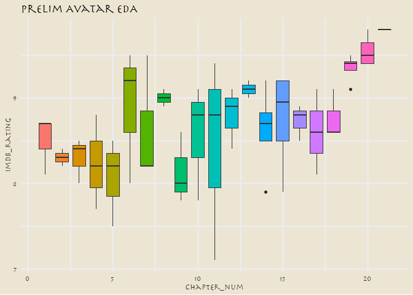
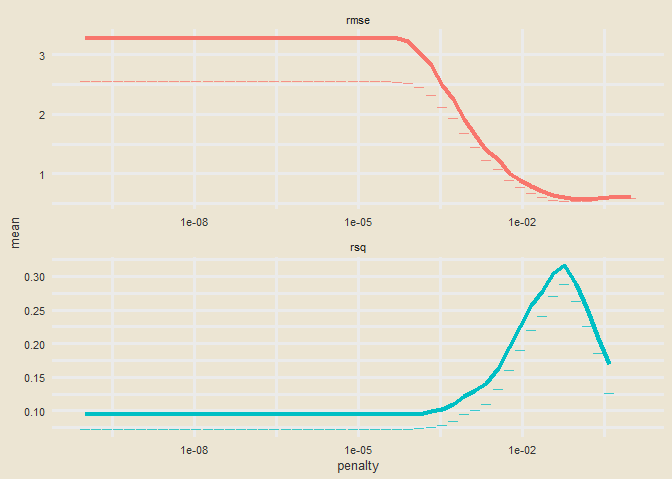

Avatar: The Last Airbender Analysis
================
Nick Cruickshank
9/24/2020

## Load Information

``` r
# load libraries
library(extrafont)
library(forcats)
library(glmnet)
library(glue)
library(janitor)
library(ngram)
library(readr)
library(shadowtext)
library(tidyverse)
library(tidymodels)
library(tvthemes)
library(vip)
loadfonts(device = "win")
```

``` r
# load data
avatar <- readr::read_csv('https://raw.githubusercontent.com/rfordatascience/tidytuesday/master/data/2020/2020-08-11/avatar.csv')
scene_description <- readr::read_csv('https://raw.githubusercontent.com/rfordatascience/tidytuesday/master/data/2020/2020-08-11/scene_description.csv')
```

``` r
# create ep list
eps <- avatar %>%
  distinct(book, book_num, chapter, chapter_num, writer, director, imdb_rating) %>%
  #mutate(writer = str_remove(writer, "<U+200E>")) %>%
  separate(writer, into = c("writer1","writer2","writer3","writer4","writer5",
                            "writer6","writer7","writer8","writer9","writer10"),
           sep = ", ")
# for each character, create a column with percent of spoke lines

books <- unique(avatar$book)
```

## Describe DF

``` r
knitr::kable(avatar %>% head(1))
```

| id | book  | book\_num | chapter                | chapter\_num | character | full\_text                                                                                                                                                                                                                                                                                                                                                                                                                                                                                                                                                                                                                                                                                                                                                                                                                                                             | character\_words                                                                                                                                                                                                                                                                                                                                                                                                                                                                                                                                                                                                                                                                                                                                                                                                                                                       | writer                                                                                  | director    | imdb\_rating |
| -: | :---- | --------: | :--------------------- | -----------: | :-------- | :--------------------------------------------------------------------------------------------------------------------------------------------------------------------------------------------------------------------------------------------------------------------------------------------------------------------------------------------------------------------------------------------------------------------------------------------------------------------------------------------------------------------------------------------------------------------------------------------------------------------------------------------------------------------------------------------------------------------------------------------------------------------------------------------------------------------------------------------------------------------- | :--------------------------------------------------------------------------------------------------------------------------------------------------------------------------------------------------------------------------------------------------------------------------------------------------------------------------------------------------------------------------------------------------------------------------------------------------------------------------------------------------------------------------------------------------------------------------------------------------------------------------------------------------------------------------------------------------------------------------------------------------------------------------------------------------------------------------------------------------------------------- | :-------------------------------------------------------------------------------------- | :---------- | -----------: |
|  1 | Water |         1 | The Boy in the Iceberg |            1 | Katara    | Water. Earth. Fire. Air. My grandmother used to tell me stories about the old days: a time of peace when the Avatar kept balance between the Water Tribes, Earth Kingdom, Fire Nation and Air Nomads. But that all changed when the Fire Nation attacked. Only the Avatar mastered all four elements; only he could stop the ruthless firebenders. But when the world needed him most, he vanished. A hundred years have passed, and the Fire Nation is nearing victory in the war. Two years ago, my father and the men of my tribe journeyed to the Earth Kingdom to help fight against the Fire Nation, leaving me and my brother to look after our tribe. Some people believe that the Avatar was never reborn into the Air Nomads and that the cycle is broken, but I haven’t lost hope. I still believe that, somehow, the Avatar will return to save the world. | Water. Earth. Fire. Air. My grandmother used to tell me stories about the old days: a time of peace when the Avatar kept balance between the Water Tribes, Earth Kingdom, Fire Nation and Air Nomads. But that all changed when the Fire Nation attacked. Only the Avatar mastered all four elements; only he could stop the ruthless firebenders. But when the world needed him most, he vanished. A hundred years have passed, and the Fire Nation is nearing victory in the war. Two years ago, my father and the men of my tribe journeyed to the Earth Kingdom to help fight against the Fire Nation, leaving me and my brother to look after our tribe. Some people believe that the Avatar was never reborn into the Air Nomads and that the cycle is broken, but I haven’t lost hope. I still believe that, somehow, the Avatar will return to save the world. | ‎Michael Dante DiMartino, Bryan Konietzko, Aaron Ehasz, Peter Goldfinger, Josh Stolberg | Dave Filoni |          8.1 |

## Exploratory Analysis

### Episode Breakdown by IMDB Rating

``` r
# worst episode
worst_ep <- eps %>%
  arrange(imdb_rating) %>%
  select(chapter, imdb_rating) %>%
  head(1)

worst_chap <- worst_ep$chapter
worst_chap_rating <- worst_ep$imdb_rating

# best episode
best_ep <- eps %>%
  arrange(desc(imdb_rating)) %>%
  select(chapter, imdb_rating) %>%
  head(1)

best_chap <- best_ep$chapter
best_chap_rating <- best_ep$imdb_rating
```

``` r
# create a graph visualizing the episodes by imbd_rating
eps %>%
  ggplot(aes(book_num, chapter_num)) + 
  geom_tile(aes(fill = imdb_rating), color = "black") + 
  scale_fill_viridis_c(option = "plasma") + 
  geom_shadowtext(aes(label = chapter), size = 2.5) + 
  labs(
    title = "Avatar Episode IMDb Ratings",
    subtitle = glue("Best episode was '{best_chap}' with a rating of {best_chap_rating}\n
                    Worst episode was '{worst_chap}' with a rating of {worst_chap_rating}"),
    x = "Book",
    y = "Chapter",
    fill = "IMBd Rating"
  ) +
  theme_avatar(title.font = "Herculanum",
               text.font = "Herculanum") + 
  theme(
    legend.position = c(0.2,0.96),
    legend.direction = "horizontal",
    legend.box.background = element_rect(),
    panel.grid = element_blank()
  )
```

<!-- -->

### Director and Writer Analysis

Which directors or writers were associated with the most succesful
episodes of Avatar?

### “Cabbages” Trending

Track the running joke for the “MY CABBAGES” joke.

### Zuko Transformation Analysis

## Which characters had the most lines?

For each line of each episode, create a column which counts the number
of words (excluding stop words?) that line contains.

``` r
# define strings to trim from dataset.
intro1 <- "Water. Earth. Fire. Air. My grandmother used to tell me"
intro2 <- "Long ago, the four nations lived together in harmony."

character_words <- avatar %>%
  filter(!(grepl(c(intro1,intro2), character_words)),
         character != "Scene Description") %>%
  group_by(book, book_num, chapter, chapter_num, character, writer, director, imdb_rating) %>%
  dplyr::summarise(
    words = wordcount(character_words)
  )
  #mutate(words = wordcount(character_words)) #doesn't work right, appears to work within a summarise
```

``` r
main_characters <- c("Aang", "Azula", "Iroh", "Katara", "Ozai", "Sokka", "Toph", "Zuko")

#font_import(pattern = "herculanum.ttf", paths = "C:\\Windows\\Fonts\\", prompt = F)
#font_import(prompt = F)

character_words %>%
  filter(character %in% main_characters) %>%
  group_by(book, character) %>%
  dplyr::summarise(
    total_words = sum(words)
  ) %>%
  ggplot(aes(fct_reorder(character, total_words, .desc = TRUE), total_words)) + 
  geom_bar(aes(fill = book), stat = "identity", color = "black") + 
  scale_fill_manual(values = c(
    "Earth" = "tan4",
    "Fire" = "firebrick",
    "Water" = "royalblue2"
  )) +
  labs(
    title = "Avatar: Word Count By Character",
    x = "Character",
    y = "Total Words"
  ) +
  theme_avatar(title.font = "Herculanum",
               text.font = "Herculanum")
```

<!-- -->

Pivot the dataframe wider, so each character gets a column whose values
are the number of words they had in the episode.

Apply the same logic for each writer and director, but instead the
column is boolean (i.e. If writer one is in s1e1, than the column value
is 1 for that episode, else 0).

Train-test split the resulting dataframe, with IMDb rating as the
y-value.

Assess numerous different models for accuracy.

## Machine Learning

Inspired by Julia Silge: <https://juliasilge.com/blog/lasso-the-office/>

``` r
remove_regex <- "[:punct:]|[:digit:]|parts |parts |part |the |and" # be careful defining this

# create df to tidy up chapter names
avatar_info <- avatar %>%
  mutate(
    chap = str_to_lower(chapter),
    chap = str_remove_all(chap, remove_regex),
    chap = str_trim(chap),
    imdb_rating
  )

avatar_info
```

    ## # A tibble: 13,385 x 12
    ##       id book  book_num chapter chapter_num character full_text character_words
    ##    <dbl> <chr>    <dbl> <chr>         <dbl> <chr>     <chr>     <chr>          
    ##  1     1 Water        1 The Bo~           1 Katara    "Water. ~ Water. Earth. ~
    ##  2     2 Water        1 The Bo~           1 Scene De~ "As the ~ <NA>           
    ##  3     3 Water        1 The Bo~           1 Sokka     "It's no~ It's not getti~
    ##  4     4 Water        1 The Bo~           1 Scene De~ "The sho~ <NA>           
    ##  5     5 Water        1 The Bo~           1 Katara    "[Happil~ Sokka, look!   
    ##  6     6 Water        1 The Bo~           1 Sokka     "[Close-~ Sshh! Katara, ~
    ##  7     7 Water        1 The Bo~           1 Scene De~ "Behind ~ <NA>           
    ##  8     8 Water        1 The Bo~           1 Katara    "[Strugg~ But, Sokka! I ~
    ##  9     9 Water        1 The Bo~           1 Scene De~ "The bub~ <NA>           
    ## 10    10 Water        1 The Bo~           1 Katara    "[Exclai~ Hey!           
    ## # ... with 13,375 more rows, and 4 more variables: writer <chr>,
    ## #   director <chr>, imdb_rating <dbl>, chap <chr>

``` r
avatar_ratings <- avatar_info %>%
  distinct(chap, imdb_rating)
```

How many times did each character speak per episode?

``` r
characters <- avatar_info %>%
  count(chap, character) %>%
  add_count(character, wt = n, name = "character_count") %>%
  filter(character_count > 50,
         character != "Scene Description") %>%
  select(-character_count) %>%
  pivot_wider(
    names_from = character,
    values_from = n,
    values_fill = list(n = 0)
    )

characters
```

    ## # A tibble: 59 x 18
    ##    chap   Aang Azula  Iroh   Mai  Suki  Toph `Ty Lee`  Zuko Katara  Roku Sokka
    ##    <chr> <int> <int> <int> <int> <int> <int>    <int> <int>  <int> <int> <int>
    ##  1 appa~     4     5     1     2     7     3        2     1      0     0     0
    ##  2 avat~    17     3     4     0     0     3        0    10      4    45     3
    ##  3 avat~    30     0     8     0     0     0        0     6     30     0    36
    ##  4 avat~    30     0     3     0     0     0        0    12     35     0    33
    ##  5 avat~    35    17    12     0     0     0        0    13     20     5    16
    ##  6 awak~    35    10     0     2     0    10        0    11     30     2    12
    ##  7 bato~    38     0     8     0     0     0        0    19     32     0    43
    ##  8 beach     4    35     0    26     0     4       31    40      2     0     1
    ##  9 bitt~    44     0    19     0     0    26        0    17     14     0    19
    ## 10 blin~    37     0     0     0     0    30        0     0     22     0    24
    ## # ... with 49 more rows, and 6 more variables: Hakoda <int>, Ozai <int>,
    ## #   Yue <int>, Zhao <int>, Jet <int>, Bumi <int>

Which writers/directors were involved in each episode?

``` r
creators <- avatar_info %>%
  distinct(chap, director, writer) %>%
  pivot_longer(director:writer, names_to = "role", values_to = "person") %>%
  separate_rows(person, sep = ",(\\s)?") %>%
  add_count(person) %>%
  filter(n > 1) %>%
  distinct(chap, person) %>%
  mutate(person_value = 1) %>%
  pivot_wider(
    names_from = person,
    values_from = person_value,
    values_fill = list(person_value = 0)
  )

creators
```

    ## # A tibble: 59 x 17
    ##    chap  `Dave Filoni` `Bryan Konietzk~ `Aaron Ehasz` `Peter Goldfing~
    ##    <chr>         <dbl>            <dbl>         <dbl>            <dbl>
    ##  1 boy ~             1                1             1                1
    ##  2 avat~             1                1             1                1
    ##  3 sout~             0                0             0                0
    ##  4 warr~             0                0             0                0
    ##  5 king~             0                0             0                0
    ##  6 impr~             1                0             0                0
    ##  7 wint~             0                0             1                0
    ##  8 wint~             0                0             0                0
    ##  9 wate~             0                0             0                0
    ## 10 jet               1                0             0                0
    ## # ... with 49 more rows, and 12 more variables: `Josh Stolberg` <dbl>, `Michael
    ## #   Dante DiMartino` <dbl>, `Lauren MacMullan` <dbl>, `Giancarlo Volpe` <dbl>,
    ## #   `Anthony Lioi` <dbl>, `John O'Bryan` <dbl>, `Tim Hedrick` <dbl>, `Elizabeth
    ## #   Welch Ehasz` <dbl>, `Joshua Hamilton` <dbl>, `Ethan Spaulding` <dbl>,
    ## #   `Katie Mattila` <dbl>, `Joaquim Dos Santos` <dbl>

Join everything together

``` r
df <- avatar_info %>%
  distinct(book, book_num, chap, chapter_num) %>%
  inner_join(characters) %>%
  inner_join(creators) %>%
  inner_join(avatar_ratings %>%
               select(chap, imdb_rating)) %>%
  janitor::clean_names()
```

    ## Joining, by = "chap"
    ## Joining, by = "chap"
    ## Joining, by = "chap"

``` r
df$imdb_rating[is.na(df$imdb_rating)] <- 9.4

df
```

    ## # A tibble: 65 x 38
    ##    book  book_num chap  chapter_num  aang azula  iroh   mai  suki  toph ty_lee
    ##    <chr>    <dbl> <chr>       <dbl> <int> <int> <int> <int> <int> <int>  <int>
    ##  1 Water        1 boy ~           1    47     0     7     0     0     0      0
    ##  2 Water        1 avat~           2    30     0     3     0     0     0      0
    ##  3 Water        1 sout~           3    52     0    13     0     0     0      0
    ##  4 Water        1 warr~           4    59     0     5     0    25     0      0
    ##  5 Water        1 king~           5    56     0     0     0     0     0      0
    ##  6 Water        1 impr~           6    23     0     0     0     0     0      0
    ##  7 Water        1 wint~           7    33     0    13     0     0     0      0
    ##  8 Water        1 wint~           8    44     0     8     0     0     0      0
    ##  9 Water        1 wate~           9    45     0    12     0     0     0      0
    ## 10 Water        1 jet            10    36     0     0     0     0     0      0
    ## # ... with 55 more rows, and 27 more variables: zuko <int>, katara <int>,
    ## #   roku <int>, sokka <int>, hakoda <int>, ozai <int>, yue <int>, zhao <int>,
    ## #   jet <int>, bumi <int>, dave_filoni <dbl>, bryan_konietzko <dbl>,
    ## #   aaron_ehasz <dbl>, peter_goldfinger <dbl>, josh_stolberg <dbl>,
    ## #   michael_dante_di_martino <dbl>, lauren_mac_mullan <dbl>,
    ## #   giancarlo_volpe <dbl>, anthony_lioi <dbl>, john_o_bryan <dbl>,
    ## #   tim_hedrick <dbl>, elizabeth_welch_ehasz <dbl>, joshua_hamilton <dbl>,
    ## #   ethan_spaulding <dbl>, katie_mattila <dbl>, joaquim_dos_santos <dbl>,
    ## #   imdb_rating <dbl>

Some brief exploratory data analysis (EDA)

``` r
df %>%
  ggplot(aes(chapter_num, imdb_rating, fill = as.factor(chapter_num))) + 
  geom_boxplot(show.legend = FALSE) + 
  labs(
    title  = "Prelim Avatar EDA"
  ) + 
  theme_avatar(title.font = "Herculanum",
               text.font = "Herculanum")
```

<!-- -->

## Training the model

Perform initial split.

``` r
df_split <- initial_split(df, strata = book_num)
df_train <- training(df_split)
df_test <- training(df_split)
```

Preprocessing. Mainly setting index.

``` r
df_rec <- recipe(imdb_rating ~ ., data = df_train) %>%
  update_role(book, new_role = "ID") %>%
  update_role(book_num, new_role = "ID") %>%
  update_role(chap, new_role = "ID") %>%
  update_role(chapter_num, new_role = "ID") %>%
  step_zv(all_predictors(), -all_outcomes()) %>%
  step_normalize(all_predictors(), -all_outcomes())

df_prep <- df_rec %>%
  prep(strings_as_factors = FALSE)

#recipe(imdb_rating ~ ., data = df_train) %>%
  #update_role(book, new_role = "ID") %>%
  #update_role(book_num, new_role = "ID") %>%
  #update_role(chap, new_role = "ID") %>%
  #update_role(chapter_num, new_role = "ID") %>%
  #step_zv(all_predictors(), -all_outcomes()) %>%
  #step_normalize(all_predictors(), -all_outcomes())
```

assign model (linear\_reg lasso) and fit the training data to it.

``` r
lasso <- linear_reg(penalty = 0.1, mixture = 1) %>%
  set_engine("glmnet")

wf <- workflow() %>%
  add_recipe(df_rec)

lasso_fit <- wf %>%
  add_model(lasso) %>%
  fit(data = df_train)

lasso_fit %>%
  pull_workflow_fit() %>%
  tidy()
```

    ## # A tibble: 1,867 x 5
    ##    term         step estimate lambda dev.ratio
    ##    <chr>       <dbl>    <dbl>  <dbl>     <dbl>
    ##  1 (Intercept)     1   8.69    0.309    0     
    ##  2 (Intercept)     2   8.69    0.282    0.0453
    ##  3 katara          2  -0.0278  0.282    0.0453
    ##  4 (Intercept)     3   8.69    0.257    0.0828
    ##  5 katara          3  -0.0530  0.257    0.0828
    ##  6 (Intercept)     4   8.69    0.234    0.114 
    ##  7 katara          4  -0.0761  0.234    0.114 
    ##  8 (Intercept)     5   8.69    0.213    0.154 
    ##  9 katara          5  -0.0966  0.213    0.154 
    ## 10 aaron_ehasz     5   0.0120  0.213    0.154 
    ## # ... with 1,857 more rows

tune the lasso model

define parameters to tune by

``` r
set.seed(1494)
df_boot <- bootstraps(df_train, stata = book_num)

tune_spec <- linear_reg(penalty = tune(), mixture = 1) %>%
  set_engine("glmnet")

lambda_grid <- grid_regular(penalty(), levels = 50)
```

tune the grid using workflow objects

``` r
doParallel::registerDoParallel()
```

``` r
set.seed(1994)

# is this like GridSearchCV?
lasso_grid <- tune_grid(
  wf %>% add_model(tune_spec),
  resamples = df_boot,
  grid = lambda_grid
)
```

Here are the results

``` r
lasso_grid %>%
  collect_metrics()
```

    ## # A tibble: 100 x 6
    ##     penalty .metric .estimator   mean     n std_err
    ##       <dbl> <chr>   <chr>       <dbl> <int>   <dbl>
    ##  1 1.00e-10 rmse    standard   3.28      25  0.732 
    ##  2 1.00e-10 rsq     standard   0.0940    25  0.0213
    ##  3 1.60e-10 rmse    standard   3.28      25  0.732 
    ##  4 1.60e-10 rsq     standard   0.0940    25  0.0213
    ##  5 2.56e-10 rmse    standard   3.28      25  0.732 
    ##  6 2.56e-10 rsq     standard   0.0940    25  0.0213
    ##  7 4.09e-10 rmse    standard   3.28      25  0.732 
    ##  8 4.09e-10 rsq     standard   0.0940    25  0.0213
    ##  9 6.55e-10 rmse    standard   3.28      25  0.732 
    ## 10 6.55e-10 rsq     standard   0.0940    25  0.0213
    ## # ... with 90 more rows

Visualize the results

``` r
lasso_grid %>%
  collect_metrics() %>%
  ggplot(aes(penalty, mean, color = .metric)) + 
  geom_errorbar(aes(
    ymin = mean - std_err,
    ymax = mean - std_err
  ),
  alpha = 0.5
  ) + 
  geom_line(size = 1.5) + 
  facet_wrap(~.metric, scales = "free", nrow = 2) + 
  scale_x_log10() + 
  theme_avatar() +
  theme(legend.position = "none")
```

    ## Warning: Removed 2 rows containing missing values (geom_errorbar).

    ## Warning: Removed 2 rows containing missing values (geom_path).

<!-- -->

select best penalty value

``` r
lowest_rmse <- lasso_grid %>% 
  select_best("rmse", maximize = FALSE)

final_lasso <- finalize_workflow(
  wf %>% add_model(tune_spec),
  lowest_rmse
)
```

finalize workflow and visualize training data

``` r
final_lasso %>%
  fit(df_train) %>%
  pull_workflow_fit() %>%
  vi(lambda = lowest_rmse$penalty) %>%
  mutate(
    Importance = abs(Importance),
    Variable = fct_reorder(Variable, Importance)
  ) %>%
  ggplot(aes(Variable, Importance)) + 
  geom_bar(aes(fill = Sign), stat = "Identity") + 
  scale_fill_manual(values = c(
    "NEG" = "firebrick",
    "POS" = "forestgreen"
  )) +
  coord_flip() + 
  scale_y_continuous(expand = c(0,0)) + 
  labs(
    title = "Avatar the Last Airbender: Importance of Characters\nand Creators on IMDb Rating",
    subtitle = "Which characters should be featured most prominently?\nWhich creators should be involved?",
    x = NULL,
    caption = "Feature importance for IMDb rating evaluated based on lasso regression analysis."
    ) +
  theme_avatar(title.font = "Herculanum",
               text.font = "Herculanum") + 
  theme(
    legend.position = c(0.9,0.1)
  )
```

<!-- -->

fit model to test data

``` r
last_fit(
  final_lasso,
  df_split
  ) %>%
  collect_metrics()
```

    ## # A tibble: 2 x 3
    ##   .metric .estimator .estimate
    ##   <chr>   <chr>          <dbl>
    ## 1 rmse    standard       0.436
    ## 2 rsq     standard       0.448
